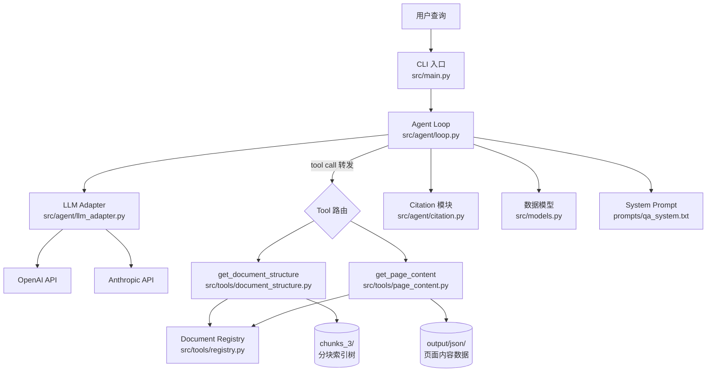
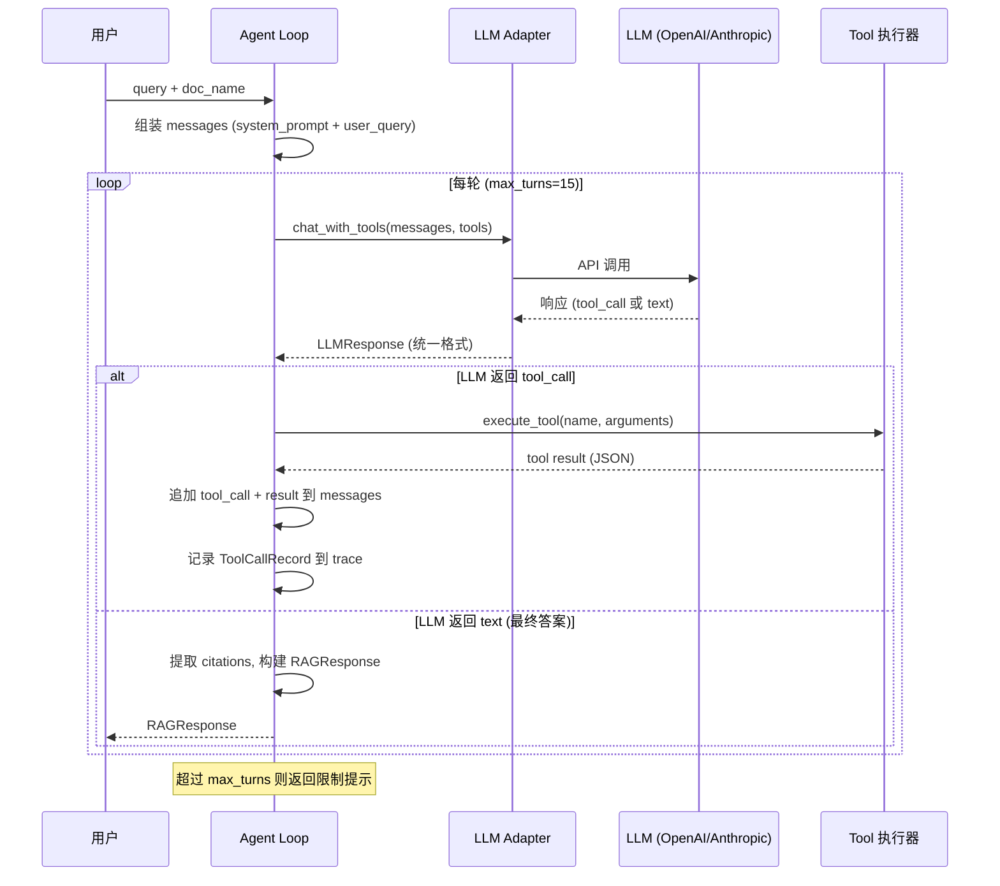

# 设计文档

## 概述

本系统实现基于 PageIndex 范式的 Agentic RAG 系统，核心架构为 **Tool-Use Agent 模式**：Agent Loop 仅负责转发 LLM 的 tool call 请求和执行结果，所有检索决策完全由 LLM 通过函数调用自主驱动。

系统提供两个工具：`get_document_structure`（获取文档目录树索引）和 `get_page_content`（获取指定页面内容）。LLM 通过阅读目录树中的章节摘要判断相关性，按需提取页面内容，推理信息充足性，最终生成带精确页码引用的答案。

系统智能分布在三个层面：
1. **索引质量（离线）**：summary 准确性、树结构粒度、节点 metadata — 决定 LLM 能否找到正确章节
2. **Tool 响应设计（代码侧）**：返回字段选择、next_steps 措辞、内容截断策略 — 决定 LLM 每步获得多少有效信息
3. **LLM 推理（在线）**：导航路径选择、信息充足性判断、答案生成 — 决定最终答案质量

支持 OpenAI 和 Anthropic 两种 LLM 提供商，面向协议技术文档（FC-LS、BFD RFC）。

## 架构

### 整体架构



### Agent Loop 交互流程



### 设计决策

| 决策 | 选择 | 理由 |
|------|------|------|
| Agent Loop 不做检索决策 | 纯转发模式 | 所有导航智能由 LLM 驱动，代码侧智能体现在 Tool 响应设计 |
| next_steps 措辞精心设计 | 代码侧智能 | 引导 LLM 在正确时机切换工具（如从 structure 切换到 content） |
| 首次 structure 调用附加 manifest | 前置全局信息 | 帮助 LLM 建立文档全局认知（总页数、总 part 数） |
| 内容截断在段落边界 | 非字符中间截断 | 保持语义完整性，避免截断在句子中间 |
| 表格始终完整保留 | 不截断表格 | 协议文档中表格承载关键信息（字段定义、状态转换表） |
| 单页引用格式 | `page="7"` 非范围 | 精确定位，便于验证 |
| max_turns=15 | 安全阀 | 正常查询 4-8 轮完成，15 轮留足余量防止死循环 |
| System Prompt 外部文件加载 | 独立于代码修改 | 支持快速迭代 prompt，且为 Phase 4 切换提取模式预留 |

## 组件与接口

### 文件结构

```
src/
├── tools/
│   ├── __init__.py
│   ├── document_structure.py    # get_document_structure 实现
│   ├── page_content.py          # get_page_content 实现
│   ├── schemas.py               # Tool Schema 定义 (OpenAI function calling 格式)
│   └── registry.py              # doc_name → 数据路径映射
├── agent/
│   ├── __init__.py
│   ├── loop.py                  # Agent Loop 核心
│   ├── llm_adapter.py           # OpenAI/Anthropic 统一适配
│   ├── citation.py              # 引用提取与验证
│   └── prompts/
│       ├── qa_system.txt        # 问答 System Prompt
│       └── extraction_system.txt # 提取 System Prompt (Phase 4 预留)
├── models.py                    # 所有数据结构
├── evaluate.py                  # 评测脚本
└── main.py                      # CLI 入口
```

### 依赖关系

- `tools/` 不 import `agent/`，只依赖 `registry.py` 和数据文件
- `agent/` import `tools/` 的函数和 schema
- `models.py` 被所有模块共享，不依赖 `tools/` 或 `agent/`
- `main.py` 组装 `agent/` 和 `tools/`
- 不 import 已有代码（`page_index.py`, `utils.py`, `structure_chunker.py`, `build_content_db.py`），仅读取其产出的数据文件

### 组件 1：Document Registry (`src/tools/registry.py`)

维护 doc_name 到数据文件路径的映射。

```python
# 类型定义
class DocConfig(TypedDict):
    chunks_dir: str      # 分块索引树目录路径
    content_dir: str     # 页面内容 JSON 目录路径
    total_pages: int     # 文档总页数

DOC_REGISTRY: dict[str, DocConfig]

# 接口
def get_doc_config(doc_name: str) -> DocConfig:
    """
    查找文档配置。
    Args:
        doc_name: 文档名称，如 "FC-LS.pdf"
    Returns:
        DocConfig 字典
    Raises:
        返回包含可用文档列表的错误信息（不抛异常，返回 dict）
    """
```

初始注册表：

| doc_name | chunks_dir | content_dir | total_pages |
|----------|-----------|-------------|-------------|
| `FC-LS.pdf` | `data/out/chunks_3/FC-LS` | `output/json` | 210 |
| `rfc5880-BFD.pdf` | `data/out/chunks_3/BFD` | `output_bfd/json` | 49 |

### 组件 2：Structure Tool (`src/tools/document_structure.py`)

```python
def get_document_structure(doc_name: str, part: int = 1) -> dict:
    """
    返回文档目录树的第 part 个分块。

    数据来源: chunks_3/{doc_stem}/part_{part:04d}.json

    Args:
        doc_name: 文档名称
        part: 分块编号，从 1 开始，默认 1

    Returns:
        {
            "structure": [...],           # 节点树（含 title, summary, start_index, end_index, children）
            "next_steps": str,            # 导航提示，引导 LLM 下一步操作
            "pagination": {
                "current_part": int,
                "total_parts": int
            },
            # 当 part=1 时额外包含：
            "doc_info": {                 # 仅首次调用
                "total_pages": int,
                "total_parts": int
            }
        }
    错误返回:
        {"error": str, "valid_range": str}
    """
```

**代码侧智能设计要点：**
- `next_steps` 措辞示例：`"Read the summaries to identify sections relevant to your question. Use get_page_content() to retrieve specific pages from relevant sections (use start_index/end_index from nodes)."`
- part=1 时附加 `doc_info`，帮助 LLM 了解文档规模
- part 越界时返回明确错误和有效范围，避免 LLM 陷入错误循环

### 组件 3：Content Tool (`src/tools/page_content.py`)

```python
def get_page_content(doc_name: str, pages: str) -> dict:
    """
    返回指定页码的实际文档内容。

    数据来源: content_dir/content_{start}_{end}.json

    Args:
        doc_name: 文档名称
        pages: 页码字符串，支持三种格式：
               - 单页: "7"
               - 连续范围: "7-11"
               - 逗号分隔: "7,9,11"

    Returns:
        {
            "content": [
                {
                    "page": int,
                    "text": str,          # 文本内容（可能被截断）
                    "tables": list[str],  # markdown 表格（始终完整）
                    "images": list[str]   # 图片信息
                },
                ...
            ],
            "next_steps": str,            # 包含引用格式提示
            "total_pages": int
        }
    错误返回:
        {"error": str}  # 页数超限或页码越界
    """
```

**关键行为：**
- 单次最大 10 页，超过返回错误提示要求分批
- 单页文本 > 4000 字符时在段落边界截断，附加 `[内容已截断，共 N 字符，已显示前 4000 字符]`
- 表格（markdown 格式）始终完整返回，不截断
- `next_steps` 包含引用格式提示：`"Use <cite doc=\"{doc_name}\" page=\"N\"/> to cite information from these pages."`

**页码解析算法：**

```python
def parse_pages(pages_str: str) -> list[int]:
    """
    解析页码字符串为页码列表。
    "7"       -> [7]
    "7-11"    -> [7, 8, 9, 10, 11]
    "7,9,11"  -> [7, 9, 11]
    """
```

**内容加载算法：**
遍历 content_dir 下的 `content_{start}_{end}.json` 文件，找到包含目标页码的文件，从中提取对应页面数据。

### 组件 4：Tool Schemas (`src/tools/schemas.py`)

```python
TOOL_SCHEMAS: list[dict]  # OpenAI function calling 格式

# get_document_structure schema
# - description 包含 "通过阅读摘要来判断章节与问题的相关性" 引导措辞
# - parameters: doc_name (required, string), part (optional, integer, default 1)

# get_page_content schema
# - description 包含 "单次请求不超过 10 页" 约束
# - description 包含 "页码范围从目录树节点的 start_index 和 end_index 获得" 工作流关系
# - parameters: doc_name (required, string), pages (required, string)

def get_tool_schemas() -> list[dict]:
    """返回 Tool Schema 列表（OpenAI 格式）。"""

def convert_to_anthropic_format(schemas: list[dict]) -> list[dict]:
    """将 OpenAI 格式 schema 转换为 Anthropic 格式。"""
```

### 组件 5：LLM Adapter (`src/agent/llm_adapter.py`)

```python
class LLMAdapter:
    """统一 OpenAI/Anthropic 的 tool calling 接口差异。"""

    def __init__(self, provider: str, model: str):
        """
        Args:
            provider: "openai" 或 "anthropic"
            model: 模型名称，如 "gpt-4o", "claude-sonnet-4-20250514"
        """

    async def chat_with_tools(
        self,
        messages: list[dict],
        tools: list[dict],
    ) -> LLMResponse:
        """
        统一的 LLM 调用接口。

        Args:
            messages: 消息列表（统一格式）
            tools: Tool Schema 列表（OpenAI 格式，内部自动转换）

        Returns:
            LLMResponse 统一响应结构
        """

    def make_tool_result_message(
        self,
        tool_call_id: str,
        result: dict
    ) -> dict:
        """
        构造 tool result 消息。
        OpenAI:    {"role": "tool", "tool_call_id": ..., "content": ...}
        Anthropic: {"role": "user", "content": [{"type": "tool_result", ...}]}
        """
```

**OpenAI vs Anthropic 差异处理：**

| 差异点 | OpenAI | Anthropic | 适配策略 |
|--------|--------|-----------|---------|
| Tool 定义格式 | `{"type": "function", "function": {...}}` | `{"name": ..., "input_schema": {...}}` | `convert_to_anthropic_format()` |
| Tool call 响应 | `message.tool_calls[].function` | `content[].type == "tool_use"` | 统一解析为 `ToolCall(name, arguments, id)` |
| Tool result 消息 | `{"role": "tool", "tool_call_id": ...}` | `{"role": "user", "content": [{"type": "tool_result", ...}]}` | `make_tool_result_message()` |
| System message | `{"role": "system", ...}` | 独立 `system` 参数 | 适配层自动拆分 |
| 并行 tool call | 支持 | 支持 | 统一处理为 `list[ToolCall]` |

### 组件 6：Agent Loop (`src/agent/loop.py`)

```python
async def agentic_rag(
    query: str,
    doc_name: str,
    model: str = None,
    max_turns: int = 15,
) -> RAGResponse:
    """
    核心 Agent 循环。

    代码只做三件事：
    1. 组装 query + system_prompt + tools 发给 LLM
    2. LLM 返回 tool_call → 执行 tool → 结果喂回
    3. LLM 返回 text → 作为最终答案返回

    代码不做任何检索决策。

    Args:
        query: 用户问题
        doc_name: 文档名称
        model: LLM 模型名称（可选，默认从配置读取）
        max_turns: 最大轮次（安全阀）

    Returns:
        RAGResponse 包含答案、引用、trace 等
    """

def execute_tool(name: str, arguments: dict) -> dict:
    """
    Tool 路由器。将 tool call 分发到对应函数。
    未知工具名返回 {"error": "Unknown tool: {name}"}，不抛异常。
    """

def load_system_prompt(prompt_file: str = "qa_system.txt") -> str:
    """从 src/agent/prompts/ 目录加载 system prompt 文件。"""
```

### 组件 7：Citation 模块 (`src/agent/citation.py`)

```python
def extract_citations(answer: str) -> list[Citation]:
    """
    从答案文本中解析 <cite doc="..." page="..."/> 标签。
    使用正则: r'<cite\\s+doc="([^"]+)"\\s+page="(\\d+)"\\s*/>'
    返回 Citation 列表，每个包含 doc_name, page, context（引用所在文本片段）。
    """

def validate_citations(
    citations: list[Citation],
    pages_retrieved: list[int]
) -> list[str]:
    """
    验证引用页码是否在实际检索的页码列表中。
    返回警告列表（如 "引用了未检索的页面: page 7"）。
    """

def clean_answer(answer: str) -> str:
    """去除答案中的 <cite/> 标签，返回纯文本。"""
```

### 组件 8：CLI 入口 (`src/main.py`)

```python
async def main():
    """
    CLI 参数：
    --doc     文档名称（必填）
    --query   用户问题（必填）
    --model   LLM 模型名称（可选）
    --verbose 详细模式，打印 tool call trace（可选）

    运行方式: python -m src.main --doc rfc5880-BFD.pdf --query "BFD 控制报文有哪些字段？"
    """
```

### 组件 9：评测脚本 (`src/evaluate.py`)

```python
async def evaluate_all(test_set_path: str, model: str = None):
    """
    从 JSON 测试集加载用例，逐个调用 agentic_rag，计算指标。

    指标：
    - key_points 覆盖率（目标 > 80%）
    - 引用有效率（目标 > 90%）
    - 平均轮次数（目标 4-8 轮）
    - 检索页码命中率（目标 > 70%）

    测试用例类型：format, state_machine, procedure, definition, cross_reference
    """
```

### 组件 10：System Prompt (`src/agent/prompts/qa_system.txt`)

外部文件加载，核心内容包括：
1. **工作流程引导**：先 `get_document_structure` 看目录树 → 阅读摘要判断相关性 → `get_page_content` 获取内容
2. **事实约束**：只基于实际读取的内容回答，不编造
3. **交叉引用跟踪**：遇到 "see section X" 时主动跳转查找
4. **信息不足处理**：明确说明已找到和缺失的信息
5. **引用规则**：`<cite doc="..." page="N"/>` 格式，单页引用，只引用实际读取的页面

## 数据模型

所有数据模型定义在 `src/models.py`，使用 `pydantic.BaseModel`，不依赖 `tools/` 或 `agent/` 模块。

### 核心模型

```python
from pydantic import BaseModel

class Citation(BaseModel):
    """答案中的页码引用。"""
    doc_name: str       # 文档名称
    page: int           # 页码
    context: str = ""   # 引用所在的文本片段

class ToolCallRecord(BaseModel):
    """单次 tool call 的记录。"""
    turn: int                  # 轮次编号
    tool: str                  # 工具名称
    arguments: dict            # 调用参数
    result_summary: str = ""   # 结果摘要（截断后的简短描述）

class RAGResponse(BaseModel):
    """Agent 循环的最终输出。"""
    answer: str                          # 包含 <cite/> 标签的原始答案
    answer_clean: str = ""               # 去除 <cite/> 标签的纯文本答案
    citations: list[Citation] = []       # 提取的引用列表
    trace: list[ToolCallRecord] = []     # 完整的 tool call 记录
    pages_retrieved: list[int] = []      # 实际检索过的页码列表
    total_turns: int = 0                 # 总轮次数

class TokenUsage(BaseModel):
    """Token 用量统计。"""
    prompt_tokens: int = 0
    completion_tokens: int = 0

class ToolCall(BaseModel):
    """统一的 tool call 表示。"""
    name: str           # 工具名称
    arguments: dict     # 调用参数
    id: str             # tool call ID

class LLMResponse(BaseModel):
    """LLM Adapter 的统一响应。"""
    has_tool_calls: bool = False
    tool_calls: list[ToolCall] = []
    text: str | None = None
    usage: TokenUsage = TokenUsage()
    raw_message: dict = {}    # 原始消息，用于追加到 messages 列表
```

### 评测模型

```python
class TestCase(BaseModel):
    """评测测试用例。"""
    id: str
    doc_name: str
    query: str
    type: str                          # format, state_machine, procedure, definition, cross_reference
    expected_pages: list[int] = []
    key_points: list[str] = []

class EvalResult(BaseModel):
    """单个测试用例的评测结果。"""
    id: str
    query: str
    key_points_covered: int
    key_points_total: int
    citation_count: int
    citation_valid_rate: float
    total_turns: int
    pages_hit_rate: float
    answer: str
```

### 扩展预留模型（Phase 4）

```python
class ProtocolState(BaseModel):
    name: str
    description: str = ""
    is_initial: bool = False
    is_final: bool = False

class ProtocolTransition(BaseModel):
    from_state: str
    to_state: str
    event: str
    condition: str = ""
    actions: list[str] = []

class ProtocolStateMachine(BaseModel):
    name: str
    states: list[ProtocolState] = []
    transitions: list[ProtocolTransition] = []
    source_pages: list[int] = []

class ProtocolField(BaseModel):
    name: str
    type: str = ""
    size_bits: int | None = None
    description: str = ""

class ProtocolMessage(BaseModel):
    name: str
    fields: list[ProtocolField] = []
    source_pages: list[int] = []

class ProtocolSchema(BaseModel):
    """协议的结构化表示 — 代码生成的输入。"""
    protocol_name: str
    state_machines: list[ProtocolStateMachine] = []
    messages: list[ProtocolMessage] = []
    constants: dict = {}
    source_document: str = ""
```

### 数据文件格式

**分块索引树 (`chunks_3/{doc}/part_NNNN.json`)**：
```json
{
  "success": true,
  "doc_name": "FC-LS.pdf",
  "structure": [
    {
      "node_id": "0002",
      "title": "1 Scope",
      "summary": "...",
      "is_skeleton": false,
      "children": [...],
      "start_index": 20,
      "end_index": 20
    }
  ]
}
```

**Manifest (`chunks_3/{doc}/manifest.json`)**：
```json
{
  "total_parts": 9,
  "files": ["part_0001.json", ...]
}
```

**页面内容 (`content_{start}_{end}.json`)**：
```json
{
  "doc_name": "FC-LS.pdf",
  "chunk_id": "1-20",
  "start_page": 1,
  "end_page": 20,
  "pages": [
    {
      "page_num": 1,
      "text": "...",
      "tables": [],
      "images": []
    }
  ]
}
```

**评测测试集 (`data/eval/test_questions.json`)**：
```json
[
  {
    "id": "bfd-01",
    "doc_name": "rfc5880-BFD.pdf",
    "query": "BFD 控制报文的强制部分包含哪些字段？",
    "type": "format",
    "expected_pages": [7, 8, 9, 10],
    "key_points": ["Version", "Diagnostic", "State", ...]
  }
]
```

## 正确性属性 (Correctness Properties)

*属性（Property）是在系统所有有效执行中都应成立的特征或行为——本质上是对系统应做什么的形式化陈述。属性是人类可读规格说明与机器可验证正确性保证之间的桥梁。*

### Property 1: 注册表查找返回完整配置

*For any* 已注册的 doc_name，调用 `get_doc_config(doc_name)` 应返回包含 `chunks_dir`（字符串）、`content_dir`（字符串）和 `total_pages`（正整数）三个字段的配置字典。

**Validates: Requirements 1.1, 1.2**

### Property 2: 未注册文档名返回可用列表

*For any* 不在注册表中的字符串作为 doc_name，调用 `get_doc_config(doc_name)` 应返回包含 `error` 字段的字典，且错误信息中包含所有已注册文档名称。

**Validates: Requirements 1.3**

### Property 3: 结构工具返回完整响应

*For any* 有效的 (doc_name, part) 组合，`get_document_structure` 的返回值应包含 `structure`（列表）、`next_steps`（字符串）和 `pagination`（含 `current_part` 和 `total_parts`）三个字段，且 `structure` 内容与对应 `part_NNNN.json` 文件中的数据一致。

**Validates: Requirements 2.1, 2.2**

### Property 4: 首次结构调用附加文档信息

*For any* 已注册的 doc_name，调用 `get_document_structure(doc_name, part=1)` 的返回值应额外包含 `doc_info` 字段，其中 `total_pages` 和 `total_parts` 为正整数。

**Validates: Requirements 2.3**

### Property 5: 结构工具越界返回错误与有效范围

*For any* 已注册的 doc_name 和超出有效范围的 part 值（part < 1 或 part > total_parts），`get_document_structure` 应返回包含 `error` 字段的字典，且响应中包含有效的 part 范围信息。

**Validates: Requirements 2.4**

### Property 6: 结构工具默认 part 等价于 part=1

*For any* 已注册的 doc_name，调用 `get_document_structure(doc_name)` 与 `get_document_structure(doc_name, part=1)` 应返回相同的结果。

**Validates: Requirements 2.5**

### Property 7: 页码解析三种格式正确性

*For any* 有效页码 n（1 ≤ n ≤ total_pages），`parse_pages` 函数对单页格式 `str(n)`、范围格式 `f"{a}-{b}"`（a ≤ b）和逗号格式 `",".join(...)` 应分别返回正确的页码列表，且列表元素均为正整数。

**Validates: Requirements 3.2**

### Property 8: 内容工具返回完整页面字段

*For any* 有效的 (doc_name, pages) 请求（页数 ≤ 10），返回的 `content` 列表中每个元素应包含 `page`（整数）、`text`（字符串）、`tables`（列表）和 `images`（列表）四个字段，且 `page` 值与请求的页码一致。

**Validates: Requirements 3.1, 3.3**

### Property 9: 内容工具拒绝超过 10 页的请求

*For any* 解析后页数超过 10 的 pages 参数，`get_page_content` 应返回包含 `error` 字段的字典，不返回任何页面内容。

**Validates: Requirements 3.4**

### Property 10: 内容截断策略——文本截断但表格完整

*For any* 页面内容，若文本长度超过 4000 字符，返回的 `text` 应被截断至 ≤ 4000 字符附近（段落边界）并包含截断标注；而 `tables` 字段始终完整返回，不受截断影响。

**Validates: Requirements 3.5, 3.6**

### Property 11: 内容工具 next_steps 包含引用格式提示

*For any* 成功的 `get_page_content` 调用，返回的 `next_steps` 字符串应包含 `<cite` 关键词，提示 LLM 使用正确的引用格式。

**Validates: Requirements 3.7**

### Property 12: 内容工具越界页码返回错误

*For any* 已注册的 doc_name 和超出文档总页数范围的页码，`get_page_content` 应返回包含 `error` 字段的字典，且错误信息中包含有效页码范围。

**Validates: Requirements 3.8**

### Property 13: Schema 格式转换正确性

*For any* 有效的 OpenAI 格式 Tool Schema，`convert_to_anthropic_format` 转换后的结果应包含 `name` 和 `input_schema` 字段，且 `input_schema` 的 `properties` 与原始 schema 的 `parameters.properties` 一致。

**Validates: Requirements 5.3, 5.4**

### Property 14: Tool Result 消息格式正确性

*For any* tool_call_id（字符串）和 result（字典），OpenAI 适配器生成的消息应包含 `{"role": "tool", "tool_call_id": tool_call_id}`，Anthropic 适配器生成的消息应包含 `{"role": "user", "content": [{"type": "tool_result", "tool_use_id": tool_call_id}]}`。

**Validates: Requirements 5.5, 5.6**

### Property 15: 未知工具名返回错误字典

*For any* 不在已注册工具列表中的工具名称字符串，`execute_tool` 应返回包含 `error` 字段的字典，不抛出异常。

**Validates: Requirements 6.7**

### Property 16: Citation 提取正确解析所有 cite 标签

*For any* 包含 `<cite doc="X" page="N"/>` 标签的字符串，`extract_citations` 应返回与标签数量相同的 Citation 列表，每个 Citation 的 `doc_name` 和 `page` 与标签中的值一致。

**Validates: Requirements 8.4**

### Property 17: Citation 验证识别未检索页码

*For any* Citation 列表和已检索页码列表，`validate_citations` 对每个 `page` 不在已检索列表中的 Citation 应生成一条警告，对 `page` 在已检索列表中的 Citation 不生成警告。

**Validates: Requirements 8.5**

### Property 18: 清理答案去除 cite 标签保留文本

*For any* 包含 cite 标签的答案字符串，`clean_answer` 的结果应不包含任何 `<cite` 标签，且原始答案中非标签部分的文本内容被完整保留。

**Validates: Requirements 8.6**

### Property 19: 测试用例加载 round-trip

*For any* 有效的 TestCase 列表，序列化为 JSON 后再加载回来，应得到与原始列表等价的 TestCase 对象列表（字段值完全一致）。

**Validates: Requirements 10.1**

### Property 20: 数据模型字段完整性

*For any* 有效的构造参数，`RAGResponse` 应包含 answer、answer_clean、citations、trace、pages_retrieved、total_turns 字段；`Citation` 应包含 doc_name、page、context 字段；`ToolCallRecord` 应包含 turn、tool、arguments、result_summary 字段。

**Validates: Requirements 11.1, 11.2, 11.3**

## 错误处理

### 错误处理策略

系统采用"返回错误字典而非抛出异常"的策略，确保 Agent Loop 不会因工具执行失败而中断，LLM 可以根据错误信息调整行为。

### 错误分类

| 错误场景 | 组件 | 处理方式 |
|----------|------|---------|
| doc_name 不存在 | Registry | 返回 `{"error": "Unknown document: {name}. Available: [...]"}` |
| part 超出范围 | Structure Tool | 返回 `{"error": "Part {n} out of range", "valid_range": "1-{max}"}` |
| 页码超出范围 | Content Tool | 返回 `{"error": "Pages out of range", "valid_range": "1-{total}"}` |
| 请求页数 > 10 | Content Tool | 返回 `{"error": "Too many pages (max 10). Please request fewer pages."}` |
| 页码格式无效 | Content Tool | 返回 `{"error": "Invalid pages format: {pages}. Use '7', '7-11', or '7,9,11'."}` |
| 数据文件缺失 | Structure/Content Tool | 返回 `{"error": "Data file not found: {path}"}` |
| 未知工具名 | Agent Loop (execute_tool) | 返回 `{"error": "Unknown tool: {name}"}` |
| max_turns 耗尽 | Agent Loop | 返回 RAGResponse，answer 包含 `"[达到最大轮次限制]"` |
| LLM API 调用失败 | LLM Adapter | 抛出异常，由 Agent Loop 捕获并返回错误 RAGResponse |
| LLM 返回格式异常 | LLM Adapter | 尝试解析，失败则视为纯文本响应 |

### 引用验证警告

引用验证不阻断流程，仅生成警告列表附加到 RAGResponse 中：
- 引用了未检索的页码 → 警告（可能是 LLM 编造）
- 引用格式不规范 → 忽略该引用，不计入 citations 列表

### Context Window 风险缓解

- 监控每轮 token 用量（通过 LLMResponse.usage）
- `get_page_content` 单次最大 10 页 + 单页 4000 字符截断
- `max_turns=15` 安全阀限制总轮次
- 未来可扩展：当总 token 接近上限时压缩历史 tool result

## 测试策略

### 双轨测试方法

系统采用单元测试 + 属性测试（Property-Based Testing）的双轨方法：

- **单元测试**：验证具体示例、边界条件和错误场景
- **属性测试**：验证跨所有输入的通用属性，使用随机生成的输入

两者互补：单元测试捕获具体 bug，属性测试验证通用正确性。

### 属性测试配置

- **库选择**：`hypothesis`（Python 生态最成熟的 PBT 库）
- **每个属性测试最少 100 次迭代**
- **每个属性测试必须引用设计文档中的 Property 编号**
- **标签格式**：`# Feature: agentic-rag-retrieval-generation, Property {N}: {property_text}`
- **每个正确性属性由一个属性测试实现**

### 测试分层

#### 第一层：工具函数测试（纯函数，无外部依赖）

**属性测试：**
- Property 1-2: Registry 查找（有效/无效 doc_name）
- Property 3-6: Structure Tool（有效调用、part=1 附加信息、越界、默认值）
- Property 7: 页码解析三种格式
- Property 8-12: Content Tool（字段完整性、页数限制、截断策略、next_steps、越界）

**单元测试：**
- `get_document_structure("FC-LS.pdf", 1)` 返回与 `part_0001.json` 一致的数据
- `get_page_content("FC-LS.pdf", "75-76")` 返回第 75-76 页内容
- Schema description 包含指定引导措辞（Requirements 4.1-4.4）
- System Prompt 包含工作流引导、事实约束、交叉引用指引（Requirements 7.1-7.5, 8.1-8.3）

#### 第二层：适配层与引用模块测试

**属性测试：**
- Property 13: Schema 格式转换
- Property 14: Tool result 消息格式
- Property 15: 未知工具名错误处理
- Property 16-18: Citation 提取、验证、清理

**单元测试：**
- OpenAI schema 转 Anthropic schema 的具体示例
- 包含多个 cite 标签的答案文本解析
- 引用验证：部分页码在检索列表中、部分不在

#### 第三层：数据模型测试

**属性测试：**
- Property 19: TestCase 序列化 round-trip
- Property 20: 数据模型字段完整性

**单元测试：**
- RAGResponse 默认值正确
- ProtocolSchema 等预留模型可正常实例化

#### 第四层：集成测试（需要 mock LLM）

**单元测试：**
- Agent Loop 在 mock LLM 返回 tool_call 时正确执行工具
- Agent Loop 在 mock LLM 返回 text 时正确终止
- Agent Loop 达到 max_turns 时返回限制提示（Requirements 6.5）
- CLI 参数解析正确（Requirements 9.1）

#### 第五层：端到端评测（需要真实 LLM API）

- 使用 `data/eval/test_questions.json` 测试集
- 指标目标：key_points 覆盖率 > 80%，引用有效率 > 90%，平均轮次 4-8，页码命中率 > 70%
- 覆盖 format、state_machine、procedure、definition、cross_reference 五种问题类型

### 测试文件结构

```
tests/
├── test_registry.py           # Registry 单元测试 + 属性测试
├── test_document_structure.py # Structure Tool 测试
├── test_page_content.py       # Content Tool 测试
├── test_page_parser.py        # 页码解析属性测试
├── test_schemas.py            # Schema 定义和转换测试
├── test_llm_adapter.py        # LLM Adapter 格式转换测试
├── test_citation.py           # Citation 模块测试
├── test_models.py             # 数据模型测试
├── test_agent_loop.py         # Agent Loop 集成测试 (mock LLM)
└── test_evaluate.py           # 评测脚本测试
```
