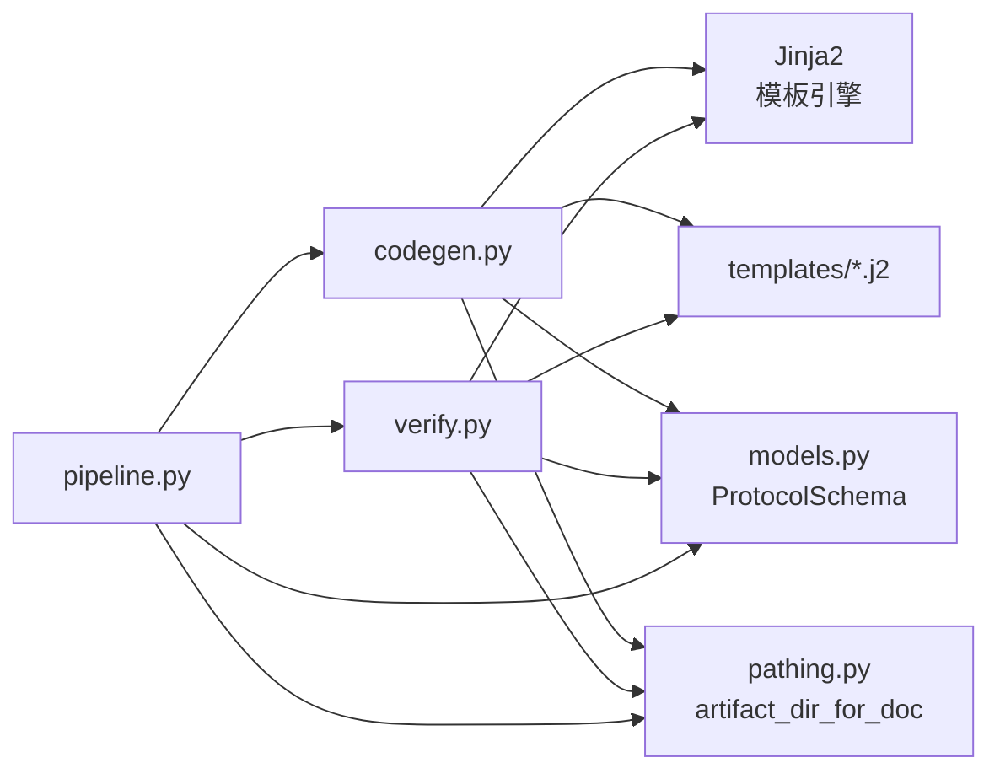

# 设计文档：代码生成与验证（CODEGEN & VERIFY）

## 概述

本设计描述协议提取流水线最后两个阶段——CODEGEN（代码生成）和 VERIFY（代码验证）的技术方案。CODEGEN 阶段以 MERGE 阶段产出的 `protocol_schema.json`（ProtocolSchema）为输入，通过 Jinja2 模板引擎生成确定性的 C 语言代码骨架；VERIFY 阶段对生成的 C 代码执行语法检查（`gcc -fsyntax-only`）、结构完整性检查，并输出结构化验证报告。

Phase 1 定位为"C 代码骨架生成 + 轻量验证"：
- 状态机：完整的 `enum` + `switch-case` 转移函数
- 报文：`struct` 骨架 + 字段注释 + `pack`/`unpack` 函数签名桩（仅签名，函数体为 TODO）
- 不做真实 bitfield 序列化、不做 round-trip correctness

生成器本身为 Python（Jinja2 模板），目标语言为 C。

### 数据流总览

```mermaid
graph TD
    A[protocol_schema.json<br/>ProtocolSchema] --> B[codegen.py<br/>Jinja2 模板渲染]
    T[src/extract/templates/<br/>*.j2 模板文件] --> B
    B --> C[data/out/{doc_stem}/generated/<br/>.h + .c 文件]
    C --> D[verify.py<br/>语法检查 + 结构完整性]
    A --> D
    D --> E[verify_report.json]
    D --> F[test_roundtrip.c<br/>测试桩文件]
```

## 架构

### 目录结构

```
src/extract/
    codegen.py              # CODEGEN 阶段：模板加载 + 数据预处理 + 渲染
    verify.py               # VERIFY 阶段：语法检查 + 结构完整性 + 报告生成
    templates/               # Jinja2 模板目录
        state_machine.h.j2   # 状态机头文件模板
        state_machine.c.j2   # 状态机源文件模板
        message.h.j2         # 报文头文件模板
        message.c.j2         # 报文源文件模板
        main_header.h.j2     # 主头文件模板（#include 汇总）
        test_roundtrip.c.j2  # Round-trip 测试桩模板
    pipeline.py             # 主流程编排（新增 CODEGEN/VERIFY 阶段实现）

data/out/{doc_stem}/
    protocol_schema.json    # MERGE 阶段产出（输入）
    generated/              # CODEGEN 阶段产出
        {protocol}_sm_{name}.h
        {protocol}_sm_{name}.c
        {protocol}_msg_{name}.h
        {protocol}_msg_{name}.c
        {protocol}.h         # 主头文件
        test_roundtrip.c     # VERIFY 阶段生成的测试桩
    verify_report.json      # VERIFY 阶段产出
```

### 模块依赖关系



### 阶段划分与职责

| 阶段 | 模块 | 输入 | 输出 | 说明 |
|------|------|------|------|------|
| Stage 4: CODEGEN | `codegen.py` | ProtocolSchema + Jinja2 模板 | `generated/` 目录下的 .h/.c 文件 | 确定性 C 代码骨架生成 |
| Stage 5: VERIFY | `verify.py` | `generated/` 目录 + ProtocolSchema | `verify_report.json` + `test_roundtrip.c` | 语法检查 + 结构完整性 + 测试桩 |


## 组件与接口

### 1. codegen.py — C 代码生成器

#### 公开接口

```python
@dataclass
class CodegenResult:
    """代码生成结果。"""
    files: list[str]                    # 生成的所有文件的绝对路径列表
    skipped_components: list[dict]      # 跳过的组件列表 [{'name': str, 'kind': str, 'reason': str}]
    warnings: list[str]                 # 非致命警告信息列表
    expected_symbols: list[dict]        # 预期 C 符号名列表（仅含成功生成的组件，供 verify 使用）
        # [{'symbol': str, 'kind': 'enum'|'struct'|'function', 'source': str}]
    generated_msg_names: list[str]      # 成功生成代码的报文名列表（供 verify 生成 test_roundtrip.c）

def generate_code(schema: ProtocolSchema, output_dir: str) -> CodegenResult:
    """从 ProtocolSchema 生成 C 语言代码骨架。

    Args:
        schema: 协议结构化表示（来自 MERGE 阶段的 protocol_schema.json）
        output_dir: 输出目录路径（如 data/out/{doc_stem}/generated/）

    Returns:
        CodegenResult 包含生成文件路径、跳过组件、警告和预期符号列表

    流程：
    1. 调用 _sort_schema(schema) 对输入进行确定性排序
    2. 调用 _load_templates() 加载 Jinja2 模板
    3. 为每个 ProtocolStateMachine 渲染 .h + .c（失败时记录到 skipped_components）
    4. 为每个 ProtocolMessage 渲染 .h + .c（失败时记录到 skipped_components）
    5. 渲染主头文件 {protocol_name}.h（仅 #include 成功生成的子头文件）
    6. 调用 _build_expected_symbols() 仅为成功生成的组件构建预期符号列表
       （跳过的组件不纳入 expected_symbols，避免 VERIFY 阶段出现假失败）
    7. 返回 CodegenResult
    """
```

#### 内部辅助函数

```python
def _sanitize_c_identifier(name: str) -> str:
    """将任意字符串转换为合法的 C 标识符。

    规则：
    - 空格、连字符、点号等替换为下划线
    - 移除其他特殊字符（仅保留 [a-zA-Z0-9_]）
    - 若首字符为数字，前缀加下划线
    - 连续下划线合并为单个
    - 空字符串返回 '_unnamed'
    """

def _to_upper_snake(name: str) -> str:
    """转换为全大写下划线命名（用于状态名、事件名）。

    示例：'BFD State Machine' → 'BFD_STATE_MACHINE'
          'Down' → 'DOWN'
    """

def _to_lower_snake(name: str) -> str:
    """转换为全小写下划线命名（用于结构体名、函数名）。

    示例：'Generic BFD Control Packet' → 'generic_bfd_control_packet'
    """

def _protocol_prefix(protocol_name: str) -> str:
    """从协议名称提取短前缀（用于 C 符号命名空间）。

    确定性算法：
    1. 以 '-' 分割 protocol_name 为段列表
    2. 过滤掉匹配 r'^rfc\\d*$'（不区分大小写）的段
    3. 若剩余段为空，回退使用原始 protocol_name（作为单段列表）
    4. 对每个剩余段调用 _sanitize_c_identifier() 后转小写
    5. 用 '_' 连接所有段
    6. 若结果为空或 '_unnamed'，回退为 'proto'

    设计决策：保留所有非 RFC 段并用 '_' 连接，而非仅取最后一段。
    原因：仅取最后一段会丢失信息（如 FC-LS → ls 辨识度太低，且 ls_ 前缀在 C 符号中不稳定）。

    示例：
    - 'rfc5880-BFD' → 分割 ['rfc5880', 'BFD'] → 过滤 ['BFD'] → 连接 'bfd'
    - 'FC-LS' → 分割 ['FC', 'LS'] → 过滤 ['FC', 'LS'] → 连接 'fc_ls'
    - 'rfc793-TCP' → 分割 ['rfc793', 'TCP'] → 过滤 ['TCP'] → 连接 'tcp'
    - 'rfc768-UDP' → 连接 'udp'
    - 'MyProtocol' → 分割 ['MyProtocol'] → 过滤 ['MyProtocol'] → 连接 'myprotocol'
    - 'FC-GS-7' → 分割 ['FC', 'GS', '7'] → 过滤 ['FC', 'GS', '7'] → 连接 'fc_gs_7'
    """

@dataclass
class FieldTypeInfo:
    """字段类型映射结果（结构化数据，供模板正确拼接 C 声明）。"""
    c_type: str           # 基础 C 类型，如 'uint8_t', 'uint16_t', 'uint32_t', 'uint64_t'
    array_len: int | None # 若为字节数组则为 N（如 5），否则为 None
    comment: str          # 位宽注释或 TODO 注释，如 '/* Vers: 3 bits */'

    def render_declaration(self, field_name: str) -> str:
        """渲染完整的 C 字段声明。

        示例：
        - FieldTypeInfo('uint8_t', None, '') → 'uint8_t field_name;'
        - FieldTypeInfo('uint8_t', 5, '/* 33 bits */') → 'uint8_t field_name[5]; /* 33 bits */'
        """
        if self.array_len is not None:
            decl = f"{self.c_type} {field_name}[{self.array_len}];"
        else:
            decl = f"{self.c_type} {field_name};"
        if self.comment:
            decl = f"{decl} {self.comment}"
        return decl

def _map_field_type(field: ProtocolField) -> FieldTypeInfo:
    """将 ProtocolField 的 size_bits 映射为结构化的 C 类型信息。

    Args:
        field: 协议字段模型

    Returns:
        FieldTypeInfo 结构化类型信息（模板通过 render_declaration(field_name) 生成正确的 C 声明）

    映射规则：
    - size_bits == 8  → FieldTypeInfo('uint8_t', None, '')
    - size_bits == 16 → FieldTypeInfo('uint16_t', None, '')
    - size_bits == 32 → FieldTypeInfo('uint32_t', None, '')
    - size_bits == 64 → FieldTypeInfo('uint64_t', None, '')
    - size_bits < 8   → FieldTypeInfo('uint8_t', None, '/* {name}: {size_bits} bits */')
    - 8 < size_bits < 16  → FieldTypeInfo('uint16_t', None, '/* {name}: {size_bits} bits */')
    - 16 < size_bits < 32 → FieldTypeInfo('uint32_t', None, '/* {name}: {size_bits} bits */')
    - 32 < size_bits < 64 → FieldTypeInfo('uint64_t', None, '/* {name}: {size_bits} bits */')
    - size_bits >= 64 且不等于 64 → FieldTypeInfo('uint8_t', N, '/* {name}: {size_bits} bits */')
                         其中 N = ceil(size_bits / 8)
    - size_bits is None → FieldTypeInfo('uint32_t', None, '/* TODO: size unknown */')
    """

def _sort_schema(schema: ProtocolSchema) -> ProtocolSchema:
    """对 ProtocolSchema 中的可排序集合进行确定性排序。

    排序规则：
    - state_machines: 按 name 排序
    - messages: 按 name 排序
    - 每个 state_machine 内部：
      - states: 按 name 排序
      - transitions: 按 (from_state, to_state, event) 三元组排序
    - 每个 message 内部：fields 保持原始顺序（字段顺序有语义）

    返回排序后的新 ProtocolSchema（不修改原对象）。
    """

def _build_expected_symbols(
    generated_sms: list[ProtocolStateMachine],
    generated_msgs: list[ProtocolMessage],
    protocol_prefix: str,
) -> list[dict]:
    """为成功生成的组件构建预期 C 符号名列表。

    注意：仅接收成功渲染的组件列表，不接收完整 schema。
    跳过的组件不纳入 expected_symbols，避免 VERIFY 阶段出现假失败。

    Args:
        generated_sms: 成功生成代码的状态机列表
        generated_msgs: 成功生成代码的报文列表
        protocol_prefix: 协议前缀（如 'bfd', 'fc_ls'）

    Returns:
        [{'symbol': str, 'kind': 'enum'|'struct'|'function', 'source': str}]

    生成规则：
    - 每个成功生成的 ProtocolStateMachine:
      - {'symbol': '{prefix}_{sm_name}_state', 'kind': 'enum', 'source': sm.name}
      - {'symbol': '{prefix}_{sm_name}_event', 'kind': 'enum', 'source': sm.name}
      - {'symbol': '{prefix}_{sm_name}_transition', 'kind': 'function', 'source': sm.name}
    - 每个成功生成的 ProtocolMessage:
      - {'symbol': '{prefix}_{msg_name}', 'kind': 'struct', 'source': msg.name}
      - {'symbol': '{prefix}_{msg_name}_pack', 'kind': 'function', 'source': msg.name}
      - {'symbol': '{prefix}_{msg_name}_unpack', 'kind': 'function', 'source': msg.name}
    """

def _load_templates() -> jinja2.Environment:
    """加载 src/extract/templates/ 目录下的 Jinja2 模板。

    配置：
    - loader: FileSystemLoader 指向 templates/ 目录
    - trim_blocks: True
    - lstrip_blocks: True
    - keep_trailing_newline: True
    - 注册自定义 filter: upper_snake, lower_snake, sanitize_id, map_field_type
    """
```

### 2. verify.py — 代码验证器

#### 公开接口

```python
def verify_generated_code(
    generated_dir: str,
    schema: ProtocolSchema,
    doc_name: str,
    expected_symbols: list[dict] | None = None,
) -> VerifyReport:
    """验证生成的 C 代码。

    Args:
        generated_dir: 生成代码目录路径
        schema: 协议结构化表示（用于生成 test_roundtrip.c）
        doc_name: 文档名称（用于报告标注）
        expected_symbols: 预期符号列表（来自 CodegenResult.expected_symbols，仅含成功生成的组件）。
                          若为 None（单独执行 VERIFY），从 generated_dir 中扫描已有 .h/.c 文件推断。

    Returns:
        VerifyReport 验证报告

    流程：
    1. 调用 _check_syntax() 对每个 .c 文件执行 gcc -fsyntax-only（仅 .c 文件，.h 通过 #include 间接验证）
    2. 调用 _check_structural_completeness(generated_dir, expected_symbols) 检查符号完整性
       - expected_symbols 来自 CODEGEN 阶段的 CodegenResult.expected_symbols（仅含成功生成的组件）
       - 若单独执行 VERIFY 且无 expected_symbols，从 generated_dir 中扫描已有文件推断
    3. 调用 _generate_roundtrip_stub() 生成 test_roundtrip.c 桩
       - 仅面向成功生成的 message 列表（由 generated_msgs 参数传入）
       - 不使用完整 schema，避免 #include 不存在的头文件
    4. 对 test_roundtrip.c 也执行语法检查
    5. 汇总结果到 VerifyReport
    """
```

#### 内部辅助函数

```python
def _check_syntax(file_path: str, include_dir: str | None = None) -> list[dict]:
    """对单个 C 文件执行 gcc 语法检查。

    Args:
        file_path: C 源文件路径
        include_dir: 头文件搜索路径（-I 参数）

    Returns:
        错误列表 [{'file': str, 'line': int, 'error': str}]

    实现：
    - 执行 subprocess.run(['gcc', '-fsyntax-only', '-Wall', '-I', include_dir, file_path])
    - 解析 stderr 输出提取错误信息
    - gcc 不可用时返回空列表（由调用方设置 syntax_checked=False）
    """

def _is_gcc_available() -> bool:
    """检查系统中是否安装了 gcc。

    通过 shutil.which('gcc') 检测。
    """

def _check_structural_completeness(
    generated_dir: str,
    expected_symbols: list[dict],
) -> list[dict]:
    """检查生成代码的结构完整性。

    Args:
        generated_dir: 生成代码目录路径
        expected_symbols: 预期符号列表（来自 codegen.py 的 CodegenResult.expected_symbols，
                          仅含成功生成的组件）

    Returns:
        检查结果列表 [{'check': str, 'passed': bool, 'detail': str}]

    实现：
    - 读取 generated_dir 下所有 .h/.c 文件的全文内容，拼接为单个文本
    - 遍历 expected_symbols 列表
    - 对每个符号，直接做子串匹配（`symbol in text`），不使用跨行正则
    - 记录每项检查的通过/失败状态

    设计决策：
    1. 预期符号名列表由 codegen.py 的 _build_expected_symbols() 统一生成，
       verify.py 不自行构造符号名，确保两个模块对命名规则的理解一致。
    2. 使用简单子串匹配而非 `enum.*{symbol}` 等跨行正则。
       原因：模板由我们自己控制，生成的符号名具有唯一性（带协议前缀），
       子串匹配足够可靠且不受换行格式影响。
    """

def _generate_roundtrip_stub(
    generated_msg_headers: list[str],
    generated_msgs: list[ProtocolMessage],
    output_dir: str,
    protocol_prefix: str,
) -> str:
    """生成 test_roundtrip.c 测试桩文件。

    注意：仅面向成功生成的 message 列表生成，不使用完整 schema。
    若某个 message 在 CODEGEN 阶段被跳过，其头文件不存在，
    test_roundtrip.c 不应 #include 该头文件，否则会导致编译失败。

    Args:
        generated_msg_headers: 成功生成的报文头文件路径列表
        generated_msgs: 成功生成代码的报文列表
        output_dir: 输出目录
        protocol_prefix: 协议前缀（如 'bfd', 'fc_ls'）

    Returns:
        生成的 test_roundtrip.c 文件路径

    生成内容：
    - #include 仅成功生成的报文头文件（不含被跳过的）
    - 每个成功生成的 ProtocolMessage 对应一个 test_{msg_name}_roundtrip() 函数桩
    - 函数体包含字段列表注释 + TODO 标注 + return 0 占位
    - main() 函数调用所有测试函数并汇总结果
    """
```

### 3. pipeline.py — CODEGEN/VERIFY 阶段集成

```python
# 在 run_pipeline() 中新增 CODEGEN 和 VERIFY 阶段处理逻辑

# CODEGEN 阶段：
# 1. 从 artifact_dir / "protocol_schema.json" 加载 ProtocolSchema
#    - 若 schema 来自前序 MERGE 阶段的内存对象，直接使用
#    - 若单独执行 CODEGEN，从文件加载
# 2. 构造 generated_dir = artifact_dir / "generated"
# 3. 调用 generate_code(schema, str(generated_dir)) → CodegenResult
# 4. 将 CodegenResult.files、skipped_components、warnings、expected_symbols、
#    generated_msg_names 记录到 StageResult.data

# VERIFY 阶段：
# 1. 获取 generated_dir 和 schema（来自 CODEGEN 阶段或文件）
# 2. 获取 expected_symbols 和 generated_msg_names（来自 CODEGEN 阶段的 CodegenResult）
#    - 若单独执行 VERIFY 且无 CODEGEN 结果，expected_symbols 传 None（verify 自行推断）
# 3. 调用 verify_generated_code(str(generated_dir), schema, doc_name, expected_symbols)
#    - verify 内部使用 generated_msg_names 生成 test_roundtrip.c（仅含成功生成的 message）
# 4. 将 VerifyReport 序列化为 JSON 写入 artifact_dir / "verify_report.json"
# 5. 将 VerifyReport 记录到 StageResult.data

def _default_stage_sequence() -> list[PipelineStage]:
    """更新默认阶段序列为全部五个阶段。"""
    return [
        PipelineStage.CLASSIFY,
        PipelineStage.EXTRACT,
        PipelineStage.MERGE,
        PipelineStage.CODEGEN,
        PipelineStage.VERIFY,
    ]
```


## 数据模型

### VerifyReport 更新

现有 `src/extract/verify.py` 中的 `VerifyReport` 需要更新以匹配需求 8 的字段定义：

```python
@dataclass
class VerifyReport:
    """验证报告数据结构。"""
    syntax_checked: bool = False        # 新增：是否执行了语法检查（区分"未检查"与"检查失败"）
    syntax_ok: bool = False             # 所有 .c 文件是否通过语法检查
    syntax_errors: list[dict] = field(default_factory=list)
        # [{'file': str, 'line': int, 'error': str}]
    structural_checks: list[dict] = field(default_factory=list)  # 新增
        # [{'check': str, 'passed': bool, 'detail': str}]
    test_results: list[dict] = field(default_factory=list)
        # [{'test_name': str, 'passed': bool, 'error': str}]
    coverage_summary: str = ""
        # 文本摘要：状态机数量、报文数量、语法结果、完整性通过率

    def to_dict(self) -> dict:
        """序列化为可 JSON 化的字典。"""
        return asdict(self)

    @classmethod
    def from_dict(cls, data: dict) -> 'VerifyReport':
        """从字典反序列化。"""
        return cls(**{k: v for k, v in data.items() if k in cls.__dataclass_fields__})
```

变更说明：
- 新增 `syntax_checked` 字段：`True` 表示执行了 gcc 语法检查，`False` 表示因 gcc 不可用而跳过
- 新增 `structural_checks` 字段：存放结构完整性检查结果
- 移除 `test_vectors_used` 字段（Phase 1 不使用测试向量）
- 新增 `to_dict()` / `from_dict()` 方法支持 JSON round-trip

### Jinja2 模板上下文数据

模板渲染时传入的上下文数据结构（非持久化模型，仅用于模板渲染）。

**设计决策：文件头注释不包含生成时间戳。** 需求 3.3 原文提及"生成时间"，但需求 4.3 要求确定性生成（相同输入 → 逐字节相同输出）。两者冲突，优先保证确定性。文件头注释仅包含固定元数据：`source_document`（源文档名称）和 `generator_name`（生成器标识，如 `'protocol-twin-codegen'`）。需求 3.3 已同步更新。

```python
# 状态机模板上下文
sm_context = {
    'protocol_prefix': str,       # 如 'bfd'
    'sm_name': str,               # 如 'bfd_state_machine'（lower_snake）
    'sm_name_upper': str,         # 如 'BFD_STATE_MACHINE'（upper_snake）
    'states': [                   # 排序后的状态列表
        {'name': str,             # 如 'STATE_DOWN'（upper_snake）
         'description': str,
         'is_initial': bool},
    ],
    'events': [str],              # 去重排序后的事件名列表（upper_snake）
    'transitions': [              # 排序后的转移列表
        {'from_state': str,       # upper_snake
         'to_state': str,         # upper_snake
         'event': str,            # upper_snake
         'condition': str,        # 原始文本（用于注释）
         'actions': [str]},       # 原始文本列表（用于注释）
    ],
    'source_document': str,       # 源文档名称（固定元数据，不含时间戳）
    'generator_name': str,        # 生成器标识，如 'protocol-twin-codegen'（固定元数据）
    'include_guard': str,         # 如 'BFD_STATE_MACHINE_H'
}

# 报文模板上下文
msg_context = {
    'protocol_prefix': str,       # 如 'bfd'
    'msg_name': str,              # 如 'bfd_control_packet'（lower_snake）
    'msg_name_upper': str,        # 如 'BFD_CONTROL_PACKET'（upper_snake）
    'fields': [                   # 保持原始顺序
        {'name': str,             # lower_snake 字段名
         'type_info': 'FieldTypeInfo',  # 结构化类型信息（通过 render_declaration(name) 生成声明）
         'original_name': str,    # 原始字段名（用于注释）
         'size_bits': int | None,
         'description': str},
    ],
    'source_document': str,       # 源文档名称（固定元数据）
    'generator_name': str,        # 生成器标识（固定元数据）
    'include_guard': str,
}

# 主头文件模板上下文
main_header_context = {
    'protocol_prefix': str,
    'protocol_name_upper': str,
    'include_guard': str,
    'sub_headers': [str],         # 排序后的子头文件名列表
    'source_document': str,       # 源文档名称（固定元数据）
    'generator_name': str,        # 生成器标识（固定元数据）
}
```

### 字段类型映射规则表

| size_bits 条件 | C 类型 | 注释 |
|---------------|--------|------|
| `== 8` | `uint8_t` | 无 |
| `== 16` | `uint16_t` | 无 |
| `== 32` | `uint32_t` | 无 |
| `== 64` | `uint64_t` | 无 |
| `< 8` | `uint8_t` | `/* {name}: {size_bits} bits */` |
| `8 < x < 16` | `uint16_t` | `/* {name}: {size_bits} bits */` |
| `16 < x < 32` | `uint32_t` | `/* {name}: {size_bits} bits */` |
| `32 < x < 64` | `uint64_t` | `/* {name}: {size_bits} bits */` |
| `> 64` | `uint8_t {name}[N]` (N=⌈size_bits/8⌉) | `/* {name}: {size_bits} bits */` |
| `None` | `uint32_t` | `/* TODO: size unknown */` |


## 正确性属性（Correctness Properties）

*正确性属性是指在系统所有有效执行中都应成立的特征或行为——本质上是对系统应做什么的形式化陈述。属性是人类可读规范与机器可验证正确性保证之间的桥梁。*

### Property 1: 确定性生成

*For any* 有效的 ProtocolSchema 对象，对 `generate_code(schema, output_dir)` 执行两次（使用不同的临时输出目录），两次生成的所有文件应逐字节相同。这包括：输入中 state_machines 和 messages 的顺序不同时，经过 `_sort_schema()` 排序后输出仍应一致。

**Validates: Requirements 1.6, 4.3, 4.4**

### Property 2: 语法有效性

*For any* 包含至少一个 ProtocolStateMachine 或 ProtocolMessage 的有效 ProtocolSchema，`generate_code` 产生的每个 `.c` 文件以及 VERIFY 阶段生成的 `test_roundtrip.c` 文件都应能通过 `gcc -fsyntax-only -Wall` 检查而不产生错误（前提：系统已安装 gcc）。`.h` 头文件不直接参与 gcc 语法检查，而是通过被 `.c` 文件 `#include` 间接验证。

**Validates: Requirements 5.1, 5.2, 7.4**

### Property 3: 结构完整性

*For any* 有效的 ProtocolSchema，代码生成后：(a) 每个未被跳过的 ProtocolStateMachine 应有对应的状态枚举（包含所有 state name）、事件枚举（包含所有去重 event）和转移函数（switch-case 结构）；(b) 每个未被跳过的 ProtocolMessage 应有对应的结构体定义（包含所有字段）和 pack/unpack 函数签名桩；(c) 应存在一个主头文件通过 `#include` 包含所有成功生成的子头文件；(d) `CodegenResult.files` 中的每个路径都应存在于磁盘上；(e) `CodegenResult.expected_symbols` 仅包含成功生成的组件对应的符号，且每个符号都应能在生成的代码文件中被找到（子串匹配）。

**Validates: Requirements 1.1, 1.2, 1.3, 1.4, 2.1, 2.4, 3.2, 3.5, 6.1, 6.2**

### Property 4: 标识符合法性

*For any* 输入字符串（包括空字符串、纯数字、含特殊字符的字符串），`_sanitize_c_identifier` 的输出应匹配正则表达式 `^[a-zA-Z_][a-zA-Z0-9_]*$`。此外，`_to_upper_snake` 的输出应仅包含大写字母、数字和下划线；`_to_lower_snake` 的输出应仅包含小写字母、数字和下划线。

**Validates: Requirements 10.1, 10.2, 10.3, 10.4**

### Property 5: 字段类型映射正确性

*For any* ProtocolField，`_map_field_type` 应严格按照以下规则返回 FieldTypeInfo：size_bits == 8 → `uint8_t`；size_bits == 16 → `uint16_t`；size_bits == 32 → `uint32_t`；size_bits == 64 → `uint64_t`；size_bits < 8 → `uint8_t` + 位宽注释；8 < size_bits < 16 → `uint16_t` + 位宽注释；16 < size_bits < 32 → `uint32_t` + 位宽注释；32 < size_bits < 64 → `uint64_t` + 位宽注释；size_bits > 64 → `uint8_t` 字节数组（array_len=⌈size_bits/8⌉）+ 位宽注释；size_bits 为 None → `uint32_t` + TODO 注释。返回的 FieldTypeInfo 通过 `render_declaration(field_name)` 应生成合法的 C 字段声明。

**Validates: Requirements 2.2, 2.3**

### Property 6: VerifyReport 序列化 Round-Trip

*For any* 有效的 VerifyReport 对象，调用 `to_dict()` 序列化为字典后再调用 `from_dict()` 反序列化，应产生与原始对象等价的 VerifyReport。

**Validates: Requirements 8.4**

### Property 7: Pipeline 阶段控制

*For any* Pipeline 执行配置，当 CODEGEN 阶段失败时，VERIFY 阶段不应执行，且返回结果应包含 CODEGEN 的失败 StageResult 但不包含 VERIFY 的 StageResult。当单独执行 CODEGEN 或 VERIFY 阶段且前置产出文件存在时，该阶段应能独立完成。

**Validates: Requirements 9.3, 9.5**


## 错误处理

### 错误分类与处理策略

| 错误类型 | 触发场景 | 处理方式 |
|---------|---------|---------|
| Schema 加载失败 | `protocol_schema.json` 不存在或格式错误 | CODEGEN 阶段返回失败 StageResult，停止后续阶段 |
| 模板加载失败 | `src/extract/templates/` 目录缺失或模板文件损坏 | CODEGEN 阶段返回失败 StageResult，记录具体缺失模板名 |
| 模板渲染错误 | Jinja2 渲染时变量缺失或类型错误 | 记录错误，跳过该组件的代码生成，继续处理其他组件 |
| 输出目录创建失败 | 磁盘空间不足或权限不足 | CODEGEN 阶段返回失败 StageResult |
| gcc 不可用 | 系统未安装 gcc | VerifyReport.syntax_checked = False，coverage_summary 注明跳过原因，不视为阶段失败 |
| gcc 语法检查失败 | 生成代码有语法错误 | VerifyReport.syntax_ok = False，syntax_errors 记录详细错误位置 |
| 结构完整性检查失败 | 生成代码缺少预期符号 | structural_checks 中标记失败项，不视为阶段级失败 |
| 标识符转换异常 | 输入名称为空字符串或全特殊字符 | `_sanitize_c_identifier` 返回 `_unnamed`，不抛异常 |

### 错误传播规则

1. **组件级错误**：单个状态机或报文的代码生成失败时，记录错误并跳过该组件，继续处理其他组件。跳过的组件记录在 `CodegenResult.skipped_components` 中。最终 StageResult 仍标记为成功（部分成功），pipeline.py 将 `CodegenResult.skipped_components` 记录到 `StageResult.data['skipped_components']`。
2. **阶段级错误**：Schema 加载失败、模板目录缺失等致命错误导致整个 CODEGEN 阶段失败，停止后续 VERIFY 阶段。
3. **VERIFY 阶段容错**：gcc 不可用不视为阶段失败（syntax_checked=False）；结构完整性检查失败不视为阶段失败（记录在报告中）。VERIFY 阶段仅在无法读取 generated_dir 时返回失败。

### 日志规范

```python
import logging
logger = logging.getLogger("extract")

# 组件级
logger.warning("Codegen: skipped state machine '%s': %s", sm.name, error_msg)
logger.warning("Codegen: skipped message '%s': %s", msg.name, error_msg)

# 阶段级
logger.info("Stage CODEGEN completed: %d files generated in %.2fs", file_count, duration)
logger.info("Stage VERIFY completed: syntax_ok=%s, structural_checks=%d/%d passed",
            report.syntax_ok, passed_count, total_count)

# 错误
logger.error("Stage CODEGEN failed: %s", error_msg)
```

## 测试策略

### 双轨测试方法

本特性采用**单元测试 + 属性测试**双轨并行的测试策略：

- **单元测试（pytest）**：验证具体示例（BFD schema）、边界条件、错误处理路径
- **属性测试（hypothesis）**：验证跨所有输入的通用属性，每个属性至少运行 100 次迭代

两者互补：单元测试捕获具体 bug，属性测试验证通用正确性。

### 属性测试库

使用 Python 的 **Hypothesis** 库进行属性测试。每个属性测试配置 `@settings(max_examples=100)`。

### 测试文件结构

```
tests/extract/
    test_codegen.py         # codegen 单元测试 + 属性测试
    test_verify.py          # verify 单元测试 + 属性测试
```

### 属性测试与设计属性的映射

| 设计属性 | 测试文件 | 测试类型 |
|---------|---------|---------|
| Property 1: 确定性生成 | test_codegen.py | 属性测试 |
| Property 2: 语法有效性 | test_codegen.py | 属性测试（需 gcc） |
| Property 3: 结构完整性 | test_codegen.py | 属性测试 |
| Property 4: 标识符合法性 | test_codegen.py | 属性测试 |
| Property 5: 字段类型映射正确性 | test_codegen.py | 属性测试 |
| Property 6: VerifyReport Round-Trip | test_verify.py | 属性测试 |
| Property 7: Pipeline 阶段控制 | test_verify.py | 属性测试 |

### 属性测试标注格式

每个属性测试必须包含以下注释：

```python
# Feature: codegen-verify, Property 1: 确定性生成
@given(schema=protocol_schema_strategy())
@settings(max_examples=100)
def test_deterministic_generation(schema: ProtocolSchema, tmp_path):
    """相同 ProtocolSchema 两次生成应产生逐字节相同的输出。"""
    ...
```

### Hypothesis 策略（Strategies）

需要为属性测试定义以下 Hypothesis 策略：

```python
# 生成随机 ProtocolField
@st.composite
def protocol_field_strategy(draw):
    name = draw(st.text(alphabet=st.characters(whitelist_categories=('L', 'N')),
                        min_size=1, max_size=20))
    size_bits = draw(st.one_of(st.none(), st.integers(min_value=1, max_value=128)))
    return ProtocolField(name=name, size_bits=size_bits)

# 生成随机 ProtocolMessage
@st.composite
def protocol_message_strategy(draw):
    name = draw(st.text(min_size=1, max_size=30))
    fields = draw(st.lists(protocol_field_strategy(), min_size=1, max_size=10))
    return ProtocolMessage(name=name, fields=fields)

# 生成随机 ProtocolStateMachine
@st.composite
def protocol_state_machine_strategy(draw):
    ...

# 生成随机 ProtocolSchema
@st.composite
def protocol_schema_strategy(draw):
    ...
```

### 单元测试重点

单元测试聚焦于以下场景（不与属性测试重复覆盖）：

1. **BFD 具体示例**：用 RFC 5880 的 BFD schema（11 个状态机、7 个报文）验证端到端 codegen + verify
2. **空 Schema**：无状态机、无报文的 ProtocolSchema 应生成仅包含主头文件的输出
3. **gcc 不可用**：mock `shutil.which('gcc')` 返回 None，验证 syntax_checked=False
4. **Pipeline 集成**：mock codegen/verify 函数，验证 CODEGEN/VERIFY 阶段在 pipeline 中的正确调用顺序
5. **错误路径**：模板缺失、schema 文件损坏、输出目录不可写等异常场景
