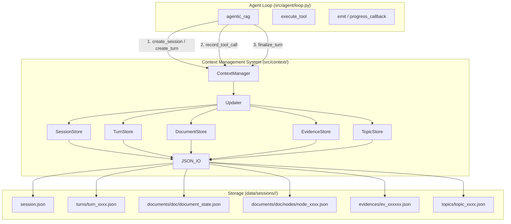
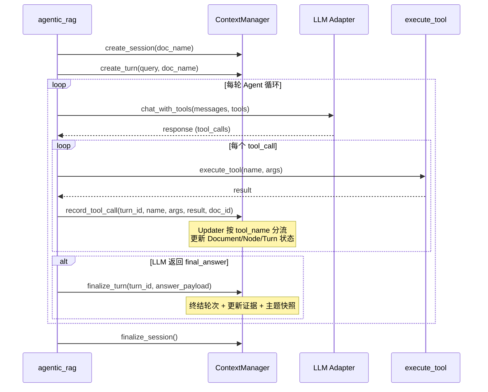
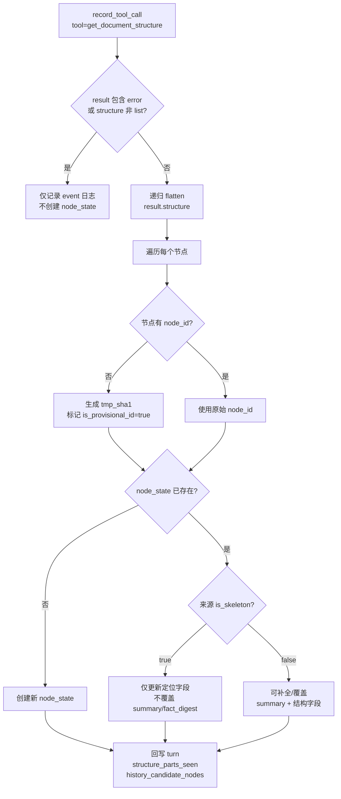

# 设计文档：Context Management System

## 概述（Overview）

本设计为现有 Agentic RAG 系统新增一个上下文管理子系统。该子系统以 **Sidecar 模式**运行，在 Agent 循环（`src/agent/loop.py::agentic_rag`）的关键接入点插入轻量回调，将多轮交互状态结构化持久化到 `data/sessions/<session_id>/` 目录下的 JSON 文件中。

核心设计原则：
- **最小侵入**：Agent 循环仅新增 3 个调用点（turn 开始、tool_call 执行后、final_answer 前），不改变现有控制流和返回值
- **单一数据源契约**：node_state 的唯一增量来源是 `get_document_structure` 的 tool result，不主动扫描 chunks 目录，避免双源漂移
- **原子写入**：所有 JSON 文件通过 tmp + fsync + os.replace 原子写入，中断不损坏已有数据
- **容错降级**：Context_Manager 任何操作异常仅记录日志，不影响主流程答案生成

### 设计决策

| 决策 | 选项 | 选择 | 理由 |
|------|------|------|------|
| 接入方式 | 装饰器 / 回调 / 直接调用 | 直接调用 | Agent 循环已有 emit 模式，直接在 emit 附近插入 Context_Manager 调用最简单 |
| 存储格式 | SQLite / JSON 文件 | JSON 文件 | 与现有 `logs/sessions/` 一致，便于手工检查和调试 |
| node_state 数据源 | 预扫描 chunks + tool result / 仅 tool result | 仅 tool result | 避免与 `data/out/chunks_3` 双源漂移 |
| skeleton 合并策略 | 覆盖 / 仅补全 | 分级合并 | is_skeleton=true 仅更新定位字段，is_skeleton=false 可覆盖，full > skeleton |
| 缺失 node_id 处理 | 跳过 / 生成临时键 | 生成 tmp_sha1 | 保证所有节点可追踪，标记 is_provisional_id=true |
| 并发模型 | 文件锁 / 单进程 | V1 单进程 | 当前系统单进程运行，不做文件锁 |

## 架构（Architecture）

### 系统架构图



### Agent 循环接入时序图



### 结构树数据源契约流程




## 组件与接口（Components and Interfaces）

### 模块结构

```
src/context/
├── __init__.py          # 导出 ContextManager
├── manager.py           # ContextManager 高层接口
├── updater.py           # Updater 事件映射器
├── stores/
│   ├── __init__.py
│   ├── session_store.py # SessionStore
│   ├── turn_store.py    # TurnStore
│   ├── document_store.py# DocumentStore（含 node_state 管理）
│   ├── evidence_store.py# EvidenceStore
│   └── topic_store.py   # TopicStore
├── json_io.py           # 原子 JSON 读写
└── id_gen.py            # ID 生成工具
```

### ContextManager（高层接口）

```python
class ContextManager:
    """上下文管理器 — 对外暴露的唯一高层接口。"""

    def __init__(self, base_dir: str = "data/sessions"):
        ...

    def create_session(self, doc_name: str) -> str:
        """创建新会话，返回 session_id。"""
        ...

    def create_turn(self, user_query: str, doc_name: str) -> str:
        """创建新轮次，返回 turn_id。"""
        ...

    def record_tool_call(
        self,
        turn_id: str,
        tool_name: str,
        arguments: dict,
        result: dict,
        doc_id: str | None = None,
    ) -> None:
        """记录工具调用，分发到 Updater 进行状态更新。
        
        对于 get_document_structure：
        - 递归 flatten result.structure
        - 按 (doc_id, node_id) upsert node_state
        - 回写 turn 的 retrieval_trace
        
        对于 get_page_content：
        - 更新 read_pages
        - 更新节点读取状态
        """
        ...

    def add_evidences(
        self, turn_id: str, doc_id: str, evidence_items: list[dict]
    ) -> list[str]:
        """添加证据条目，返回 evidence_ids 列表。"""
        ...

    def finalize_turn(self, turn_id: str, answer_payload: dict) -> None:
        """终结轮次，更新证据使用记录和主题快照。"""
        ...

    def finalize_session(self) -> None:
        """终结会话，将 status 更新为 completed。"""
        ...
```

### Updater（事件映射器）

```python
class Updater:
    """将工具调用事件映射为状态更新操作。"""

    def __init__(
        self,
        document_store: DocumentStore,
        turn_store: TurnStore,
        evidence_store: EvidenceStore,
        topic_store: TopicStore,
    ):
        ...

    def handle_tool_call(
        self,
        turn_id: str,
        tool_name: str,
        arguments: dict,
        result: dict,
        doc_id: str | None = None,
    ) -> None:
        """按 tool_name 分流处理。未知工具记录警告日志并跳过。"""
        ...

    def _handle_document_structure(
        self, turn_id: str, arguments: dict, result: dict, doc_id: str
    ) -> None:
        """处理 get_document_structure 结果。
        
        1. 校验 result 无 error 且 structure 为 list
        2. 递归 flatten structure
        3. 对每个节点执行 upsert（遵循 skeleton 合并规则）
        4. 回写 turn 的 retrieval_trace
        """
        ...

    def _handle_page_content(
        self, turn_id: str, arguments: dict, result: dict, doc_id: str
    ) -> None:
        """处理 get_page_content 结果。"""
        ...

    def handle_final_answer(self, turn_id: str, answer_payload: dict) -> None:
        """处理 final_answer 事件。"""
        ...
```

### JSON_IO（原子读写）

```python
class JSON_IO:
    """原子 JSON 读写工具。"""

    @staticmethod
    def save(path: Path, data: Any) -> None:
        """原子写入：tmp 文件 → fsync → os.replace。"""
        ...

    @staticmethod
    def load(path: Path) -> Any | None:
        """读取 JSON 文件，不存在返回 None。"""
        ...

    @staticmethod
    def append_to_list(path: Path, item: Any) -> None:
        """读取现有列表 → 追加 → 原子写回。"""
        ...
```

### DocumentStore（含节点状态管理）

```python
class DocumentStore:
    """文档状态存储，管理 document_state.json 和 nodes/ 子目录。"""

    def __init__(self, session_dir: Path):
        ...

    def update_visited_parts(self, doc_id: str, part: int) -> None:
        """追加已访问的 part 编号到 visited_parts。"""
        ...

    def update_read_pages(self, doc_id: str, pages: list[int]) -> None:
        """追加已读取的页码到 read_pages（去重）。"""
        ...

    def upsert_node(
        self, doc_id: str, node_data: dict, turn_id: str
    ) -> str:
        """创建或更新节点状态，遵循 skeleton 合并规则。
        
        返回实际使用的 node_id（可能是 tmp_sha1 生成的临时键）。
        """
        ...

    def flatten_structure(self, structure: list[dict], parent_path: str = "") -> list[dict]:
        """递归 flatten 结构树，返回扁平节点列表。"""
        ...

    @staticmethod
    def generate_provisional_id(
        doc_id: str, title: str, start: int, end: int, path: str
    ) -> str:
        """生成稳定临时键：tmp_sha1(doc_id|title|start|end|path)。"""
        ...
```

### Store 间交互

| 调用方 | 被调用方 | 场景 |
|--------|----------|------|
| Updater | DocumentStore | get_document_structure → 更新 visited_parts + upsert nodes |
| Updater | DocumentStore | get_page_content → 更新 read_pages + 节点读取状态 |
| Updater | TurnStore | 所有 tool_call → 追加 tool_calls 记录 + 更新 retrieval_trace |
| Updater | EvidenceStore | finalize_turn → 更新证据使用记录 |
| Updater | TopicStore | finalize_turn → 创建/更新主题快照 |
| ContextManager | SessionStore | create_session / finalize_session |
| ContextManager | TurnStore | create_turn |
| ContextManager | Updater | record_tool_call / finalize_turn |


## 数据模型（Data Models）

### session.json

```json
{
  "session_id": "sess_20250101_120000",
  "created_at": "2025-01-01T12:00:00Z",
  "doc_name": "FC-LS.pdf",
  "status": "active",
  "turns": ["turn_0001", "turn_0002"]
}
```

### turn_xxxx.json

```json
{
  "turn_id": "turn_0001",
  "user_query": "What is FC-LS?",
  "doc_name": "FC-LS.pdf",
  "started_at": "2025-01-01T12:00:01Z",
  "finished_at": null,
  "status": "active",
  "tool_calls": [
    {
      "tool_name": "get_document_structure",
      "arguments": {"doc_name": "FC-LS.pdf", "part": 1},
      "result_summary": "structure with 5 nodes",
      "timestamp": "2025-01-01T12:00:02Z"
    }
  ],
  "retrieval_trace": {
    "structure_parts_seen": [1, 2],
    "history_candidate_nodes": ["node_001", "node_002", "node_003"],
    "pages_read": [7, 8, 9]
  },
  "answer_payload": null
}
```

### document_state.json

```json
{
  "doc_name": "FC-LS.pdf",
  "visited_parts": [1, 2],
  "read_pages": [7, 8, 9, 10],
  "total_reads": 4
}
```

### node_xxxx.json

```json
{
  "node_id": "node_001",
  "title": "Chapter 1: Introduction",
  "start_index": 1,
  "end_index": 15,
  "summary": "Introduction to FC-LS protocol...",
  "parent_path": "",
  "status": "discovered",
  "read_count": 0,
  "is_skeleton_latest": false,
  "seen_in_parts": [1],
  "first_seen_turn_id": "turn_0001",
  "last_seen_turn_id": "turn_0001",
  "is_provisional_id": false,
  "fact_digest": null
}
```

字段说明：
- `is_skeleton_latest`: 最近一次更新来源是否为 skeleton 节点
- `seen_in_parts`: 该节点出现在哪些 part 中
- `first_seen_turn_id` / `last_seen_turn_id`: 首次/最近发现该节点的轮次
- `is_provisional_id`: 是否为系统生成的临时 ID（原始数据缺失 node_id）
- `status`: discovered → reading → read_complete 三态流转
- `fact_digest`: 从节点内容中提取的事实摘要（V2 扩展预留）

### node_state 合并规则

```
来源 is_skeleton=true:
  ├── 更新: title, start_index, end_index, parent_path, seen_in_parts, last_seen_turn_id
  ├── 保留: summary（如已有）, fact_digest（如已有）
  └── 设置: is_skeleton_latest = true

来源 is_skeleton=false:
  ├── 更新: title, start_index, end_index, parent_path, seen_in_parts, last_seen_turn_id
  ├── 覆盖: summary, fact_digest（即使已有值）
  └── 设置: is_skeleton_latest = false

冲突优先级: full node (is_skeleton=false) > skeleton (is_skeleton=true)
```

### ev_xxxxxx.json

```json
{
  "evidence_id": "ev_000001",
  "source_doc": "FC-LS.pdf",
  "source_page": 7,
  "content": "FC-LS defines the Fibre Channel...",
  "extracted_in_turn": "turn_0001",
  "used_in_turns": ["turn_0001", "turn_0003"]
}
```

### topic_xxxx.json

```json
{
  "topic_id": "topic_0001",
  "related_turn_ids": ["turn_0001", "turn_0002"],
  "related_node_ids": ["node_001", "node_003"],
  "core_evidence_ids": ["ev_000001"],
  "open_gaps": ["Missing details on error handling"]
}
```

### ID 生成规则

| 实体 | 格式 | 示例 |
|------|------|------|
| session_id | `sess_YYYYMMDD_HHMMSS` | `sess_20250101_120000` |
| turn_id | `turn_` + 4 位零填充递增 | `turn_0001` |
| evidence_id | `ev_` + 6 位零填充递增 | `ev_000001` |
| node_id | 复用结构树原始 node_id | `node_001` |
| provisional node_id | `tmp_` + sha1 前 12 位 | `tmp_a1b2c3d4e5f6` |
| topic_id | `topic_` + 4 位零填充递增 | `topic_0001` |

### 目录结构

```
data/sessions/<session_id>/
├── session.json
├── turns/
│   ├── turn_0001.json
│   └── turn_0002.json
├── documents/
│   └── FC-LS.pdf/
│       ├── document_state.json
│       └── nodes/
│           ├── node_001.json
│           └── node_002.json
├── evidences/
│   ├── ev_000001.json
│   └── ev_000002.json
└── topics/
    └── topic_0001.json
```

### Agent 循环接入点（对 loop.py 的修改）

在 `agentic_rag` 函数中新增 3 个接入点：

```python
# 接入点 1: 函数入口，创建会话和首轮
ctx = ContextManager()
session_id = ctx.create_session(doc_name)
turn_id = ctx.create_turn(query, doc_name)

# 接入点 2: execute_tool 返回后，emit tool_call 之后
try:
    ctx.record_tool_call(turn_id, tc.name, tc.arguments, result, doc_id=doc_name)
except Exception:
    logger.exception("Context manager record_tool_call failed")

# 接入点 3: final_answer 时，emit 之后，_save_session 之前
try:
    ctx.finalize_turn(turn_id, answer_payload)
    ctx.finalize_session()
except Exception:
    logger.exception("Context manager finalize failed")
```

现有 `_save_session` 新增 `context_session_id` 字段写入 `logs/sessions/` 日志，保持向后兼容。


## 正确性属性（Correctness Properties）

*正确性属性是在系统所有合法执行路径上都应成立的特征或行为——本质上是对系统应做什么的形式化陈述。属性是人类可读规格说明与机器可验证正确性保证之间的桥梁。*

### Property 1: JSON_IO 读写往返

*For any* 合法的 JSON 可序列化 Python 对象（包含非 ASCII 字符如中文），通过 JSON_IO.save 写入后再通过 JSON_IO.load 读取，应得到与原始对象相等的值。

**Validates: Requirements 1.1, 1.5**

### Property 2: JSON_IO 列表追加语义

*For any* 已存在的 JSON 列表文件和任意新条目，执行 JSON_IO.append_to_list 后，重新 load 的列表长度应比原列表大 1，且最后一个元素等于追加的条目。

**Validates: Requirements 1.4**

### Property 3: 会话创建完整性

*For any* doc_name，调用 create_session 后，session.json 应存在且包含 session_id、created_at、doc_name、status="active"、turns=[] 五个字段，且 session_id 匹配 `sess_YYYYMMDD_HHMMSS` 格式。

**Validates: Requirements 2.1, 2.2, 2.3, 12.1**

### Property 4: 轮次注册到会话

*For any* 会话和 N 次 create_turn 调用，session.json 的 turns 列表应包含 N 个 turn_id，且顺序与创建顺序一致。

**Validates: Requirements 2.4**

### Property 5: 会话与轮次终结状态

*For any* 已终结的会话，session.json 的 status 应为 "completed"。*For any* 已终结的轮次，turn_xxxx.json 的 status 应为 "completed"，且 finished_at 非空，answer_payload 非空。

**Validates: Requirements 2.5, 3.4**

### Property 6: 轮次创建完整性

*For any* user_query 和 doc_name，调用 create_turn 后，对应的 turn_xxxx.json 应存在且包含 turn_id、user_query、doc_name、started_at、tool_calls=[]、status="active" 字段，且 turn_id 匹配 `turn_XXXX` 四位零填充格式。

**Validates: Requirements 3.1, 3.2, 12.2**

### Property 7: 工具调用记录追加

*For any* 轮次和 K 次 record_tool_call 调用，该轮次的 tool_calls 列表应包含 K 条记录，每条包含 tool_name、arguments 和 result_summary，且顺序与调用顺序一致。

**Validates: Requirements 3.3**

### Property 8: 文档访问状态聚合

*For any* 文档和一系列 get_document_structure（parts P1..Pn）及 get_page_content（pages G1..Gm）调用，document_state.json 的 visited_parts 应包含 {P1..Pn} 的去重集合，read_pages 应包含 {G1..Gm} 的去重集合。

**Validates: Requirements 4.1, 4.2, 4.3**

### Property 9: 节点创建完整性

*For any* 结构树中的节点，首次通过 record_tool_call 处理后，对应的 node_xxxx.json 应存在且包含 node_id、title、start_index、end_index、status、read_count=0、is_skeleton_latest、seen_in_parts、first_seen_turn_id、last_seen_turn_id 字段。

**Validates: Requirements 5.1, 5.3, 5.7**

### Property 10: Skeleton 合并保护

*For any* 已存在且拥有非空 summary 的节点，当合并一个 is_skeleton=true 的来源节点时，合并后的 summary 和 fact_digest 应与合并前相同，而 title/start_index/end_index/seen_in_parts/last_seen_turn_id 应被更新。

**Validates: Requirements 5.5, 14.3**

### Property 11: Full Node 合并覆盖

*For any* 已存在的节点（无论之前由 skeleton 还是 full node 设置），当合并一个 is_skeleton=false 的来源节点时，合并后的 summary 应等于来源节点的 summary，is_skeleton_latest 应为 false。

**Validates: Requirements 5.6, 14.4**

### Property 12: 临时 ID 稳定性

*For any* 缺失 node_id 的节点，给定相同的 (doc_id, title, start_index, end_index, path)，generate_provisional_id 应始终返回相同的 `tmp_` 前缀字符串，且生成的 node_state 中 is_provisional_id=true。

**Validates: Requirements 5.8, 14.5**

### Property 13: 结构树递归展平

*For any* 嵌套结构树（含 children 递归），flatten_structure 应返回所有层级的节点，且返回的节点总数等于树中所有节点的总数（包括所有层级的 children）。

**Validates: Requirements 8.7, 14.2**

### Property 14: 错误结果不创建节点

*For any* 包含 error 字段的 result 或 structure 字段非 list 类型的 result，调用 record_tool_call 后，不应创建或更新任何 node_state 文件。

**Validates: Requirements 8.9, 14.6**

### Property 15: Retrieval Trace 回写

*For any* 成功处理的 get_document_structure 调用（part=P，包含节点 N1..Nk），处理后该 turn 的 retrieval_trace.structure_parts_seen 应包含 P，retrieval_trace.history_candidate_nodes 应包含 N1..Nk。

**Validates: Requirements 8.8, 14.7**

### Property 16: 证据创建与查询

*For any* 一组证据条目（各有不同的 source_doc 和 source_page），添加后按 source_doc 和 source_page 查询应返回且仅返回匹配的证据，evidence_id 匹配 `ev_XXXXXX` 六位零填充格式。

**Validates: Requirements 6.1, 6.2, 6.4, 12.3**

### Property 17: 证据跨轮次引用

*For any* 已有证据和 M 次跨轮次引用，该证据的 used_in_turns 列表应包含所有引用轮次的 turn_id。

**Validates: Requirements 6.3**

### Property 18: 未知工具容错

*For any* 未知的 tool_name，调用 Updater.handle_tool_call 不应抛出异常，且不应创建或修改任何状态文件。

**Validates: Requirements 9.4**

### Property 19: ID 格式一致性

*For any* 生成的 turn_id、evidence_id 和 node_id，它们应分别匹配 `turn_\d{4}`、`ev_\d{6}` 和原始 node_id（或 `tmp_[a-f0-9]{12}` 格式的临时 ID）。

**Validates: Requirements 12.2, 12.3, 12.4**

### Property 20: Agent 循环容错

*For any* Context_Manager 操作抛出异常的情况，agentic_rag 函数应仍然返回有效的 RAGResponse，且 progress_callback 事件序列与无 Context_Manager 时一致。

**Validates: Requirements 10.4, 10.5, 10.6**

### Property 21: 节点唯一数据源

*For any* 会话执行过程，node_state 文件仅在 record_tool_call 处理 get_document_structure 时被创建或更新，其他任何代码路径不应直接写入 node_state 文件。

**Validates: Requirements 14.1**


## 错误处理（Error Handling）

### 分层容错策略

```
Layer 1: JSON_IO（最底层）
├── 写入异常 → 清理临时文件 → 向上抛出
├── 读取文件不存在 → 返回 None
└── JSON 解析失败 → 向上抛出

Layer 2: Store 层
├── JSON_IO 异常 → 记录日志 → 向上抛出
├── 目录不存在 → 自动创建（makedirs）
└── 数据校验失败 → 记录警告 → 跳过该条目

Layer 3: Updater 层
├── 未知工具名称 → 记录警告 → 跳过（不抛出）
├── result 包含 error → 记录 event → 不创建 node_state
├── result.structure 非 list → 记录 event → 不创建 node_state
└── Store 异常 → 记录日志 → 向上抛出

Layer 4: ContextManager 层
├── Store/Updater 异常 → 记录日志 → 向上抛出
└── 会话目录创建失败 → 向上抛出

Layer 5: Agent 循环接入层（最顶层）
├── ContextManager 任何异常 → logger.exception → 继续执行
└── 确保主流程（LLM 调用、工具执行、答案生成）不受影响
```

### 关键错误场景

| 场景 | 处理方式 | 影响范围 |
|------|----------|----------|
| 磁盘空间不足导致写入失败 | JSON_IO 清理 tmp 文件，Layer 5 捕获并记录 | 上下文状态可能不完整，主流程不受影响 |
| get_document_structure 返回 error | Updater 记录 event，不创建 node_state | 该轮次的节点状态缺失，不影响后续轮次 |
| structure 中节点缺失 node_id | 生成 tmp_sha1 临时键，标记 is_provisional_id | 节点可追踪但 ID 非原始值 |
| session.json 被外部损坏 | JSON_IO.load 返回 None 或抛出解析异常 | ContextManager 可能需要重建会话状态 |
| 并发写入冲突（V2 场景） | V1 不处理，依赖单进程假设 | V2 需引入文件锁 |

### 日志规范

- `logger.info`: 会话/轮次创建、工具调用记录
- `logger.warning`: 未知工具名称、数据校验跳过、临时 ID 生成
- `logger.error`: Store 写入失败、JSON 解析失败
- `logger.exception`: Agent 循环中 ContextManager 异常（含完整 traceback）

## 测试策略（Testing Strategy）

### 双轨测试方法

本系统采用单元测试 + 属性测试（Property-Based Testing）双轨并行的测试策略：

- **单元测试**：验证具体示例、边界情况和错误条件
- **属性测试**：验证跨所有输入的通用属性

两者互补：单元测试捕获具体 bug，属性测试验证通用正确性。

### 属性测试配置

- **PBT 库**：[Hypothesis](https://hypothesis.readthedocs.io/)（Python 生态最成熟的 PBT 框架）
- **最小迭代次数**：每个属性测试至少 100 次迭代
- **标签格式**：每个测试用注释标注对应的设计属性
  - 格式：`# Feature: context-management-system, Property {number}: {property_text}`
- **每个正确性属性由一个属性测试实现**

### 测试文件结构

```
tests/context/
├── test_json_io.py          # Property 1, 2 + 边界用例
├── test_session_store.py    # Property 3, 4, 5
├── test_turn_store.py       # Property 6, 7
├── test_document_store.py   # Property 8, 9, 10, 11, 12, 13
├── test_evidence_store.py   # Property 16, 17
├── test_updater.py          # Property 14, 15, 18, 21
├── test_id_gen.py           # Property 19
├── test_context_manager.py  # Property 5, 20 (集成)
└── test_agent_integration.py# Property 20 (Agent 循环集成)
```

### 单元测试覆盖

| 测试文件 | 覆盖场景 |
|----------|----------|
| test_json_io.py | 文件不存在返回 None、写入异常清理 tmp、空列表 append |
| test_session_store.py | 目录自动创建、session_id 格式验证 |
| test_turn_store.py | 轮次编号递增、终结时间戳写入 |
| test_document_store.py | 节点状态三态流转、skeleton 合并边界、provisional ID 边界 |
| test_evidence_store.py | 证据编号递增、空查询结果 |
| test_updater.py | 未知工具跳过、error result 处理、空 structure 处理 |
| test_context_manager.py | 完整会话生命周期、多轮次场景 |
| test_agent_integration.py | ContextManager 异常不影响主流程、context_session_id 写入 |

### 属性测试与设计属性映射

| 属性编号 | 测试文件 | Hypothesis 策略 |
|----------|----------|-----------------|
| Property 1 | test_json_io.py | `st.dictionaries(st.text(), st.text(min_size=1))` 含中文字符 |
| Property 2 | test_json_io.py | `st.lists(st.integers())` + `st.integers()` |
| Property 3 | test_session_store.py | `st.text(min_size=1, max_size=50)` for doc_name |
| Property 4 | test_session_store.py | `st.integers(min_value=1, max_value=20)` for turn count |
| Property 5 | test_session_store.py | 会话 + 轮次终结序列 |
| Property 6 | test_turn_store.py | `st.text()` for query, `st.text(min_size=1)` for doc_name |
| Property 7 | test_turn_store.py | `st.lists(st.fixed_dictionaries({...}))` for tool calls |
| Property 8 | test_document_store.py | `st.lists(st.integers(1, 100))` for parts/pages |
| Property 9 | test_document_store.py | 随机生成结构树节点 |
| Property 10 | test_document_store.py | 随机 summary + skeleton 合并 |
| Property 11 | test_document_store.py | 随机 summary + full node 合并 |
| Property 12 | test_document_store.py | 随机 (doc_id, title, start, end, path) 组合 |
| Property 13 | test_document_store.py | 递归生成嵌套结构树 |
| Property 14 | test_updater.py | 随机 error result / 非 list structure |
| Property 15 | test_updater.py | 随机 part + 节点列表 |
| Property 16 | test_evidence_store.py | 随机证据条目列表 |
| Property 17 | test_evidence_store.py | 随机证据 + 多轮次引用 |
| Property 18 | test_updater.py | `st.text()` for unknown tool names |
| Property 19 | test_id_gen.py | 随机递增序列 |
| Property 20 | test_agent_integration.py | Mock ContextManager 抛出异常 |
| Property 21 | test_updater.py | 多种 tool_name 调用序列 |

### Hypothesis 自定义策略示例

```python
import hypothesis.strategies as st

# 生成随机结构树节点
node_strategy = st.fixed_dictionaries({
    "node_id": st.one_of(st.text(min_size=1, max_size=20), st.none()),
    "title": st.text(min_size=1, max_size=100),
    "start_index": st.integers(min_value=1, max_value=1000),
    "end_index": st.integers(min_value=1, max_value=1000),
    "summary": st.one_of(st.text(max_size=500), st.none()),
    "is_skeleton": st.booleans(),
})

# 生成嵌套结构树（递归）
def structure_tree(max_depth=3):
    if max_depth <= 0:
        return st.just([])
    return st.lists(
        st.fixed_dictionaries({
            **node_strategy.wrapped_strategy,
            "children": structure_tree(max_depth - 1),
        }),
        min_size=0, max_size=5,
    )

# 生成随机 tool result（含 error 场景）
tool_result_strategy = st.one_of(
    # 正常结果
    st.fixed_dictionaries({
        "structure": st.lists(node_strategy, min_size=1, max_size=10),
        "pagination": st.fixed_dictionaries({
            "current_part": st.integers(min_value=1, max_value=20),
            "total_parts": st.integers(min_value=1, max_value=20),
        }),
    }),
    # 错误结果
    st.fixed_dictionaries({
        "error": st.text(min_size=1),
    }),
)
```
