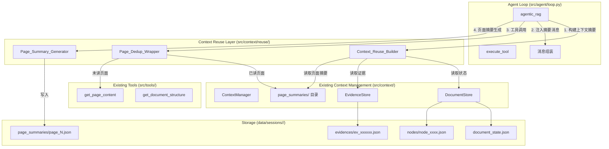
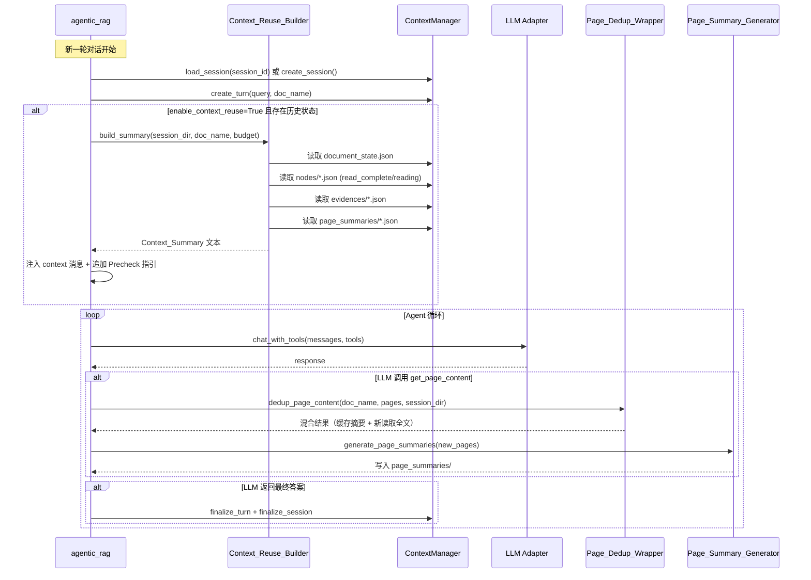
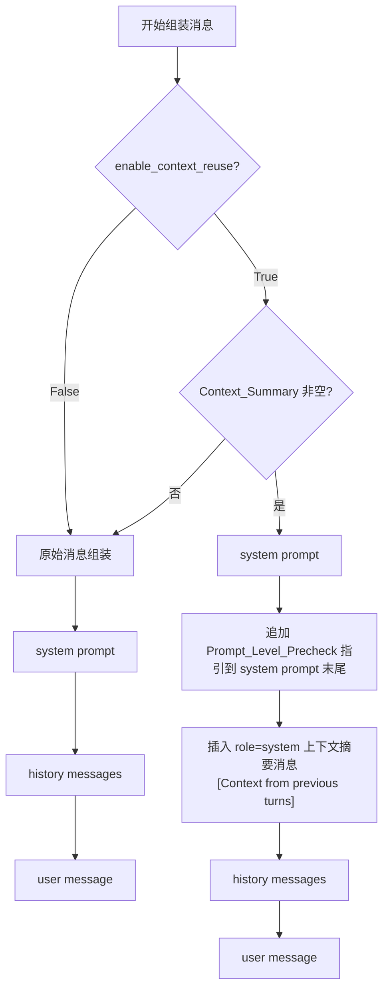

# 设计文档：上下文复用增强（Context Reuse Enhancement）

## 概述（Overview）

本设计为现有 Agentic RAG 系统新增上下文复用层。该层以 **Sidecar 模式**运行，在每轮新对话开始前从已有的 Context Management System 读取累积状态（已访问节点、已读页面、已提取证据），构建结构化的 Context_Summary 并注入 LLM 消息流，同时在 system prompt 中追加 Prompt_Level_Precheck 指引，使 LLM 能够复用之前的检索成果、避免重复读取已读页面。

核心设计原则：
- **只读消费**：Context_Reuse_Builder 仅读取 Context Management System 已有的持久化状态，不修改任何已有数据
- **Sidecar 容错**：上下文复用层的任何异常不影响主流程答案生成，失败时静默降级为无复用模式
- **规则方法生成 Page_Summary**：使用前段截断法（取前 N 个段落直到达到原文 50% 字符限制）生成页面摘要，不依赖额外 LLM 调用
- **纯 Prompt 工程预检**：Prompt_Level_Precheck 通过在 system prompt 末尾追加指引段落实现，不涉及独立代码模块
- **可配置**：所有功能通过函数参数和环境变量控制，支持完全关闭

### 术语约定：doc_name

本系统中 `doc_name` 为文档的唯一标识符（如 `"FC-LS.pdf"`），在所有接口和数据模型中统一使用 `doc_name`。不使用 `doc_id`。已有 Context Management System 中 DocumentStore 的参数名为 `doc_id`，在本功能的新增代码中统一映射为 `doc_name`，调用已有 Store 时传入 `doc_name` 作为 `doc_id` 参数值。

### Non-goals（不在本期范围内）

- **LLM 驱动的摘要生成**：Page_Summary 仅使用规则方法（前段截断），不调用 LLM 生成智能摘要。V2 可考虑
- **跨文档上下文复用**：本期仅支持同一文档内的上下文复用，不支持跨文档的知识迁移
- **并发会话写入**：V1 假设单进程单会话，不处理多进程并发写入同一会话目录的场景
- **Context_Summary 持久化**：Context_Summary 为运行时构建的临时对象，不持久化到磁盘。每次新轮次从源数据重新构建
- **Evidence 自动提取**：本功能不新增 Evidence 提取逻辑，仅复用已有 Evidence Store 中的数据
- **Token 精确计数**：预算单位为字符数而非 token 数，不引入 tokenizer 依赖
- **前端 UI 变更**：本期仅扩展 API 接口，不涉及前端 UI 修改

### 设计决策

| 决策 | 选项 | 选择 | 理由 |
|------|------|------|------|
| Context_Summary 预算单位 | token / 字符 | 字符 | 字符计数无需 tokenizer 依赖，实现简单，默认 4000 字符 |
| Page_Summary 生成方式 | LLM 摘要 / 规则方法 | 规则方法 | 避免额外 LLM 调用开销，前段截断法即可满足去重需求 |
| Prompt_Level_Precheck 实现 | 独立代码模块 / 纯 prompt 工程 | 纯 prompt 工程 | 在 system prompt 末尾追加指引段落，最小侵入 |
| Context_Summary 注入位置 | system prompt 内嵌 / 独立 system 消息 | 独立 system 消息 | 便于控制长度和开关，不污染原始 system prompt |
| 截断优先级 | 均匀截断 / 分级截断 | 分级截断 | Evidence（最新优先）> Page_Summary > Node_Summary，保留最有价值的信息 |
| 页面去重触发点 | Agent Loop 层 / Tool 层 | Tool 层包装 | 在 `get_page_content` 调用前拦截，对 LLM 透明 |
| 会话复用方式 | 自动检测 / 显式传入 session_id | 显式传入 | 通过 QARequest 的 `context_session_id` 字段，前端控制会话连续性 |


## 架构（Architecture）

### 系统架构图



### 上下文复用时序图



### 消息组装流程




## 组件与接口（Components and Interfaces）

### 模块结构

```
src/context/
├── __init__.py              # 导出 ContextManager（已有）
├── manager.py               # ContextManager（已有，需扩展）
├── updater.py               # Updater（已有）
├── json_io.py               # JSON_IO（已有）
├── id_gen.py                # ID 生成（已有）
├── stores/                  # 已有 Store 层
│   ├── document_store.py    # DocumentStore（已有）
│   ├── evidence_store.py    # EvidenceStore（已有）
│   ├── session_store.py     # SessionStore（已有）
│   ├── turn_store.py        # TurnStore（已有）
│   └── topic_store.py       # TopicStore（已有）
└── reuse/                   # 新增：上下文复用层
    ├── __init__.py           # 导出 ContextReuseBuilder, PageSummaryGenerator, PageDedupWrapper
    ├── builder.py            # Context_Reuse_Builder
    ├── page_summary.py       # Page_Summary_Generator
    └── dedup.py              # Page_Dedup_Wrapper
```

### Context_Reuse_Builder（上下文复用构建器）

```python
class ContextReuseBuilder:
    """从已有上下文状态构建 Context_Summary。
    
    只读消费 Context Management System 的持久化数据，
    不修改任何已有文件。
    """

    def __init__(self, session_dir: Path, summary_char_budget: int = 4000):
        """
        Parameters
        ----------
        session_dir: 会话目录路径
        summary_char_budget: 摘要文本最大字符数，默认 4000
        """
        ...

    def build_summary(self, doc_name: str) -> str:
        """构建 Context_Summary 的纯文本字符串（Markdown 格式）。
        
        返回包含三个 ## 区段的 Markdown 文本：
        - ## 已探索的文档结构（Node_Summary）
        - ## 已读页面摘要（Page_Summary）
        - ## 已提取的证据（Evidence）
        
        如果所有数据源均为空，返回空字符串。
        超出 summary_char_budget 时按优先级截断。
        """
        ...

    def build_summary_dict(self, doc_name: str) -> dict:
        """构建符合 Context_Summary Schema 的结构化字典。
        
        Returns
        -------
        dict: 符合 Context_Summary JSON Schema 的字典
        """
        ...

    def _read_document_state(self, doc_name: str) -> dict | None:
        """读取 document_state.json，失败返回 None 并记录警告。"""
        ...

    def _read_node_summaries(self, doc_name: str) -> list[dict]:
        """读取所有 read_complete/reading 状态的节点摘要。"""
        ...

    def _read_page_summaries(self, doc_name: str) -> list[dict]:
        """读取 page_summaries/ 目录下所有 Page_Summary 文件。"""
        ...

    def _read_evidences(self) -> list[dict]:
        """读取 evidences/ 目录下所有证据文件，按 extracted_in_turn 降序排序。"""
        ...

    def _truncate_to_budget(
        self, evidences: list[dict], page_summaries: list[dict],
        node_summaries: list[dict], doc_state: dict
    ) -> tuple[list[dict], list[dict], list[dict]]:
        """按优先级截断：Evidence > Page_Summary > Node_Summary。"""
        ...
```

### Page_Summary_Generator（页面摘要生成器）

```python
class PageSummaryGenerator:
    """规则方法生成 Page_Summary：前段截断法。
    
    取前 N 个段落直到达到原文 50% 字符限制，不依赖 LLM 调用。
    """

    @staticmethod
    def generate(page_num: int, doc_name: str, text: str, turn_id: str) -> dict:
        """为单个页面生成 Page_Summary。
        
        规则：取前 N 个段落直到达到原始文本 50% 字符限制。
        
        Returns
        -------
        dict: 符合 Page_Summary JSON Schema 的字典
        """
        ...

    @staticmethod
    def save(session_dir: Path, doc_name: str, summary: dict) -> None:
        """将 Page_Summary 写入 page_summaries/page_<N>.json。
        
        如果文件已存在（同一页面已有摘要），跳过不覆盖。
        """
        ...

    @staticmethod
    def load(session_dir: Path, doc_name: str, page_num: int) -> dict | None:
        """读取指定页面的 Page_Summary，不存在返回 None。"""
        ...

    @staticmethod
    def load_all(session_dir: Path, doc_name: str) -> list[dict]:
        """读取所有已生成的 Page_Summary。"""
        ...
```

### Page_Dedup_Wrapper（页面去重包装器）

```python
class PageDedupWrapper:
    """页面去重包装器 — 拦截 get_page_content 调用。
    
    对已读且有 Page_Summary 的页面返回摘要，
    对其余页面调用原始 get_page_content。
    """

    def __init__(self, session_dir: Path, doc_name: str, enable: bool = True):
        ...

    def get_page_content(self, doc_name: str, pages: str) -> dict:
        """去重版 get_page_content。
        
        1. 解析页码列表
        2. 查询 document_state.json 的 read_pages
        3. 对已读且有 Page_Summary 的页面：返回摘要（is_cached=True）
        4. 对其余页面：调用原始 get_page_content
        5. 合并结果，保持原始返回结构
        
        Returns
        -------
        dict: 与原始 get_page_content 相同的返回结构，
              每个页面条目额外包含 is_cached 布尔字段
        """
        ...
```

### Agent Loop 修改点

在 `agentic_rag` 函数中新增以下接入点：

```python
# 新增参数
async def agentic_rag(
    query: str,
    doc_name: str,
    # ... 已有参数 ...
    enable_context_reuse: bool = True,      # 新增
    context_session_id: str | None = None,  # 新增：复用已有会话
    summary_char_budget: int = 4000,        # 新增
    enable_page_dedup: bool = True,         # 新增
) -> RAGResponse:
    ...

# 接入点 1: 会话复用（在 ContextManager 初始化后）
if context_session_id and session_dir_exists(context_session_id):
    ctx.load_session(context_session_id)  # 加载已有会话
else:
    ctx.create_session(doc_name)          # 创建新会话

# 接入点 2: 上下文摘要构建与注入（在消息组装时）
if enable_context_reuse:
    try:
        builder = ContextReuseBuilder(session_dir, summary_char_budget)
        context_text = builder.build_summary(doc_name)
        if context_text:
            # 追加 Precheck 指引到 system prompt
            system_prompt += PRECHECK_GUIDANCE
            # 在 system prompt 后插入上下文摘要消息
            messages.insert(1, {"role": "system", "content": f"[Context from previous turns]\n{context_text}"})
    except Exception:
        logger.exception("Context reuse build failed")

# 接入点 3: 页面去重（在 execute_tool 中）
if enable_page_dedup and tc.name == "get_page_content":
    dedup = PageDedupWrapper(session_dir, doc_name)
    result = dedup.get_page_content(doc_name, tc.arguments["pages"])
else:
    result = execute_tool(tc.name, tc.arguments)

# 接入点 4: 页面摘要生成（在 record_tool_call 后）
if tc.name == "get_page_content" and "content" in result:
    try:
        for page_item in result["content"]:
            if not page_item.get("is_cached", False):
                summary = PageSummaryGenerator.generate(
                    page_item["page"], doc_name, page_item["text"], ctx_turn_id
                )
                PageSummaryGenerator.save(session_dir, doc_name, summary)
    except Exception:
        logger.exception("Page summary generation failed")
```

### ContextManager 扩展

```python
class ContextManager:
    # ... 已有方法 ...

    def load_session(self, session_id: str) -> str:
        """加载已有会话，恢复内部状态。
        
        读取 session.json，恢复 turn_seq 计数器，
        重新初始化所有 Store 和 Updater。
        
        Returns
        -------
        str: session_id
        """
        ...

    @property
    def session_dir(self) -> Path | None:
        """返回当前会话目录路径。"""
        return self._session_dir
```

### Web API 扩展

```python
class QARequest(BaseModel):
    # ... 已有字段 ...
    enable_context_reuse: bool = True           # 新增
    context_session_id: str | None = None       # 新增
```

响应中新增 `context_session_id` 字段：

```python
# /api/qa 和 /api/qa/stream 响应
{
    "ok": True,
    "doc_name": "...",
    "context_session_id": "sess_20250101_120000",  # 新增
    "response": { ... }
}
```


## 数据模型（Data Models）

### Context_Summary 结构化字典

```json
{
  "doc_name": "FC-LS.pdf",
  "explored_structure": {
    "visited_parts": [1, 2, 3],
    "nodes": [
      {
        "node_id": "node_001",
        "title": "Chapter 1: Introduction",
        "start_index": 1,
        "end_index": 15,
        "summary": "Introduction to FC-LS protocol...",
        "status": "read_complete"
      }
    ]
  },
  "read_pages": {
    "page_numbers": [7, 8, 9, 10, 15],
    "page_summaries": [
      {
        "page_num": 7,
        "summary_text": "本页介绍了 FC-LS 协议的基本概念..."
      }
    ]
  },
  "evidences": [
    {
      "evidence_id": "ev_000001",
      "source_page": 7,
      "content": "FC-LS defines the Fibre Channel...",
      "extracted_in_turn": "turn_0002"
    }
  ],
  "total_chars": 2850
}
```

### Context_Summary Markdown 序列化格式

```markdown
## 已探索的文档结构

已访问分块: 1, 2, 3

### node_001: Chapter 1: Introduction (pp.1-15) [read_complete]
Introduction to FC-LS protocol...

### node_003: Chapter 3: Login (pp.30-45) [reading]
Login procedure and state machine...

## 已读页面摘要

已读页码: 7, 8, 9, 10, 15

- **Page 7**: 本页介绍了 FC-LS 协议的基本概念...
- **Page 8**: 本页描述了 FC-LS 的帧格式...

## 已提取的证据

- [ev_000003, turn_0002, p.15] FC-LS Login Accept (LS_ACC) 包含...
- [ev_000001, turn_0001, p.7] FC-LS defines the Fibre Channel...

```

### Page_Summary JSON 文件

存储路径：`data/sessions/<session_id>/documents/<doc_name>/page_summaries/page_<N>.json`

```json
{
  "page_num": 7,
  "doc_name": "FC-LS.pdf",
  "summary_text": "本页介绍了 FC-LS 协议的基本概念，包括 Fibre Channel 链路服务的定义和分类。主要内容涵盖...",
  "original_length": 3200,
  "summary_length": 1500,
  "generated_at": "2025-01-01T12:00:05Z",
  "source_turn_id": "turn_0001"
}
```

### 目录结构扩展

在已有会话目录结构基础上新增 `page_summaries/` 子目录：

```
data/sessions/<session_id>/
├── session.json                          # 已有
├── turns/                                # 已有
├── documents/
│   └── FC-LS.pdf/
│       ├── document_state.json           # 已有
│       ├── nodes/                        # 已有
│       │   ├── node_001.json
│       │   └── node_002.json
│       └── page_summaries/               # 新增
│           ├── page_7.json
│           ├── page_8.json
│           └── page_9.json
├── evidences/                            # 已有
└── topics/                               # 已有
```

### 配置参数优先级

```
函数参数 > 环境变量 > 默认值

enable_context_reuse:
  函数参数 → CONTEXT_REUSE_ENABLED → True

summary_char_budget:
  函数参数 → CONTEXT_REUSE_CHAR_BUDGET → 4000

enable_page_dedup:
  函数参数 → CONTEXT_REUSE_PAGE_DEDUP → True
```

### Prompt_Level_Precheck 指引文本

追加到 system prompt 末尾的指引段落：

```
## Context Reuse Guidance

You have been provided with a "[Context from previous turns]" section above containing:
- Previously explored document structure and section summaries
- Summaries of pages already read in earlier turns
- Evidence fragments extracted from previous retrievals

Before calling any tools, evaluate whether the existing context already contains sufficient information to answer the current question:

1. If the evidence and page summaries above fully cover the question, generate your answer directly without calling any tools.
2. If the existing context only partially covers the question, only retrieve the missing parts (unread sections or pages). Do NOT re-read pages already listed in the context.
3. For pages listed in the "已读页面摘要" section, do NOT call get_page_content again unless you specifically need more detailed original content not captured in the summary.
```


## 正确性属性（Correctness Properties）

*正确性属性是在系统所有合法执行路径上都应成立的特征或行为——本质上是对系统应做什么的形式化陈述。属性是人类可读规格说明与机器可验证正确性保证之间的桥梁。*

### Property 1: 上下文摘要完整组装

*For any* 会话目录，其中包含任意数量的 read_complete/reading 状态节点、任意数量的证据文件和任意数量的 Page_Summary 文件，调用 `build_summary_dict` 应返回一个符合 Context_Summary Schema 的字典，其中：nodes 列表仅包含 status 为 read_complete 或 reading 的节点，evidences 列表包含所有证据条目，page_summaries 列表包含所有已生成的页面摘要，visited_parts 和 read_pages 与 document_state.json 一致。

**Validates: Requirements 1.1, 1.2, 1.3, 1.4, 1.5**

### Property 2: Context_Summary Markdown 序列化格式

*For any* 非空的 Context_Summary 数据，调用 `build_summary` 应返回包含三个 Markdown 区段标题（`## 已探索的文档结构`、`## 已读页面摘要`、`## 已提取的证据`）的文本字符串，且文本末尾包含 `total_chars` 的数值。

**Validates: Requirements 1.6, 9.1, 9.4**

### Property 3: 数据源失败容错

*For any* 会话目录，当 document_state.json、nodes 目录、evidences 目录或 page_summaries 目录中的任意一个读取失败时，`build_summary_dict` 应对失败的数据源返回空列表，其余数据源正常组装，不抛出异常。

**Validates: Requirements 1.7**

### Property 4: 消息注入结构正确性

*For any* 非空的 Context_Summary 文本，消息组装后的 messages 列表应满足：第一条消息为原始 system prompt（末尾包含 Precheck 指引文本），第二条消息为 role="system" 且 content 以 `[Context from previous turns]` 开头的上下文摘要消息，之后为 history messages 和 user message。

**Validates: Requirements 2.1, 2.2, 2.3, 5.1**

### Property 5: 空上下文保持原始行为

*For any* 空的 Context_Summary（首轮对话或构建失败）或 enable_context_reuse=False，消息组装后的 messages 列表应与原始逻辑一致：仅包含 system prompt（不含 Precheck 指引）、history messages 和 user message，不包含任何上下文摘要消息。

**Validates: Requirements 2.4, 6.2**

### Property 6: 摘要字符预算约束

*For any* Context_Summary 数据和任意正整数 summary_char_budget，`build_summary` 返回的文本字符数不应超过 summary_char_budget。当原始数据超出预算时，截断应按优先级保留：Evidence（按 extracted_in_turn 降序）> Page_Summary > Node_Summary。

**Validates: Requirements 2.5, 2.6, 8.4**

### Property 7: 页面去重正确性

*For any* 页码列表，其中部分页码存在于 read_pages 且有对应 Page_Summary，去重后的结果应满足：有 Page_Summary 的已读页面返回 is_cached=True 且 text 以 `[已读页面摘要]` 开头，其余页面返回 is_cached=False 且包含原始全文内容。结果保持原始 get_page_content 的返回结构（content 列表、next_steps、total_pages）。

**Validates: Requirements 3.1, 3.2, 3.3, 3.4, 3.6**

### Property 8: Page_Summary 生成约束

*For any* 非空的页面文本，生成的 Page_Summary 应满足：summary_text 字符数不超过原始文本字符数的 50%，且 Page_Summary 字典包含 page_num、doc_name、summary_text、original_length、summary_length、generated_at、source_turn_id 所有必需字段。

**Validates: Requirements 4.1, 4.2, 4.3**

### Property 9: Page_Summary 首次生成不可覆盖

*For any* 已存在 Page_Summary 的页面，再次调用 save 不应覆盖已有摘要，已有文件内容应保持不变。

**Validates: Requirements 4.6**

### Property 10: 配置优先级

*For any* 配置参数（enable_context_reuse、summary_char_budget、enable_page_dedup），当函数参数、环境变量和默认值同时存在时，最终生效的值应遵循优先级：函数参数 > 环境变量 > 默认值。

**Validates: Requirements 6.6, 6.7**

### Property 11: enable_page_dedup=False 直通原始工具

*For any* 页码请求，当 enable_page_dedup=False 时，所有页面应通过原始 get_page_content 获取，返回结果中所有页面的 is_cached 应为 False。

**Validates: Requirements 6.5**

### Property 12: Sidecar 容错

*For any* Context_Reuse_Builder 或 Page_Dedup_Wrapper 抛出的异常，Agent Loop 应捕获异常并继续执行：Builder 异常时使用空 Context_Summary（不注入、不追加 Precheck），Dedup 异常时回退到原始 get_page_content。所有容错场景应通过 progress_callback 发送 type="context_reuse_error" 事件。

**Validates: Requirements 7.1, 7.2, 7.3, 7.4**

### Property 13: 跨轮次累积状态

*For any* 包含 N 轮对话的会话（N > 1），第 N+1 轮开始时 `build_summary_dict` 返回的 Context_Summary 应反映前 N 轮所有累积的 visited_parts、read_pages、节点状态和证据，而非仅上一轮的状态。新轮次生成的 Page_Summary 应追加到已有的 page_summaries 目录中，不影响已有文件。

**Validates: Requirements 8.1, 8.2, 8.3**

### Property 14: Context_Summary 字典 JSON 往返

*For any* 合法的 Context_Summary 字典（由 `build_summary_dict` 生成），通过 JSON 序列化再反序列化应产生与原始字典相等的值。

**Validates: Requirements 9.3**

### Property 15: 会话复用加载

*For any* 已存在的 session_id，通过 `load_session(session_id)` 加载后，ContextManager 应恢复正确的内部状态（turn_seq 计数器、所有 Store 引用），后续 create_turn 应生成正确递增的 turn_id。

**Validates: Requirements 10.2, 10.5**


## 错误处理（Error Handling）

### 分层容错策略

```
Layer 1: Context Reuse 数据读取层
├── document_state.json 不存在或损坏 → 返回空 dict，记录 warning
├── nodes/ 目录不存在 → 返回空列表
├── evidences/ 目录不存在 → 返回空列表
├── page_summaries/ 目录不存在 → 返回空列表
└── 单个文件 JSON 解析失败 → 跳过该文件，记录 warning

Layer 2: Context_Reuse_Builder 层
├── 任意数据源读取失败 → 对该数据源返回空列表，其余正常组装
├── 序列化/截断异常 → 返回空字符串
└── 所有异常向上抛出（由 Layer 3 捕获）

Layer 3: Page_Summary_Generator 层
├── 文本为空 → 跳过，不生成摘要
├── 文件写入失败 → 记录 warning，不影响主流程
└── 已有摘要文件 → 跳过，不覆盖

Layer 4: Page_Dedup_Wrapper 层
├── Page_Summary 文件不存在 → 回退到原始 get_page_content
├── document_state.json 读取失败 → 回退到原始 get_page_content
└── 任何异常 → 回退到原始 get_page_content

Layer 5: Agent Loop 接入层（最顶层）
├── ContextReuseBuilder 异常 → logger.exception → 使用空 Context_Summary
├── PageDedupWrapper 异常 → logger.exception → 调用原始 get_page_content
├── PageSummaryGenerator 异常 → logger.exception → 跳过摘要生成
├── ContextManager.load_session 异常 → 创建新会话
└── 所有容错场景 → emit context_reuse_error 事件
```

### 关键错误场景

| 场景 | 处理方式 | 影响范围 |
|------|----------|----------|
| 会话目录不存在（context_session_id 无效） | 创建新会话，记录 warning | 无上下文复用，但主流程正常 |
| document_state.json 损坏 | Builder 返回空 visited_parts/read_pages | 上下文摘要缺少文档状态，不影响答案 |
| Page_Summary 文件写入失败（磁盘满） | 记录 warning，跳过 | 后续轮次该页面无法去重，需重新读取 |
| 所有数据源均读取失败 | Builder 返回空字符串 | 等同于首轮对话，无上下文复用 |
| summary_char_budget 设为极小值（如 10） | 截断后可能仅保留部分 Evidence | 上下文信息极少，但不报错 |
| 页面去重时原始 get_page_content 也失败 | 返回原始错误结果 | 与无去重时行为一致 |

### 日志规范

- `logger.info`: 上下文摘要构建成功（含 total_chars）、页面去重命中
- `logger.warning`: 数据源读取失败、Page_Summary 写入失败、无效 session_id
- `logger.exception`: Builder/Dedup/Generator 异常（含完整 traceback）


## 测试策略（Testing Strategy）

### 双轨测试方法

本功能采用单元测试 + 属性测试（Property-Based Testing）双轨并行的测试策略：

- **单元测试**：验证具体示例、边界情况和错误条件
- **属性测试**：验证跨所有输入的通用属性

两者互补：单元测试捕获具体 bug，属性测试验证通用正确性。

### 属性测试配置

- **PBT 库**：[Hypothesis](https://hypothesis.readthedocs.io/)（与现有测试一致）
- **最小迭代次数**：每个属性测试至少 100 次迭代
- **标签格式**：每个测试用注释标注对应的设计属性
  - 格式：`# Feature: context-reuse-enhancement, Property {number}: {property_text}`
- **每个正确性属性由一个属性测试实现**

### 测试文件结构

```
tests/context/reuse/
├── test_builder.py           # Property 1, 2, 3, 6, 13, 14
├── test_page_summary.py      # Property 8, 9
├── test_dedup.py             # Property 7, 11
├── test_config.py            # Property 10
├── test_message_assembly.py  # Property 4, 5
├── test_sidecar.py           # Property 12
└── test_session_reuse.py     # Property 15
```

### 单元测试覆盖

| 测试文件 | 覆盖场景 |
|----------|----------|
| test_builder.py | 空会话返回空字符串、单数据源场景、Markdown 格式验证、total_chars 准确性 |
| test_page_summary.py | 空文本跳过、超长文本截断、中文文本处理、已有文件不覆盖 |
| test_dedup.py | 全部已读、全部未读、混合场景、Page_Summary 缺失回退 |
| test_config.py | 默认值验证、环境变量读取、函数参数覆盖 |
| test_message_assembly.py | 首轮无注入、有上下文注入、Precheck 指引内容验证 |
| test_sidecar.py | Builder 异常捕获、Dedup 异常回退、Generator 异常跳过、error 事件发送 |
| test_session_reuse.py | 有效 session_id 加载、无效 session_id 创建新会话、turn_seq 恢复 |

### 属性测试与设计属性映射

| 属性编号 | 测试文件 | Hypothesis 策略 |
|----------|----------|-----------------|
| Property 1 | test_builder.py | 随机生成 node 文件（含各种 status）、evidence 文件、page_summary 文件 |
| Property 2 | test_builder.py | 随机生成非空 Context_Summary 数据，验证 Markdown 区段标题 |
| Property 3 | test_builder.py | 随机选择一个数据源目录使其不可读，验证其余正常 |
| Property 4 | test_message_assembly.py | 随机生成 context_text + history messages，验证消息列表结构 |
| Property 5 | test_message_assembly.py | 随机生成 history messages，验证无上下文时消息结构 |
| Property 6 | test_builder.py | 随机生成超出预算的数据，`st.integers(100, 10000)` for budget |
| Property 7 | test_dedup.py | 随机生成 read_pages + page_summaries + 请求页码列表 |
| Property 8 | test_page_summary.py | `st.text(min_size=1, max_size=10000)` for page text |
| Property 9 | test_page_summary.py | 随机生成 page_summary 后再次调用 save，验证不覆盖 |
| Property 10 | test_config.py | 随机生成函数参数 + 环境变量组合 |
| Property 11 | test_dedup.py | 随机页码请求 + enable_page_dedup=False |
| Property 12 | test_sidecar.py | Mock Builder/Dedup 抛出随机异常 |
| Property 13 | test_builder.py | 随机生成多轮次累积数据 |
| Property 14 | test_builder.py | 随机生成 Context_Summary dict，JSON 往返验证 |
| Property 15 | test_session_reuse.py | 随机生成已有会话（含 N 轮），验证 load 后状态恢复 |

### Hypothesis 自定义策略示例

```python
import hypothesis.strategies as st

# 生成随机 node 状态文件数据
node_state_strategy = st.fixed_dictionaries({
    "node_id": st.text(min_size=1, max_size=20, alphabet=st.characters(whitelist_categories=("L", "N"))),
    "title": st.text(min_size=1, max_size=100),
    "start_index": st.integers(min_value=1, max_value=500),
    "end_index": st.integers(min_value=1, max_value=500),
    "summary": st.one_of(st.text(min_size=1, max_size=200), st.none()),
    "status": st.sampled_from(["discovered", "reading", "read_complete"]),
})

# 生成随机 evidence 数据
evidence_strategy = st.fixed_dictionaries({
    "evidence_id": st.from_regex(r"ev_\d{6}", fullmatch=True),
    "source_doc": st.text(min_size=1, max_size=30),
    "source_page": st.integers(min_value=1, max_value=500),
    "content": st.text(min_size=1, max_size=500),
    "extracted_in_turn": st.from_regex(r"turn_\d{4}", fullmatch=True),
})

# 生成随机 page summary 数据
page_summary_strategy = st.fixed_dictionaries({
    "page_num": st.integers(min_value=1, max_value=500),
    "doc_name": st.text(min_size=1, max_size=30),
    "summary_text": st.text(min_size=1, max_size=500),
    "original_length": st.integers(min_value=100, max_value=10000),
    "summary_length": st.integers(min_value=10, max_value=5000),
    "generated_at": st.just("2025-01-01T12:00:00Z"),
    "source_turn_id": st.from_regex(r"turn_\d{4}", fullmatch=True),
})

# 生成随机配置参数组合
config_strategy = st.fixed_dictionaries({
    "func_param": st.one_of(st.just(None), st.booleans()),
    "env_var": st.one_of(st.just(None), st.sampled_from(["true", "false"])),
    "default": st.booleans(),
})
```
