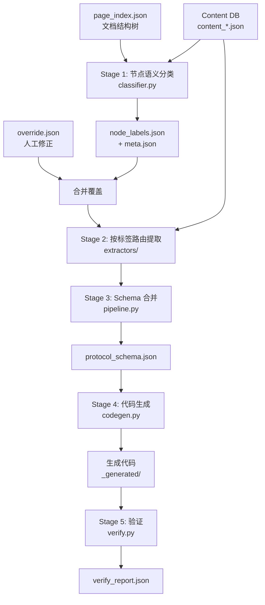
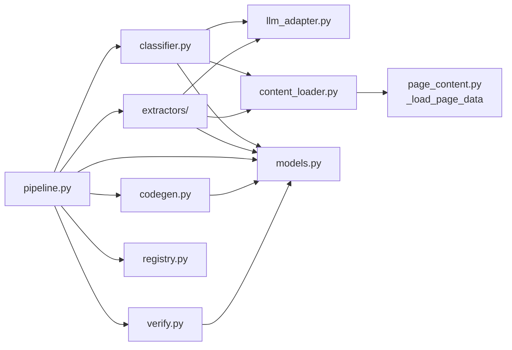

# 设计文档：协议提取 Pipeline（Protocol Extraction Pipeline）

## 概述

本设计描述一条五阶段协议提取流水线的技术方案。流水线以已有的文档结构树（page_index.json）和按页内容库（Content DB）为输入，经过**节点语义分类 → 结构化提取 → Schema 合并 → 代码生成 → 验证**五个阶段，最终输出可执行的协议实现代码及验证报告。

新模块位于 `src/extract/`，与现有 `src/agent/`、`src/ingest/` 平行。复用现有基础设施：
- `src/agent/llm_adapter.py`：LLM 调用（OpenAI / Anthropic）
- `src/tools/page_content.py`：页面内容加载逻辑
- `src/tools/registry.py`：文档注册与配置查询
- `src/models.py`：已定义的 Protocol* 和 NodeSemantic* 数据模型

目标协议：先用 BFD（RFC 5880，49 页，状态机明确）跑通全流程，再扩展到 FC-LS（210 页，帧格式为主）。

### 数据流总览



## 架构

### 目录结构

```
src/extract/
    __init__.py
    classifier.py           # Stage 1：节点语义分类 + 持久化 + 缓存
    content_loader.py       # 节点内容获取（从 Content DB 或 node.text）
    extractors/
        __init__.py
        base.py             # 提取器基类
        state_machine.py    # state_machine → ProtocolStateMachine
        message.py          # message_format → ProtocolMessage
        procedure.py        # procedure_rule → 处理步骤列表
        timer.py            # timer_rule → 定时器配置
        error.py            # error_handling → 错误处理规则
    pipeline.py             # 主流程编排（五阶段串联）
    codegen.py              # Stage 4：代码生成
    verify.py               # Stage 5：验证
```

### 模块依赖关系



### 阶段划分与职责

| 阶段 | 模块 | 输入 | 输出 | 说明 |
|------|------|------|------|------|
| Stage 1 | `classifier.py` | page_index 叶节点 + 节点文本 | `node_labels.json` + `meta.json` | LLM 分类，支持缓存和 override |
| Stage 2 | `extractors/*` | 分类结果 + 节点文本 | ProtocolStateMachine / ProtocolMessage / 规则列表 | 按标签路由到专用提取器 |
| Stage 3 | `pipeline.py` | 所有提取结果 | `protocol_schema.json` | 合并为 ProtocolSchema |
| Stage 4 | `codegen.py` | ProtocolSchema | Python 代码文件 | 状态机 + 解析器 + pretty printer |
| Stage 5 | `verify.py` | 生成代码 + ProtocolSchema | `verify_report.json` | 语法检查 + 自动测试 + 测试向量 |

## 组件与接口

### 1. content_loader.py — 节点内容获取

负责从 Content DB 或 node.text 中获取叶节点的原文内容。封装现有 `page_content.py` 的 `_load_page_data` 逻辑。

```python
def get_node_text(node: dict, content_dir: str) -> str | None:
    """获取叶节点的文本内容。
    
    Args:
        node: page_index 中的节点字典，包含 node_id, start_index, end_index,
              start_line, end_line, 可选 text 字段
        content_dir: Content DB 目录路径
    
    Returns:
        节点文本内容，获取失败返回 None
    
    逻辑：
    1. 若 node 有 text 字段且非空 → 直接返回
    2. 否则根据 start_index/end_index 从 content DB 加载页面
    3. 根据 start_line/end_line 切取行范围
    """
```

### 2. classifier.py — 节点语义分类器

```python
# 默认标签优先级
DEFAULT_LABEL_PRIORITY: list[str] = [
    "state_machine",
    "message_format",
    "timer_rule",
    "error_handling",
    "procedure_rule",
    "general_description",
]

PROMPT_VERSION: str = "v1.0"

async def classify_node(
    node_id: str,
    title: str,
    summary: str,
    text_snippet: str,
    label_priority: list[str],
    llm: LLMAdapter,
) -> NodeSemanticLabel:
    """对单个叶节点进行语义分类。
    
    通过 LLM 调用完成分类，prompt 包含六类标签定义、优先级规则、
    procedure_rule 排他规则。返回 NodeSemanticLabel。
    """

async def classify_all_nodes(
    nodes: list[dict],
    content_dir: str,
    llm: LLMAdapter,
    label_priority: list[str] = DEFAULT_LABEL_PRIORITY,
) -> dict[str, NodeSemanticLabel]:
    """对所有叶节点执行分类。
    
    逐节点调用 classify_node，单节点失败时记录错误并跳过。
    返回 {node_id: NodeSemanticLabel} 字典。
    """

def load_or_classify(
    doc_stem: str,
    nodes: list[dict],
    content_dir: str,
    llm: LLMAdapter,
    label_priority: list[str] = DEFAULT_LABEL_PRIORITY,
) -> dict[str, NodeSemanticLabel]:
    """带缓存的分类入口。
    
    1. 检查 node_labels.json + meta.json 是否存在
    2. 比较 model_name, prompt_version, label_priority
    3. 缓存有效 → 加载缓存；否则 → 重新分类并保存
    4. 加载 override.json 并合并覆盖
    """

def save_labels(labels: dict[str, NodeSemanticLabel], path: str) -> None:
    """将分类结果持久化为 JSON。"""

def save_meta(path: str, meta: NodeLabelMeta) -> None:
    """将分类元信息持久化为 JSON。"""

def load_labels(path: str) -> dict[str, NodeSemanticLabel]:
    """从 JSON 加载分类结果。"""

def load_meta(path: str) -> NodeLabelMeta:
    """从 JSON 加载分类元信息。"""

def apply_overrides(
    labels: dict[str, NodeSemanticLabel],
    override_path: str,
) -> dict[str, NodeSemanticLabel]:
    """将 override.json 中的条目合并覆盖到分类结果。
    
    override 中 node_id 不存在于 labels 时记录警告并跳过。
    """
```

### 3. extractors/ — 专用提取器

#### 基类

```python
# extractors/base.py
from abc import ABC, abstractmethod

class BaseExtractor(ABC):
    """提取器基类。"""
    
    def __init__(self, llm: LLMAdapter):
        self.llm = llm
    
    @abstractmethod
    async def extract(self, node_id: str, text: str, title: str) -> dict:
        """从节点文本中提取结构化信息。
        
        Args:
            node_id: 节点 ID
            text: 节点原文内容
            title: 节点标题
        
        Returns:
            提取结果字典，具体结构由子类定义
        """
```

#### StateMachineExtractor

```python
# extractors/state_machine.py
class StateMachineExtractor(BaseExtractor):
    
    async def extract(self, node_id: str, text: str, title: str) -> ProtocolStateMachine:
        """从 state_machine 节点提取状态机模型。
        
        通过 LLM 调用提取：
        - states: ProtocolState 列表（name, description, is_initial, is_final）
        - transitions: ProtocolTransition 列表（from_state, to_state, event, condition, actions）
        
        返回 ProtocolStateMachine，提取失败返回空对象并记录警告。
        """
```

#### MessageExtractor

```python
# extractors/message.py
class MessageExtractor(BaseExtractor):
    
    async def extract(self, node_id: str, text: str, title: str) -> ProtocolMessage:
        """从 message_format 节点提取报文结构。
        
        通过 LLM 调用提取：
        - fields: ProtocolField 列表（name, type, size_bits, description）
        
        优先从表格中提取字段信息。
        返回 ProtocolMessage，提取失败返回空对象并记录警告。
        """
```

#### 辅助提取器

```python
# extractors/procedure.py
class ProcedureExtractor(BaseExtractor):
    async def extract(self, node_id: str, text: str, title: str) -> dict:
        """提取处理步骤列表，每个步骤包含 condition 和 action。"""

# extractors/timer.py
class TimerExtractor(BaseExtractor):
    async def extract(self, node_id: str, text: str, title: str) -> dict:
        """提取定时器配置：timer_name, timeout_value, trigger_action。"""

# extractors/error.py
class ErrorExtractor(BaseExtractor):
    async def extract(self, node_id: str, text: str, title: str) -> dict:
        """提取错误处理规则：error_condition, handling_action。"""
```

### 4. pipeline.py — 主流程编排

```python
from enum import Enum

class PipelineStage(Enum):
    CLASSIFY = "classify"
    EXTRACT = "extract"
    MERGE = "merge"
    CODEGEN = "codegen"
    VERIFY = "verify"

@dataclass
class StageResult:
    stage: PipelineStage
    success: bool
    duration_sec: float
    node_count: int = 0
    error: str | None = None
    data: Any = None

async def run_pipeline(
    doc_name: str,
    stages: list[PipelineStage] | None = None,
    label_priority: list[str] | None = None,
) -> list[StageResult]:
    """运行提取流水线。
    
    Args:
        doc_name: 文档名称（如 "rfc5880-BFD.pdf"）
        stages: 要执行的阶段列表，None 表示全部五个阶段
        label_priority: 自定义标签优先级，None 使用默认
    
    Returns:
        各阶段执行结果列表
    
    流程：
    1. 从 registry 获取文档配置（chunks_dir, content_dir）
    2. 加载 page_index.json，提取所有叶节点
    3. 按 stages 顺序执行各阶段
    4. 任一阶段失败 → 记录错误，停止后续阶段，返回已完成结果
    5. 每阶段完成后记录耗时和处理节点数
    """

def _collect_leaf_nodes(page_index: dict) -> list[dict]:
    """递归遍历文档树，收集所有 is_skeleton=false 的叶节点。"""

def _route_to_extractor(label: NodeLabelType) -> BaseExtractor | None:
    """根据标签类型返回对应的提取器实例。
    
    general_description → 返回 None（跳过）
    """

def _merge_to_schema(
    doc_stem: str,
    source_document: str,
    state_machines: list[ProtocolStateMachine],
    messages: list[ProtocolMessage],
    procedures: list[ProcedureRule],
    timers: list[TimerConfig],
    errors: list[ErrorRule],
) -> ProtocolSchema:
    """将所有提取结果合并为 ProtocolSchema。
    
    辅助规则（procedures, timers, errors）直接写入 ProtocolSchema 的对应字段，
    不塞进 constants。
    """
```

### 5. codegen.py — 代码生成

```python
def generate_code(schema: ProtocolSchema, output_dir: str) -> list[str]:
    """从 ProtocolSchema 生成 Python 代码。
    
    Args:
        schema: 协议结构化表示
        output_dir: 输出目录（data/out/{doc_stem}_generated/）
    
    Returns:
        生成的文件路径列表
    
    生成内容：
    1. 每个 ProtocolStateMachine → 状态枚举 + 转移函数 + 事件处理
    2. 每个 ProtocolMessage → 解析器（parser）+ 编码器（encoder）+ pretty printer
    """

def _generate_state_machine(sm: ProtocolStateMachine) -> str:
    """生成单个状态机的 Python 代码。"""

def _generate_message_parser(msg: ProtocolMessage) -> str:
    """生成单个报文的解析器 + 编码器 + pretty printer 代码。"""
```

### 6. verify.py — 验证

```python
@dataclass
class VerifyReport:
    syntax_ok: bool
    syntax_errors: list[dict]       # [{file, line, error}]
    test_results: list[dict]        # [{test_name, passed, error}]
    test_vectors_used: int
    coverage_summary: str
    
def verify_generated_code(
    generated_dir: str,
    schema: ProtocolSchema,
    doc_name: str,
) -> VerifyReport:
    """验证生成的代码。
    
    1. 语法检查：ast.parse() 每个 .py 文件
    2. 自动生成测试：状态转移路径 + 字段解析
    3. 测试向量验证（如有）
    4. 输出 verify_report.json
    """

def _check_syntax(file_path: str) -> list[dict]:
    """用 ast.parse 检查 Python 语法。"""

def _generate_tests(schema: ProtocolSchema) -> str:
    """自动生成单元测试代码。"""

def _run_tests(test_file: str) -> list[dict]:
    """执行测试并收集结果。"""
```

## 数据模型

### 已存在模型（src/models.py，Phase 4 预留）

以下模型已在 `src/models.py` 中作为 Phase 4 扩展预留定义，直接复用：

```python
class ProtocolState(BaseModel):
    name: str
    description: str = ""
    is_initial: bool = False
    is_final: bool = False

class ProtocolTransition(BaseModel):
    from_state: str
    to_state: str
    event: str
    condition: str = ""
    actions: list[str] = []

class ProtocolStateMachine(BaseModel):
    name: str
    states: list[ProtocolState] = []
    transitions: list[ProtocolTransition] = []
    source_pages: list[int] = []

class ProtocolField(BaseModel):
    name: str
    type: str = ""
    size_bits: int | None = None
    description: str = ""

class ProtocolMessage(BaseModel):
    name: str
    fields: list[ProtocolField] = []
    source_pages: list[int] = []
```

### 本次新增模型

以下模型需要新增到 `src/models.py`：

```python
# ── 节点语义分类模型 ──────────────────────────────────────

NodeLabelType = Literal[
    "state_machine", "message_format", "procedure_rule",
    "timer_rule", "error_handling", "general_description",
]

class NodeSemanticLabel(BaseModel):
    """单个文档树叶节点的语义分类结果。"""
    node_id: str
    label: NodeLabelType
    confidence: float = Field(default=1.0, ge=0.0, le=1.0)
    rationale: str = ""          # 模型层允许空串；Classifier 输出时保证非空
    secondary_hints: list[str] = Field(default_factory=list)

class NodeLabelMeta(BaseModel):
    """分类运行记录 — 用于判断缓存是否失效。"""
    source_document: str
    model_name: str
    prompt_version: str
    label_priority: list[str]
    created_at: str

# ── 辅助提取结果模型 ──────────────────────────────────────

class ProcedureStep(BaseModel):
    """处理流程中的单个步骤。"""
    step_number: int
    condition: str = ""
    action: str

class ProcedureRule(BaseModel):
    """从 procedure_rule 节点提取的处理规则。"""
    name: str
    steps: list[ProcedureStep] = []
    source_pages: list[int] = []

class TimerConfig(BaseModel):
    """从 timer_rule 节点提取的定时器配置。"""
    timer_name: str
    timeout_value: str = ""
    trigger_action: str = ""
    description: str = ""
    source_pages: list[int] = []

class ErrorRule(BaseModel):
    """从 error_handling 节点提取的错误处理规则。"""
    error_condition: str
    handling_action: str
    description: str = ""
    source_pages: list[int] = []
```

### ProtocolSchema 扩展

现有 `ProtocolSchema` 需要扩展以接纳辅助提取结果，否则 Stage 2 提取出的 ProcedureRule、TimerConfig、ErrorRule 在 Stage 3 合并时没有正式字段承接：

```python
class ProtocolSchema(BaseModel):
    """协议的结构化表示 — 代码生成的输入。"""
    protocol_name: str
    state_machines: list[ProtocolStateMachine] = []
    messages: list[ProtocolMessage] = []
    procedures: list[ProcedureRule] = []      # 新增
    timers: list[TimerConfig] = []            # 新增
    errors: list[ErrorRule] = []              # 新增
    constants: dict = {}
    source_document: str = ""
```

### 持久化文件格式

| 文件 | 路径 | 格式 |
|------|------|------|
| 分类结果 | `data/out/{doc_stem}_node_labels.json` | `{node_id: NodeSemanticLabel.model_dump()}` |
| 分类元信息 | `data/out/{doc_stem}_node_labels.meta.json` | `NodeLabelMeta.model_dump()` |
| 人工修正 | `data/out/{doc_stem}_node_labels.override.json` | `{node_id: {label, rationale}}` |
| 提取结果 | `data/out/{doc_stem}_protocol_schema.json` | `ProtocolSchema.model_dump_json()` |
| 生成代码 | `data/out/{doc_stem}_generated/*.py` | Python 源文件 |
| 验证报告 | `data/out/{doc_stem}_verify_report.json` | `VerifyReport` JSON |


## 正确性属性（Correctness Properties）

*正确性属性是指在系统所有有效执行中都应成立的特征或行为——本质上是对系统应做什么的形式化陈述。属性是人类可读规范与机器可验证正确性保证之间的桥梁。*

### Property 1: 分类完整性

*For any* 有效的 page_index 文档树和其中的叶节点集合（is_skeleton=false），分类器执行后应为每个叶节点生成恰好一个 NodeSemanticLabel，即输出字典的键集合应等于输入叶节点的 node_id 集合（排除因错误跳过的节点）。

**Validates: Requirements 1.1**

### Property 2: NodeSemanticLabel 有效性不变量

*For any* 由分类器生成的 NodeSemanticLabel 对象，其 label 字段必须是六类有效标签之一（state_machine、message_format、procedure_rule、timer_rule、error_handling、general_description），confidence 必须在 [0.0, 1.0] 范围内。注意：rationale 在模型层允许空串（默认值 `""`），但 Classifier 的输出约束要求 rationale 为非空字符串——即分类器在构造 NodeSemanticLabel 时必须填入非空理由。

**Validates: Requirements 1.2, 1.5**

### Property 3: 优先级冲突消解

*For any* 标签优先级列表和一组候选标签，优先级选择函数应返回候选标签中在优先级列表中排位最靠前的标签。若候选标签集合为空，应返回 general_description。

**Validates: Requirements 1.3**

### Property 4: 分类数据序列化 Round-Trip

*For any* 有效的 `dict[str, NodeSemanticLabel]` 分类结果和有效的 `NodeLabelMeta` 对象，序列化为 JSON 文件后再反序列化应产生与原始对象等价的结果。

**Validates: Requirements 2.1, 2.2**

### Property 5: 缓存有效性判断

*For any* 两个 NodeLabelMeta 对象 A（缓存）和 B（当前），缓存有效当且仅当 A.model_name == B.model_name 且 A.prompt_version == B.prompt_version 且 A.label_priority == B.label_priority。三者中任一不同则缓存无效。

**Validates: Requirements 2.3, 2.4**

### Property 6: Override 合并正确性

*For any* 分类结果字典和 override 字典，合并后：(a) override 中存在于分类结果中的 node_id，其 label 应被替换为 override 指定的值；(b) override 中不存在于分类结果中的 node_id 应被忽略；(c) 分类结果中未被 override 覆盖的条目应保持不变。

**Validates: Requirements 3.1, 3.3**

### Property 7: 节点内容获取正确性

*For any* 叶节点，若该节点包含非空 text 字段，则 get_node_text 应直接返回该 text 内容而不访问 Content DB；若该节点无 text 字段，则 get_node_text 应根据 start_index/end_index 加载页面并根据 start_line/end_line 切取对应行范围的文本。

**Validates: Requirements 5.1, 5.2**

### Property 8: 提取器路由正确性

*For any* NodeLabelType 值，路由函数对 state_machine 应返回 StateMachineExtractor，对 message_format 应返回 MessageExtractor，对 procedure_rule 应返回 ProcedureExtractor，对 timer_rule 应返回 TimerExtractor，对 error_handling 应返回 ErrorExtractor，对 general_description 应返回 None（跳过提取）。

**Validates: Requirements 8.4**

### Property 9: Schema 合并完整性

*For any* 提取阶段产生的 ProtocolStateMachine 列表、ProtocolMessage 列表、ProcedureRule 列表、TimerConfig 列表和 ErrorRule 列表，合并后的 ProtocolSchema 的 state_machines 应包含所有输入的状态机对象，messages 应包含所有输入的报文对象，procedures 应包含所有输入的处理规则，timers 应包含所有输入的定时器配置，errors 应包含所有输入的错误处理规则，且 protocol_name 和 source_document 字段应非空。

**Validates: Requirements 9.1, 9.2, 9.4**

### Property 10: ProtocolSchema 序列化 Round-Trip

*For any* 有效的 ProtocolSchema 对象，使用 model_dump_json() 序列化为 JSON 字符串后再使用 model_validate_json() 反序列化，应产生与原始对象等价的 ProtocolSchema。

**Validates: Requirements 10.2**

### Property 11: 生成代码语法有效性

*For any* 包含至少一个 ProtocolStateMachine 或 ProtocolMessage 的有效 ProtocolSchema，代码生成器产生的每个 Python 文件都应能被 `ast.parse()` 成功解析而不抛出 SyntaxError。

**Validates: Requirements 11.1, 11.2, 11.3, 11.5, 12.1**

### Property 12: 报文解析/格式化 Round-Trip

*For any* 有效的 ProtocolMessage 定义和符合该定义的原始字节序列，解析（parse）后再格式化输出（pretty print）再解析，应产生与首次解析结果等价的对象。

**Validates: Requirements 11.6**

### Property 13: Pipeline 阶段控制

*For any* 阶段子集配置，Pipeline 应仅执行指定的阶段；当某阶段失败时，后续阶段不应执行，且返回结果应包含所有已执行阶段（含失败阶段）的 StageResult。

**Validates: Requirements 13.2, 13.3**

### Property 14: 故障隔离

*For any* 包含 N 个叶节点的文档树，若其中 K 个节点处理失败（分类或提取），Pipeline 应成功处理剩余 N-K 个节点，且最终汇总报告中 success_count + failure_count == N。

**Validates: Requirements 14.1, 14.2, 14.3**

## 错误处理

### 错误分类与处理策略

| 错误类型 | 触发场景 | 处理方式 |
|---------|---------|---------|
| LLM 调用失败 | 网络超时、API 错误、返回格式异常 | 记录 node_id + 错误信息，跳过该节点，继续处理 |
| Content DB 缺失 | 对应页面的 content JSON 文件不存在 | 记录错误日志，跳过该节点 |
| JSON 解析失败 | 缓存文件损坏、LLM 返回非法 JSON | 丢弃缓存重新分类 / 跳过该节点 |
| Override 文件格式错误 | override.json 格式不合法 | 记录警告，忽略整个 override 文件 |
| Override node_id 不存在 | override 中的 node_id 在分类结果中不存在 | 记录警告，忽略该条目 |
| 代码生成失败 | 模板渲染错误 | 记录错误，跳过该组件的代码生成 |
| 语法检查失败 | 生成代码有语法错误 | 在验证报告中标记错误位置和信息 |
| 阶段级失败 | 某阶段整体失败（如无法加载 page_index） | 停止后续阶段，返回已完成阶段的部分结果 |

### 错误传播规则

1. **节点级错误**：隔离到单个节点，不影响其他节点处理。分类和提取阶段均采用 try/except 包裹单节点处理逻辑。
2. **阶段级错误**：停止后续阶段执行。Pipeline 在每个阶段完成后检查是否有致命错误（如 page_index 加载失败、所有节点均失败）。
3. **汇总报告**：Pipeline 执行完成后，在日志中输出成功/失败节点数量和失败节点的 node_id 列表。

### 日志规范

```python
import logging
logger = logging.getLogger("extract")

# 节点级错误
logger.warning("Node %s classification failed: %s", node_id, error_msg)

# 阶段级信息
logger.info("Stage %s completed: %d nodes in %.2fs", stage_name, node_count, duration)

# 汇总
logger.info("Pipeline summary: %d succeeded, %d failed. Failed nodes: %s",
            success_count, fail_count, failed_node_ids)
```

## 测试策略

### 双轨测试方法

本特性采用**单元测试 + 属性测试**双轨并行的测试策略：

- **单元测试（pytest）**：验证具体示例、边界条件、错误处理路径
- **属性测试（hypothesis）**：验证跨所有输入的通用属性，每个属性至少运行 100 次迭代

两者互补：单元测试捕获具体 bug，属性测试验证通用正确性。

### 属性测试库

使用 Python 的 **Hypothesis** 库进行属性测试。项目中已有 `.hypothesis/` 目录，说明 Hypothesis 已在使用中。

### 属性测试配置

- 每个属性测试至少 100 次迭代：`@settings(max_examples=100)`
- 每个测试用注释标注对应的设计属性：`# Feature: protocol-extraction-pipeline, Property N: {title}`

### 测试文件结构

```
tests/extract/
    __init__.py
    test_classifier.py          # 分类器单元测试 + 属性测试
    test_content_loader.py      # 内容加载器测试
    test_extractors.py          # 提取器单元测试
    test_pipeline.py            # Pipeline 编排测试
    test_codegen.py             # 代码生成测试
    test_verify.py              # 验证模块测试
    test_schema_roundtrip.py    # 序列化 round-trip 属性测试
```

### 属性测试与设计属性的映射

| 设计属性 | 测试文件 | 测试类型 |
|---------|---------|---------|
| Property 1: 分类完整性 | test_classifier.py | 属性测试 |
| Property 2: NodeSemanticLabel 有效性 | test_classifier.py | 属性测试 |
| Property 3: 优先级冲突消解 | test_classifier.py | 属性测试 |
| Property 4: 分类数据 Round-Trip | test_schema_roundtrip.py | 属性测试 |
| Property 5: 缓存有效性 | test_classifier.py | 属性测试 |
| Property 6: Override 合并 | test_classifier.py | 属性测试 |
| Property 7: 节点内容获取 | test_content_loader.py | 属性测试 |
| Property 8: 提取器路由 | test_pipeline.py | 属性测试 |
| Property 9: Schema 合并完整性 | test_pipeline.py | 属性测试 |
| Property 10: ProtocolSchema Round-Trip | test_schema_roundtrip.py | 属性测试 |
| Property 11: 生成代码语法有效性 | test_codegen.py | 属性测试 |
| Property 12: 报文解析 Round-Trip | test_codegen.py | 属性测试 |
| Property 13: Pipeline 阶段控制 | test_pipeline.py | 属性测试 |
| Property 14: 故障隔离 | test_pipeline.py | 属性测试 |

### 单元测试重点

单元测试聚焦于以下场景（不与属性测试重复覆盖）：

1. **BFD 具体示例**：用 RFC 5880 的已知状态机（AdminDown, Down, Init, Up）验证分类和提取
2. **LLM Mock 测试**：mock llm_adapter 返回预设 JSON，验证分类器和提取器的解析逻辑
3. **边界条件**：空文档树、所有节点均为 skeleton、override 文件不存在、Content DB 缺失
4. **错误路径**：LLM 返回非法 JSON、confidence 超出范围、未知标签值
5. **集成测试**：用小型 fixture 文档跑通完整 Pipeline 五阶段

### 属性测试标注格式

每个属性测试必须包含以下注释：

```python
# Feature: protocol-extraction-pipeline, Property 10: ProtocolSchema 序列化 Round-Trip
@given(schema=protocol_schema_strategy())
@settings(max_examples=100)
def test_protocol_schema_roundtrip(schema: ProtocolSchema):
    json_str = schema.model_dump_json()
    restored = ProtocolSchema.model_validate_json(json_str)
    assert restored == schema
```
