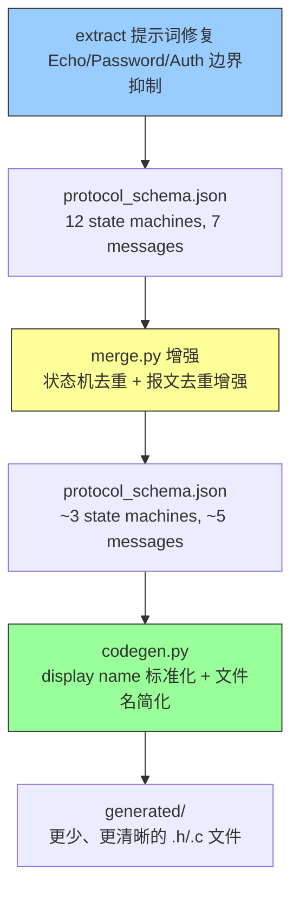
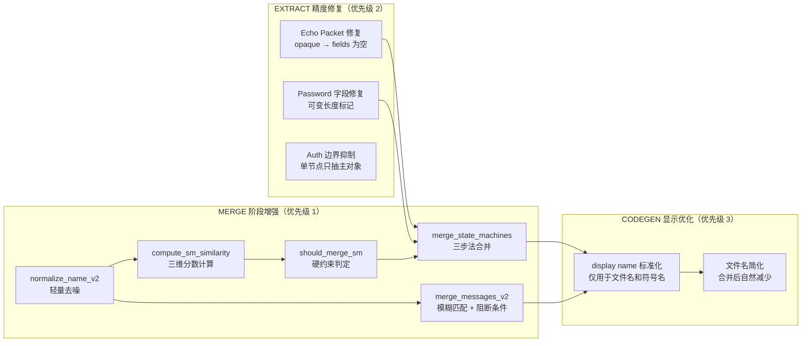
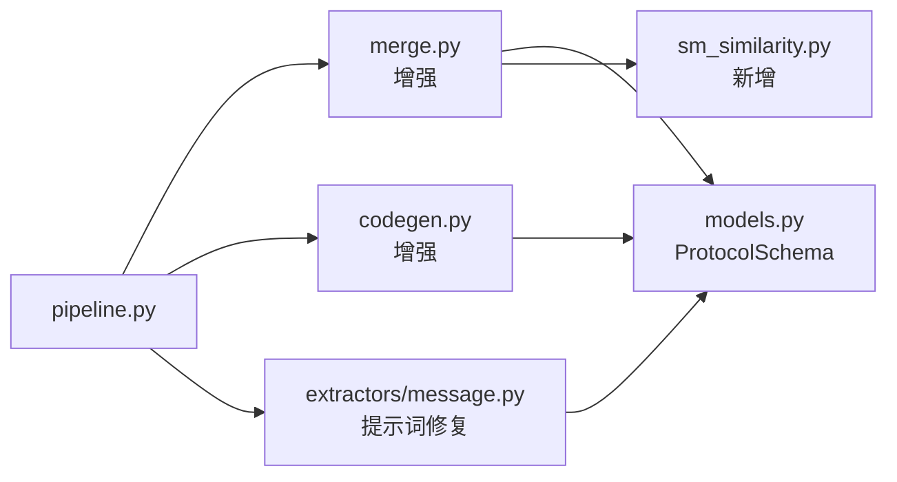
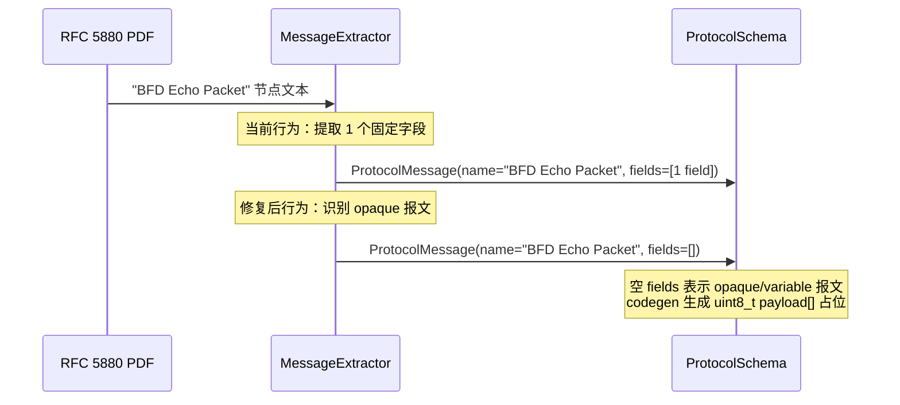
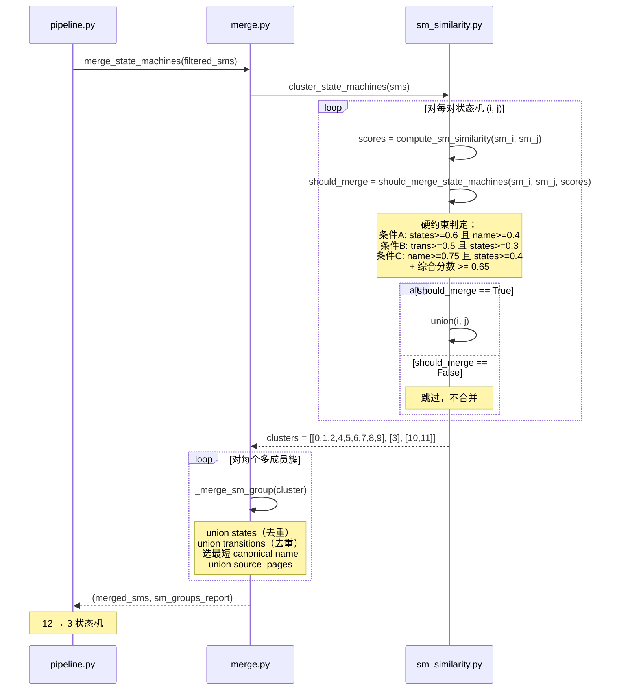

# 设计文档：Schema 质量改进（MERGE 去重 + EXTRACT 精度 + CODEGEN 显示优化）

## 概述

本设计描述协议提取流水线中 Schema 质量的三项改进，按优先级排列：

1. **MERGE Phase 2（最高优先级）**：为状态机和报文实现基于相似度的去重合并。当前 `merge.py` 仅合并 timers 和 messages（按 `normalize_name` 精确匹配），状态机完全未合并。BFD schema 中 12 个状态机应合并为 ~3 个，7 个报文中仍有漏网重复（如 SHA1 认证段）。核心挑战在于状态机名称差异大（含括号内 RFC 引用、章节号等），需要基于名称相似度 + 状态重叠 + 转移重叠的多维度匹配算法，并引入硬约束防止链式误合并。

2. **EXTRACT 精度修复（第二优先级）**：修正最具影响力的提取错误。Echo Packet 不应有固定字段（当前被提取为 1 个字段，实际应为 opaque/variable）；Simple Password 的 Password 字段应允许可变长度；主报文与认证段的边界需通过提示词抑制混入，而非改变 extractor 返回类型。

3. **CODEGEN 显示优化（第三优先级）**：在上游 schema 更干净后，仅做命名标准化和文件名简化。schema 层保持合并后的 canonical name 不变，codegen 层通过 `standardize_sm_name()` / `standardize_msg_name()` 生成 display name 用于文件名和符号名。不做多对象聚合进单一文件。

本设计不涉及 RAG 集成——聚焦于让 schema 本身更干净。

### 数据流总览



## 架构

### 变更范围



### 模块依赖关系



### 目录结构变更

```
src/extract/
    merge.py                    # 增强：新增 merge_state_machines(), normalize_name_v2(), merge_messages_v2()
    sm_similarity.py            # 新增：状态机相似度计算 + 硬约束判定模块
    extractors/
        message.py              # 修复：Echo/Password/Auth 边界提示词
        state_machine.py        # 不变
    codegen.py                  # 增强：standardize_sm_name(), standardize_msg_name() 仅用于 display name
    pipeline.py                 # 更新：调用 merge_state_machines()
```

## 组件与接口

### 优先级 1：MERGE Phase 2 — 状态机去重

#### 1.1 增强名称归一化

当前 `normalize_name()` 的问题：名称如 `"BFD Session State Machine (RFC 5880 §6.1 Overview)"` 和 `"BFD Session State Machine"` 归一化后不同，因为括号内容（如 "Overview"）中的非 RFC/章节号文本被保留。

**设计原则：名称归一化只做去噪，不做语义压缩。** 不删除核心语义词（state machine, session, version negotiation, administrative control, poll, demand 等），只删除噪声（RFC 引用、章节号、括号内纯引用、overview/excerpt/summary 等修饰词）。

```python
def normalize_name_v2(text: str, aggressive: bool = False) -> str:
    """增强版名称归一化，支持两级模式。

    Args:
        text: 原始名称字符串
        aggressive: 是否启用去噪模式（用于状态机分组预过滤）

    Returns:
        归一化后的字符串

    conservative 模式（aggressive=False，向后兼容）:
        与现有 normalize_name() 行为完全一致

    aggressive 模式（aggressive=True，用于状态机预过滤）:
        1. 执行 conservative 模式的所有步骤
        2. 移除括号及其内容（仅当括号内为 RFC 引用、章节号、
           或纯修饰词时）: (RFC 5880 §6.1 Overview), (Auto-Versioning)
        3. 移除修饰词: "excerpt", "overview", "summary"
        4. 重新 collapse 空白

        **不删除的核心语义词**（保留以防误合并）:
        - state machine, session, state
        - version negotiation
        - administrative control, forwarding plane reset
        - poll, demand, poll sequence
        - failure detection, reception checks
        - concatenated paths
        - backward compatibility

    示例（aggressive=True）:
        "BFD Session State Machine (RFC 5880 §6.1 Overview)"
            → "bfd session state machine"
        "BFD Session State Machine (RFC 5880 §6.2)"
            → "bfd session state machine"
        "BFD Session State Machine"
            → "bfd session state machine"
        "BFD Session State (RFC 5880 §6.8.1 excerpt)"
            → "bfd session state"
        "BFD Failure Detection (Control/Echo) and Control Packet Reception Checks"
            → "bfd failure detection control echo and control packet reception checks"
        "BFD Session (Forwarding Plane Reset & Administrative Control)"
            → "bfd session forwarding plane reset administrative control"
        "BFD Administrative Control and Forwarding Plane Reset"
            → "bfd administrative control and forwarding plane reset"
        "BFD Backward Compatibility Version Negotiation (Auto-Versioning)"
            → "bfd backward compatibility version negotiation"
        "BFD Backward-Compatibility Automatic Version Negotiation (RFC 5880 Appendix A)"
            → "bfd backward compatibility automatic version negotiation"
    """
```

**设计决策**：aggressive 模式保留所有核心语义词，因此不同语义的状态机不会被归一化为相同 key。归一化仅作为预过滤步骤，真正的合并判定由 `should_merge_state_machines()` 的硬约束完成。

#### 1.2 状态机相似度计算与硬约束判定（新模块 `sm_similarity.py`）

```python
"""状态机相似度计算与合并判定模块。

采用三步法：
1. compute_sm_similarity() — 计算名称/状态/转移三维分数
2. should_merge_state_machines() — 硬约束判定，防止链式误合并
3. cluster_state_machines() — 仅对通过硬约束的 pair 做 Union-Find

设计原则：不能只靠单阈值 + 单链接聚类。单链接容易出现链式误合并
（A 像 B，B 像 C，但 A 和 C 不该合并）。硬约束确保每对合并都有
充分的结构证据。
"""

from src.models import ProtocolStateMachine, ProtocolState, ProtocolTransition


def normalize_state_name(name: str) -> str:
    """归一化状态名用于比较。

    规则：
    - 转小写
    - 去除前后空白
    - 常见同义词映射: "asynchronous" → "async", "pollsequence" → "poll"

    示例:
        "Down" → "down"
        "AdminDown" → "admindown"
        "Asynchronous" → "async"
        "PollSequence" → "poll"
    """


def normalize_transition_key(t: ProtocolTransition) -> tuple[str, str, str]:
    """将转移归一化为 (from_state, to_state, event_keyword) 三元组。

    event_keyword 提取规则：
    - 转小写
    - 提取核心动词/名词: "Receive BFD Control packet" → "receive control"
    - "Detection Time expires" → "detection expire"
    - "Administrative disable" → "admin disable"
    - 其他: 取前两个有意义的词

    Returns:
        (normalized_from, normalized_to, event_keyword)
    """


def name_similarity(sm_a: ProtocolStateMachine, sm_b: ProtocolStateMachine) -> float:
    """计算两个状态机的名称相似度。

    算法：
    1. 对两个名称分别调用 normalize_name_v2(aggressive=True)
    2. 将归一化结果分词为 set
    3. 计算 Jaccard 相似度: |A ∩ B| / |A ∪ B|
    4. 若任一集合为空，返回 0.0

    Returns:
        [0.0, 1.0] 范围的相似度分数
    """


def state_overlap(sm_a: ProtocolStateMachine, sm_b: ProtocolStateMachine) -> float:
    """计算两个状态机的状态重叠度。

    算法：
    1. 提取两个状态机的状态名集合（归一化后）
    2. 计算 Jaccard 相似度: |A ∩ B| / |A ∪ B|
    3. 若两个集合都为空，返回 1.0（两个空状态机视为相同）

    Returns:
        [0.0, 1.0] 范围的重叠度分数
    """


def transition_overlap(sm_a: ProtocolStateMachine, sm_b: ProtocolStateMachine) -> float:
    """计算两个状态机的转移重叠度。

    算法：
    1. 将每个转移归一化为 (from, to, event_keyword) 三元组
    2. 构建两个三元组集合
    3. 计算 Jaccard 相似度: |A ∩ B| / |A ∪ B|
    4. 若两个集合都为空，返回 1.0

    Returns:
        [0.0, 1.0] 范围的重叠度分数
    """


def compute_sm_similarity(
    sm_a: ProtocolStateMachine,
    sm_b: ProtocolStateMachine,
) -> dict[str, float]:
    """计算两个状态机的三维相似度分数。

    注意：本函数只计算分数，不做合并判定。
    合并判定由 should_merge_state_machines() 完成。

    Args:
        sm_a: 状态机 A
        sm_b: 状态机 B

    Returns:
        {
            "name": float,        # 名称相似度 [0.0, 1.0]
            "states": float,      # 状态重叠度 [0.0, 1.0]
            "transitions": float, # 转移重叠度 [0.0, 1.0]
        }
    """


# ── 硬约束合并判定 ──────────────────────────────────────────

SM_MERGE_THRESHOLD = 0.65  # 综合加权分数的最低门槛

def should_merge_state_machines(
    sm_a: ProtocolStateMachine,
    sm_b: ProtocolStateMachine,
    scores: dict[str, float] | None = None,
) -> bool:
    """判定两个状态机是否应合并。

    采用硬约束 + 综合分数双重门槛，防止链式误合并。

    Args:
        sm_a: 状态机 A
        sm_b: 状态机 B
        scores: 预计算的三维分数（若为 None 则内部调用 compute_sm_similarity）

    Returns:
        True 表示应合并，False 表示不应合并

    判定逻辑（两步）：

    步骤 1 — 硬约束（必须满足以下任一条件）：
        条件 A: state_overlap >= 0.6 且 name_similarity >= 0.4
        条件 B: transition_overlap >= 0.5 且 state_overlap >= 0.3
        条件 C: name_similarity >= 0.75 且 state_overlap >= 0.4
    若三个条件均不满足，直接返回 False（不合并）。

    步骤 2 — 综合分数门槛：
        weighted_score = 0.3 × name + 0.35 × states + 0.35 × transitions
        若 weighted_score < SM_MERGE_THRESHOLD (0.65)，返回 False

    两步都通过才返回 True。

    设计理由：
    - 硬约束防止"名称很像但结构完全不同"或"结构有点像但语义不同"的误合并
    - 综合分数门槛作为最终安全网
    - 比单纯 0.3/0.35/0.35 加权安全得多
    """


def cluster_state_machines(
    state_machines: list[ProtocolStateMachine],
) -> list[list[int]]:
    """将状态机按硬约束判定结果聚类。

    算法（三步法）：
    1. 对所有两两对 (i, j) 调用 compute_sm_similarity() 计算三维分数
    2. 对每对调用 should_merge_state_machines() 做硬约束判定
    3. 仅对 should_merge == True 的 pair 执行 Union-Find 合并

    不再使用单阈值参数——合并判定完全由 should_merge_state_machines() 控制。

    Args:
        state_machines: 状态机列表

    Returns:
        簇列表，如 [[0, 1, 2], [3], [4, 5]]
        每个内部列表包含属于同一逻辑状态机的索引
    """
```

#### 1.3 状态机合并逻辑（`merge.py` 新增）

```python
def merge_state_machines(
    state_machines: list[ProtocolStateMachine],
) -> tuple[list[ProtocolStateMachine], list[dict]]:
    """合并相似的状态机（三步法）。

    Args:
        state_machines: 输入状态机列表（已过滤空状态机）

    Returns:
        merged: 合并后的状态机列表
        groups: 合并组报告列表

    流程：
    1. 调用 cluster_state_machines() 获取聚类结果（内部使用硬约束判定）
    2. 对每个包含多个成员的簇，调用 _merge_sm_group() 合并
    3. 单成员簇直接保留
    4. 构建合并报告
    """


def _merge_sm_group(group: list[ProtocolStateMachine]) -> ProtocolStateMachine:
    """合并一组相似状态机为单个状态机。

    Args:
        group: 同一簇内的状态机列表（len >= 2）

    Returns:
        合并后的单个 ProtocolStateMachine

    合并规则：
    1. 名称选择（canonical name）：
       - 对每个名称调用 normalize_name_v2(aggressive=True)
       - 选择归一化后最短的原始名称
       - 若长度相同，选择原始名称最短的
       - 理由：最短名称通常是最通用的（如 "BFD Session State Machine"
         优于 "BFD Session State Machine (RFC 5880 §6.2)"）
       - 注意：此名称为 schema canonical name，codegen 层可进一步
         通过 standardize_sm_name() 生成 display name

    2. 状态合并：
       - 按 normalize_state_name() 去重
       - 同名状态保留 description 最长的版本
       - is_initial: 任一为 True 则为 True
       - is_final: 任一为 True 则为 True

    3. 转移合并：
       - 按 normalize_transition_key() 去重
       - 同 key 转移保留 actions 列表最长的版本
       - 同 key 转移保留 condition 最长的版本

    4. source_pages: union 所有页码，排序去重
    """
```

#### 1.4 报文合并增强

当前 `merge_messages()` 对部分名称变体有效，但对语义近似、名称不一致的对象仍不足。经验证，当前 `normalize_name` 无法将 "Generic BFD Control Packet Format" 和 "BFD Control Packet" 归一化为同一 key（前者含 "generic" 和 "format"），SHA1 认证段的两个变体同样无法匹配。

**设计原则：模糊合并必须同时满足名称相似度和字段相似度，并设置阻断条件防止误合并。**

```python
# ── 报文互斥关键词 ──────────────────────────────────────────

MSG_EXCLUSIVE_KEYWORDS = [
    {"md5", "sha1"},           # MD5 和 SHA1 是不同认证类型
    {"simple password", "keyed"},  # Simple Password 和 Keyed 是不同认证方式
    {"echo", "control"},       # Echo Packet 和 Control Packet 是不同报文
]


def _message_name_similarity(name_a: str, name_b: str) -> float:
    """计算两个报文名称的相似度（Jaccard on word sets）。

    Returns:
        [0.0, 1.0] 范围的相似度
    """


def _field_name_jaccard(msg_a: ProtocolMessage, msg_b: ProtocolMessage) -> float:
    """计算两个报文的字段名集合 Jaccard 相似度。

    算法：
    1. 提取两个报文的字段名集合（normalize_name 后）
    2. 计算 Jaccard: |A ∩ B| / |A ∪ B|
    3. 若两个集合都为空，返回 1.0

    Returns:
        [0.0, 1.0] 范围的相似度
    """


def _has_exclusive_keywords(name_a: str, name_b: str) -> bool:
    """检查两个报文名称是否包含互斥关键词。

    遍历 MSG_EXCLUSIVE_KEYWORDS 中的每个互斥组 {kw1, kw2}：
    若 name_a 含 kw1 且 name_b 含 kw2（或反之），返回 True。

    Returns:
        True 表示存在互斥关键词，不应合并
    """


def merge_messages_v2(
    messages: list[ProtocolMessage],
    name_similarity_threshold: float = 0.7,
    field_jaccard_threshold: float = 0.5,
) -> tuple[list[ProtocolMessage], list[dict]]:
    """增强版报文合并，支持模糊名称匹配 + 阻断条件。

    流程：
    1. 先按 normalize_name 精确分组（与现有逻辑一致）
    2. 对未合并的单独报文，两两检查：
       a. 阻断条件：若 _has_exclusive_keywords() 返回 True，跳过（不合并）
       b. 名称相似度：_message_name_similarity() >= name_similarity_threshold (0.7)
       c. 字段相似度：_field_name_jaccard() >= field_jaccard_threshold (0.5)
       d. 必须同时满足 b 和 c 才合并
    3. 字段合并逻辑复用现有 _merge_fields()

    向后兼容：当 name_similarity_threshold=1.0 时行为与现有 merge_messages 完全一致。

    设计理由：
    - 仅靠名字模糊匹配不够稳，会误合并 MD5/SHA1 等相似但不同的认证段
    - 阻断条件是第一道防线：互斥关键词直接拒绝
    - 字段 Jaccard 是第二道防线：字段名不像的不合并
    - 双重门槛确保只合并真正的重复对象
    """
```

### 优先级 2：EXTRACT 精度修复

#### 2.1 Echo Packet 修复



**修复方案**：在 `src/extract/extractors/message.py` 的 MessageExtractor 提取 prompt 中增加指导规则：

```python
ECHO_PACKET_RULE = """
If the message is described as opaque, implementation-specific, 
or "not defined by this specification", return an EMPTY fields list.
Do NOT invent fields for opaque/variable-content packets.
Examples: BFD Echo Packet payload is opaque — return fields=[].
"""
```

#### 2.2 Simple Password 字段修复

```python
# src/extract/extractors/message.py 提取 prompt 增加规则：
VARIABLE_LENGTH_RULE = """
If a field's length is described as "variable", "1 to N bytes", 
or "up to X bytes", set size_bits=None and include the length 
constraint in the description field. Do NOT assign a fixed size_bits.
Example: Simple Password Authentication "Password" field is 1-16 bytes 
variable → size_bits=None, description="1-16 bytes, variable length".
"""
```

#### 2.3 Auth 段边界抑制

**设计决策**：当前 `MessageExtractor.extract()` 一次只返回一个 `ProtocolMessage`，改变返回类型会牵动 pipeline / tests / schema roundtrip 大量代码。Phase 2 不要求一节点产出多个 message。

**修复方案**：通过提示词做"边界抑制"——单节点只抽当前主对象，不混入其他对象的字段：

```python
# src/extract/extractors/message.py 提取 prompt 增加规则：
AUTH_BOUNDARY_RULE = """
Extract ONLY the primary message described in this section.
- If this section primarily describes an authentication section/format,
  extract ONLY the authentication fields. Do NOT include main packet fields.
- If this section primarily describes a main control packet,
  extract ONLY the main packet fields. Do NOT include optional 
  authentication fields that belong to a separate section.
- One node = one message. Do not mix fields from different message types.
"""
```

**与原设计的区别**：
- 原设计：要求 extractor 返回多个 ProtocolMessage（需改接口）
- 修改后：extractor 返回类型不变，通过提示词确保每个节点只提取其主对象
- 效果相同：主报文不会混入认证字段，认证段不会混入主报文字段
- 风险更低：不改 extractor 返回类型，不牵动 pipeline / tests

### 优先级 3：CODEGEN 显示优化

**设计原则：区分 schema canonical name 和 codegen display name。** schema 层保持合并后的 canonical name 不变（用于 merge report、回溯、调试），codegen 层通过 `standardize_sm_name()` / `standardize_msg_name()` 生成 display name 仅用于文件名和 C 符号名。

#### 3.1 命名标准化（仅用于 codegen display name）

```python
# codegen.py 新增，仅用于文件名和符号名生成，不修改 schema

def standardize_sm_name(canonical_name: str) -> str:
    """从 schema canonical name 生成 codegen display name（状态机）。

    仅用于文件名和 C 符号名，不修改 schema 中的 name 字段。

    规则：
    1. 移除括号内的 RFC 引用和章节号
    2. 移除 "excerpt", "overview" 等修饰词
    3. 保留核心语义词
    4. 确保名称以协议名开头

    示例：
        "BFD Session State Machine" → "BFD Session State Machine"（不变）
        "BFD Demand Mode and Poll Sequence" → "BFD Demand Mode Poll Sequence"
        "BFD Backward Compatibility Version Negotiation" → "BFD Version Negotiation"
    """


def standardize_msg_name(canonical_name: str) -> str:
    """从 schema canonical name 生成 codegen display name（报文）。

    仅用于文件名和 C 符号名，不修改 schema 中的 name 字段。

    规则：
    1. 移除 "Generic" 前缀
    2. 移除括号内的 RFC 引用
    3. 统一 "Format" 后缀（移除）

    示例：
        "Generic BFD Control Packet Format" → "BFD Control Packet"
        "BFD Authentication Section - Simple Password Authentication"
            → "BFD Auth Simple Password"
    """
```

#### 3.2 文件名简化

当前每个状态机/报文生成独立的 .h/.c 文件对。合并后状态机数量从 12 降至 ~3，文件碎片化问题自然缓解。

**不做的事**：不做多个状态机/多个报文聚合进单一 .c/.h 文件。这会牵动 verify、expected_symbols、测试，范围太大。当前更稳的优化路径是：合并后对象变少 → 名称更短 → 文件自然就少而清晰。

```python
# codegen.py 文件名生成流程变更：
# 1. 从 schema 获取 canonical name（合并后的名称）
# 2. 调用 standardize_sm_name() / standardize_msg_name() 获取 display name
# 3. 对 display name 调用 _to_lower_snake() 生成文件名
#
# 文件名示例（合并前 vs 合并后）：
#   合并前: bfd_sm_bfd_session_state_machine_rfc_5880_6_2.h  (冗长)
#   合并后: bfd_sm_bfd_session_state_machine.h  (简洁，因为 canonical name 已去除 RFC 引用)
#   display: bfd_sm_session_state_machine.h  (更简洁，standardize 去除了冗余前缀)
```

## 数据模型

### 现有模型无需变更

`ProtocolStateMachine`、`ProtocolState`、`ProtocolTransition`、`ProtocolMessage`、`ProtocolField` 等模型结构不变。改进完全在 merge 和 codegen 逻辑层面。schema 中的 `name` 字段保持 canonical name，codegen 层单独维护 display name。

### 合并报告扩展

`build_merge_report()` 需要扩展以包含状态机合并信息，但保持向后兼容：

```python
def build_merge_report(
    pre: dict[str, int],
    dropped: dict[str, int],
    post_filter: dict[str, int],
    post: dict[str, int],
    timer_groups: list[dict],
    message_groups: list[dict],
    state_machine_groups: list[dict] | None = None,  # 新增，默认 None 保持向后兼容
) -> dict[str, Any]:
    """构建合并报告。

    state_machine_groups 为 None 时不在报告中包含该字段（向后兼容）。
    非 None 时格式：
    [
        {
            "canonical_name": "BFD Session State Machine",
            "merged_from": [
                "BFD Session State Machine (RFC 5880 §6.1 Overview)",
                "BFD Session State Machine (RFC 5880 §6.2)",
                "BFD Session State Machine",
                ...
            ],
            "similarity_scores": {"name": 0.85, "states": 0.92, "transitions": 0.78},
            "hard_constraint_met": "A",  # 满足的硬约束条件
            "source_pages_union": [14, 15, 16, 17, 27, 28, 29, 33, 34, 35, 41],
            "states_before": 26,
            "states_after": 5,
            "transitions_before": 78,
            "transitions_after": 15,
        },
        ...
    ]
    """
```

### pipeline.py MERGE 阶段更新

```python
# pipeline.py MERGE 阶段变更：
# 现有代码：
#   post_merge_counts["state_machine"] = len(filtered_state_machines)  # 未合并
# 
# 变更为：
#   merged_state_machines, sm_groups = merge_state_machines(filtered_state_machines)
#   post_merge_counts["state_machine"] = len(merged_state_machines)
#
# build_merge_report 调用增加 state_machine_groups=sm_groups 参数
# 由于 state_machine_groups 默认为 None，旧测试不受影响
```

## 主要算法/工作流

### 状态机去重合并流程（三步法）



### BFD 状态机预期聚类结果

基于当前 BFD schema 的 12 个状态机，预期聚类结果：

| 簇 | 成员（索引） | 合并后 canonical name | 状态数 |
|---|---|---|---|
| 簇 1: Session | 0, 1, 2, 4, 5, 6, 7, 8, 9 | BFD Session State Machine | ~5 (Down, Init, Up, AdminDown + 可能的变体) |
| 簇 2: Demand/Poll | 3 | BFD Demand Mode and Poll Sequence (RFC 5880 §6.5–6.6) | 4 (Async, Demand, PollSequence, Down) |
| 簇 3: Version | 10, 11 | BFD Backward Compatibility Version Negotiation (Auto-Versioning) | ~4 |

**关键判断依据**：
- 项 0-2（Session SM 三个变体）：状态集合高度重叠（Down, Init, Up, AdminDown），满足硬约束条件 A（states>=0.6 且 name>=0.4）
- 项 4-6（Session State / Failure Detection 变体）：状态集合相同（Down, Init, Up, AdminDown），满足硬约束条件 B（trans>=0.5 且 states>=0.3）
- 项 7-9（Admin/Reset 变体）：状态集合为 {Down, AdminDown}，与 Session SM 的 states overlap = 2/5 = 0.4，满足条件 C（name>=0.75 且 states>=0.4）需验证 name_similarity
- 项 3（Demand Mode）：状态集合 {Async, Demand, PollSequence, Down}，与 Session SM 的 states overlap 仅 {Down} = 1/8 ≈ 0.125，不满足任何硬约束 → 不合并 ✓
- 项 10-11（Version Negotiation）：名称高度相似，状态集合相似，满足条件 A

### 硬约束合并判定算法

```pascal
ALGORITHM should_merge_state_machines(sm_a, sm_b, scores)
INPUT: sm_a, sm_b ∈ ProtocolStateMachine; scores: {name, states, transitions}
OUTPUT: bool

BEGIN
  IF scores IS NULL THEN
    scores ← compute_sm_similarity(sm_a, sm_b)
  END IF

  name_s ← scores["name"]
  state_s ← scores["states"]
  trans_s ← scores["transitions"]

  // 步骤 1: 硬约束检查（必须满足至少一个条件）
  condition_A ← (state_s >= 0.6 AND name_s >= 0.4)
  condition_B ← (trans_s >= 0.5 AND state_s >= 0.3)
  condition_C ← (name_s >= 0.75 AND state_s >= 0.4)

  IF NOT (condition_A OR condition_B OR condition_C) THEN
    RETURN False
  END IF

  // 步骤 2: 综合分数门槛
  weighted ← 0.3 × name_s + 0.35 × state_s + 0.35 × trans_s
  IF weighted < 0.65 THEN
    RETURN False
  END IF

  RETURN True
END
```

**前置条件**：
- sm_a 和 sm_b 为有效的 ProtocolStateMachine
- scores 中的值均在 [0.0, 1.0] 范围内

**后置条件**：
- 返回 True 当且仅当至少一个硬约束条件成立且综合分数 >= 0.65
- 对称性：should_merge(a, b) == should_merge(b, a)

### 三步法聚类算法

```pascal
ALGORITHM cluster_state_machines(state_machines)
INPUT: state_machines: list[ProtocolStateMachine]
OUTPUT: clusters: list[list[int]]

BEGIN
  n ← len(state_machines)
  
  // 步骤 1: 初始化 Union-Find
  parent ← [i FOR i IN range(n)]
  
  FUNCTION find(x)
    WHILE parent[x] ≠ x DO
      parent[x] ← parent[parent[x]]
      x ← parent[x]
    END WHILE
    RETURN x
  END FUNCTION
  
  FUNCTION union(x, y)
    rx ← find(x)
    ry ← find(y)
    IF rx ≠ ry THEN parent[rx] ← ry END IF
  END FUNCTION
  
  // 步骤 2: 对每对计算分数 + 硬约束判定 + 条件合并
  FOR i ← 0 TO n-2 DO
    FOR j ← i+1 TO n-1 DO
      scores ← compute_sm_similarity(state_machines[i], state_machines[j])
      IF should_merge_state_machines(state_machines[i], state_machines[j], scores) THEN
        union(i, j)
      END IF
    END FOR
  END FOR
  
  // 步骤 3: 收集簇
  cluster_map ← {}
  FOR i ← 0 TO n-1 DO
    root ← find(i)
    cluster_map[root].append(i)
  END FOR
  
  RETURN list(cluster_map.values())
END
```

**前置条件**：state_machines 非空列表
**后置条件**：簇列表覆盖所有索引 [0, n)，每个索引恰好出现在一个簇中

### 状态机组合并算法

```pascal
ALGORITHM merge_sm_group(group)
INPUT: group: list[ProtocolStateMachine], len(group) >= 2
OUTPUT: merged: ProtocolStateMachine

BEGIN
  // 步骤 1: 选择 canonical name（最短归一化名称对应的原始名称）
  best_name ← group[0].name
  best_norm_len ← len(normalize_name_v2(group[0].name, aggressive=True))
  FOR sm IN group[1:] DO
    norm_len ← len(normalize_name_v2(sm.name, aggressive=True))
    IF norm_len < best_norm_len OR
       (norm_len = best_norm_len AND len(sm.name) < len(best_name)) THEN
      best_name ← sm.name
      best_norm_len ← norm_len
    END IF
  END FOR

  // 步骤 2: Union 状态（按归一化名称去重）
  state_map ← {}
  FOR sm IN group DO
    FOR state IN sm.states DO
      key ← normalize_state_name(state.name)
      IF key NOT IN state_map THEN
        state_map[key] ← state
      ELSE
        existing ← state_map[key]
        IF len(state.description) > len(existing.description) THEN
          state_map[key].description ← state.description
        END IF
        state_map[key].is_initial ← existing.is_initial OR state.is_initial
        state_map[key].is_final ← existing.is_final OR state.is_final
      END IF
    END FOR
  END FOR

  // 步骤 3: Union 转移（按归一化 key 去重）
  trans_map ← {}
  FOR sm IN group DO
    FOR t IN sm.transitions DO
      key ← normalize_transition_key(t)
      IF key NOT IN trans_map THEN
        trans_map[key] ← t
      ELSE
        existing ← trans_map[key]
        IF len(t.actions) > len(existing.actions) THEN
          trans_map[key].actions ← t.actions
        END IF
        IF len(t.condition) > len(existing.condition) THEN
          trans_map[key].condition ← t.condition
        END IF
      END IF
    END FOR
  END FOR

  // 步骤 4: Union source_pages
  all_pages ← sorted(set(p FOR sm IN group FOR p IN sm.source_pages))

  RETURN ProtocolStateMachine(
    name=best_name,
    states=list(state_map.values()),
    transitions=list(trans_map.values()),
    source_pages=all_pages,
  )
END
```

**前置条件**：group 包含至少 2 个 ProtocolStateMachine
**后置条件**：合并后的状态集合（归一化后）是所有输入状态集合并集的超集；转移同理；source_pages 为并集

### 报文模糊合并算法

```pascal
ALGORITHM merge_messages_v2(messages, name_threshold, field_threshold)
INPUT: messages: list[ProtocolMessage], name_threshold=0.7, field_threshold=0.5
OUTPUT: merged: list[ProtocolMessage], groups: list[dict]

BEGIN
  // 步骤 1: 精确分组（与现有 merge_messages 一致）
  exact_groups ← group_by(normalize_name, messages)
  merged ← []
  remaining ← []
  
  FOR key, group IN exact_groups DO
    IF len(group) > 1 THEN
      merged.append(merge_group(group))  // 复用现有 _merge_fields
    ELSE
      remaining.append(group[0])
    END IF
  END FOR
  
  // 步骤 2: 对 remaining 做模糊匹配
  n ← len(remaining)
  parent ← [i FOR i IN range(n)]
  // ... Union-Find 同上 ...
  
  FOR i ← 0 TO n-2 DO
    FOR j ← i+1 TO n-1 DO
      // 阻断条件
      IF _has_exclusive_keywords(remaining[i].name, remaining[j].name) THEN
        CONTINUE
      END IF
      // 双重门槛
      name_sim ← _message_name_similarity(remaining[i].name, remaining[j].name)
      IF name_sim < name_threshold THEN CONTINUE END IF
      field_sim ← _field_name_jaccard(remaining[i], remaining[j])
      IF field_sim < field_threshold THEN CONTINUE END IF
      union(i, j)
    END FOR
  END FOR
  
  // 步骤 3: 合并模糊匹配的组
  FOR cluster IN collect_clusters(parent) DO
    IF len(cluster) > 1 THEN
      merged.append(merge_group([remaining[k] FOR k IN cluster]))
    ELSE
      merged.append(remaining[cluster[0]])
    END IF
  END FOR
  
  RETURN merged, groups
END
```

## 示例用法

### 状态机合并示例

```python
from src.extract.merge import merge_state_machines
from src.models import ProtocolStateMachine, ProtocolState, ProtocolTransition

# 输入：BFD schema 中的 12 个状态机
state_machines = schema.state_machines  # len == 12

# 合并（不再需要传 threshold，硬约束内置）
merged_sms, sm_groups = merge_state_machines(state_machines)

# 结果
assert len(merged_sms) <= 4  # 预期 ~3
for group in sm_groups:
    print(f"合并: {group['merged_from']} → {group['canonical_name']}")
    print(f"  硬约束: 条件 {group['hard_constraint_met']}")
    print(f"  状态: {group['states_before']} → {group['states_after']}")
    print(f"  转移: {group['transitions_before']} → {group['transitions_after']}")
```

### 硬约束判定示例

```python
from src.extract.sm_similarity import compute_sm_similarity, should_merge_state_machines

# 应合并：Session SM 变体
sm_a = schema.state_machines[0]  # "BFD Session State Machine (RFC 5880 §6.1 Overview)"
sm_b = schema.state_machines[2]  # "BFD Session State Machine"
scores = compute_sm_similarity(sm_a, sm_b)
# scores ≈ {"name": 0.85, "states": 0.75, "transitions": 0.6}
assert should_merge_state_machines(sm_a, sm_b, scores) == True
# 满足条件 A: states(0.75) >= 0.6 且 name(0.85) >= 0.4 ✓

# 不应合并：Session SM vs Demand Mode
sm_session = schema.state_machines[2]  # "BFD Session State Machine"
sm_demand = schema.state_machines[3]   # "BFD Demand Mode and Poll Sequence"
scores = compute_sm_similarity(sm_session, sm_demand)
# scores ≈ {"name": 0.15, "states": 0.125, "transitions": 0.05}
assert should_merge_state_machines(sm_session, sm_demand, scores) == False
# 条件 A: states(0.125) < 0.6 ✗
# 条件 B: trans(0.05) < 0.5 ✗
# 条件 C: name(0.15) < 0.75 ✗ → 全部不满足
```

### 报文合并增强示例

```python
from src.extract.merge import merge_messages_v2

messages = schema.messages  # len == 7

merged_msgs, msg_groups = merge_messages_v2(messages)

# 预期结果：
# - "Generic BFD Control Packet Format" + "BFD Control Packet"
#   → 合并（name_sim >= 0.7, field_jaccard >= 0.5, 无互斥关键词）
# - "Keyed SHA1..." + "BFD Authentication Section (Keyed SHA1...)"
#   → 合并（name_sim >= 0.7, field_jaccard >= 0.5, 无互斥关键词）
# - "Keyed MD5..." vs "Keyed SHA1..."
#   → 不合并（互斥关键词: md5 vs sha1）
# - "BFD Echo Packet" vs "BFD Control Packet"
#   → 不合并（互斥关键词: echo vs control）
assert len(merged_msgs) == 5
```

### CODEGEN display name 示例

```python
from src.extract.codegen import standardize_sm_name, standardize_msg_name

# schema canonical name 不变
sm = merged_sms[0]
assert sm.name == "BFD Session State Machine"  # canonical name

# codegen 生成 display name 用于文件名
display = standardize_sm_name(sm.name)
# display == "BFD Session State Machine"（已经很简洁，不变）
file_stem = _to_lower_snake(display)
# file_stem == "bfd_session_state_machine"

# 报文 display name
msg_display = standardize_msg_name("Generic BFD Control Packet Format")
# msg_display == "BFD Control Packet"
```

## 正确性属性（Correctness Properties）

*正确性属性是指在系统所有有效执行中都应成立的特征或行为——本质上是对系统应做什么的形式化陈述。*

### Property 1: 相似度对称性与自反性

*For any* 两个有效的 ProtocolStateMachine `a` 和 `b`，`compute_sm_similarity(a, b)` 的每个维度分数都等于 `compute_sm_similarity(b, a)` 的对应维度（对称性）。*For any* 有效的 ProtocolStateMachine `a`，`compute_sm_similarity(a, a)` 的每个维度分数都为 `1.0`（自反性）。所有分数始终在 `[0.0, 1.0]` 范围内。

**Validates: Requirements 2.1**

### Property 2: 硬约束判定对称性

*For any* 两个有效的 ProtocolStateMachine `a` 和 `b`，`should_merge_state_machines(a, b) == should_merge_state_machines(b, a)`。

**Validates: Requirements 3.1, 3.4**

### Property 3: 聚类完整性与互斥性

*For any* 状态机列表 `sms`，`cluster_state_machines(sms)` 返回的簇列表满足：(a) 所有索引 `[0, len(sms))` 恰好出现一次（完整性）；(b) 没有索引出现在多个簇中（互斥性）；(c) 簇的数量 `<= len(sms)`（不会凭空增加）。

**Validates: Requirements 4.3**

### Property 4: 合并不丢失信息

*For any* 状态机组 `group`（len >= 2），`_merge_sm_group(group)` 返回的合并结果满足：(a) 合并后的状态集合（归一化后）是所有输入状态集合的并集的超集；(b) 合并后的转移集合（归一化后）是所有输入转移集合的并集的超集；(c) 合并后的 `source_pages` 是所有输入 `source_pages` 的并集。

**Validates: Requirements 5.2, 5.3, 5.4, 5.5**

### Property 5: 合并幂等性

*For any* 已合并的状态机列表 `merged_sms`，再次调用 `merge_state_machines(merged_sms)` 应返回与 `merged_sms` 等价的结果（不会进一步合并已经合并过的状态机）。

**Validates: Requirements 5.6**

### Property 6: normalize_name_v2 向后兼容

*For any* 字符串 `s`，`normalize_name_v2(s, aggressive=False)` 的输出应与现有 `normalize_name(s)` 的输出完全一致。aggressive=False 模式不改变现有行为。

**Validates: Requirement 1.1**

### Property 7: 报文合并增强向后兼容

*For any* 报文列表 `msgs`，`merge_messages_v2(msgs, name_similarity_threshold=1.0)` 的输出应与现有 `merge_messages(msgs)` 的输出在报文数量和名称上一致。threshold=1.0 退化为精确匹配。

**Validates: Requirement 6.4**

### Property 8: 报文互斥关键词阻断

*For any* 两个报文名称分别包含同一互斥组中的不同关键词（如一个含 "md5" 另一个含 "sha1"），`merge_messages_v2` 不会将它们合并，无论名称相似度和字段相似度多高。

**Validates: Requirement 6.2**

### Property 9: 标识符合法性保持

*For any* 合并后的状态机或报文 canonical name，经过 `standardize_sm_name()` 或 `standardize_msg_name()` 处理后再传入 `_sanitize_c_identifier()`，应产生合法的 C 标识符（匹配 `^[a-zA-Z_][a-zA-Z0-9_]*$`）。

**Validates: Requirement 10.4**

### Property 10: schema canonical name 不可变性

*For any* 经过 MERGE 阶段处理的 ProtocolSchema，其 `state_machines[i].name` 和 `messages[i].name` 字段在 CODEGEN 阶段前后保持不变。`standardize_sm_name()` / `standardize_msg_name()` 仅生成 display name，不修改 schema 对象。

**Validates: Requirement 10.3**

## 错误处理

### 错误分类与处理策略

| 错误类型 | 触发场景 | 处理方式 |
|---------|---------|---------|
| 相似度计算异常 | 状态机名称为空或 states/transitions 为 None | 返回全零分数 {"name": 0, "states": 0, "transitions": 0}，记录 warning |
| 硬约束判定异常 | scores 字典缺少字段 | 返回 False（不合并），记录 warning |
| 聚类结果异常 | 所有状态机两两 should_merge == False | 每个状态机独立成簇，等价于不合并 |
| 合并组为空 | _merge_sm_group 收到空列表 | 抛出 ValueError（不应发生，由调用方保证） |
| 名称归一化为空 | aggressive 模式剥离后名称为空字符串 | 回退使用 conservative 模式的结果 |
| 转移归一化冲突 | 两个语义不同的转移归一化为相同 key | 保留 actions 更多的版本（可能丢失信息，记录 warning） |
| 报文互斥关键词误判 | 关键词列表不完整导致漏阻断 | 可通过扩展 MSG_EXCLUSIVE_KEYWORDS 修复，不影响架构 |
| Echo Packet 提取 | LLM 仍然提取出固定字段 | 后处理检查：若报文名含 "echo" 且字段数 <= 1，清空 fields |
| Password 字段 | LLM 仍然分配固定 size_bits | 后处理检查：若字段名含 "password" 且 description 含 "variable"，置 size_bits=None |

### 错误传播规则

1. **相似度计算层**：任何异常返回全零分数（安全默认值 = 不合并），不中断流程
2. **硬约束判定层**：异常返回 False（不合并）
3. **聚类层**：异常时回退为每个状态机独立成簇
4. **合并层**：单个组合并失败时保留该组所有原始状态机，记录 warning，继续处理其他组
5. **Pipeline 层**：merge_state_machines 整体失败时回退为不合并（filtered_state_machines 直接传递），MERGE 阶段仍标记为成功但 warning 中注明状态机未合并

### 日志规范

```python
import logging
logger = logging.getLogger("extract")

# 相似度计算
logger.debug("SM similarity(%s, %s) = name=%.3f, states=%.3f, trans=%.3f",
             sm_a.name, sm_b.name, scores["name"], scores["states"], scores["transitions"])

# 硬约束判定
logger.debug("SM should_merge(%s, %s) = %s (constraint=%s, weighted=%.3f)",
             sm_a.name, sm_b.name, result, constraint_met, weighted_score)

# 聚类结果
logger.info("SM clustering: %d state machines → %d clusters",
            len(state_machines), len(clusters))

# 合并结果
logger.info("SM merge: cluster [%s] → '%s' (states: %d→%d, transitions: %d→%d)",
            ", ".join(sm.name for sm in group), merged.name,
            sum(len(sm.states) for sm in group), len(merged.states),
            sum(len(sm.transitions) for sm in group), len(merged.transitions))

# 报文互斥阻断
logger.debug("MSG merge blocked: '%s' vs '%s' (exclusive keywords: %s vs %s)",
             msg_a.name, msg_b.name, kw_a, kw_b)

# 回退
logger.warning("SM merge failed for cluster, falling back to no-merge: %s", error)
```

## 测试策略

### 双轨测试方法

本特性采用**单元测试 + 属性测试**双轨并行的测试策略：

- **单元测试（pytest）**：验证 BFD schema 具体场景、边界条件、回退路径
- **属性测试（hypothesis）**：验证相似度函数的数学性质、硬约束的对称性、合并的信息保持性、向后兼容性

### 属性测试库

使用 Python 的 **Hypothesis** 库进行属性测试。每个属性测试配置 `@settings(max_examples=100)`。

### 测试文件结构

```
tests/extract/
    test_sm_similarity.py       # 相似度计算 + 硬约束判定 单元测试 + 属性测试
    test_merge_state_machines.py # 状态机合并单元测试 + 属性测试
    test_merge_enhanced.py       # 报文合并增强测试（含互斥关键词）
    test_extract_fixes.py        # EXTRACT 精度修复测试
    test_codegen_naming.py       # CODEGEN display name 标准化测试
```

### 属性测试与设计属性的映射

| 设计属性 | 测试文件 | 测试类型 |
|---------|---------|---------|
| Property 1: 相似度对称性与自反性 | test_sm_similarity.py | 属性测试 |
| Property 2: 硬约束判定对称性 | test_sm_similarity.py | 属性测试 |
| Property 3: 聚类完整性与互斥性 | test_merge_state_machines.py | 属性测试 |
| Property 4: 合并不丢失信息 | test_merge_state_machines.py | 属性测试 |
| Property 5: 合并幂等性 | test_merge_state_machines.py | 属性测试 |
| Property 6: normalize_name_v2 向后兼容 | test_merge_enhanced.py | 属性测试 |
| Property 7: 报文合并增强向后兼容 | test_merge_enhanced.py | 属性测试 |
| Property 8: 报文互斥关键词阻断 | test_merge_enhanced.py | 单元测试 |
| Property 9: 标识符合法性保持 | test_codegen_naming.py | 属性测试 |
| Property 10: schema canonical name 不可变性 | test_codegen_naming.py | 单元测试 |

### Hypothesis 策略（Strategies）

```python
from hypothesis import strategies as st, given, settings
from src.models import ProtocolStateMachine, ProtocolState, ProtocolTransition

@st.composite
def protocol_state_strategy(draw):
    """生成随机 ProtocolState。"""
    name = draw(st.sampled_from(["Down", "Up", "Init", "AdminDown", "Idle",
                                  "Active", "Passive", "Error", "Waiting"]))
    description = draw(st.text(min_size=0, max_size=50))
    is_initial = draw(st.booleans())
    is_final = draw(st.booleans())
    return ProtocolState(name=name, description=description,
                         is_initial=is_initial, is_final=is_final)

@st.composite
def protocol_transition_strategy(draw, state_names=None):
    """生成随机 ProtocolTransition。"""
    if state_names is None:
        state_names = ["Down", "Up", "Init", "AdminDown"]
    from_state = draw(st.sampled_from(state_names))
    to_state = draw(st.sampled_from(state_names))
    event = draw(st.sampled_from([
        "Receive BFD Control packet",
        "Detection Time expires",
        "Administrative disable",
        "Echo loss",
        "Poll Sequence timeout",
    ]))
    condition = draw(st.text(min_size=0, max_size=30))
    actions = draw(st.lists(st.text(min_size=1, max_size=30), max_size=3))
    return ProtocolTransition(from_state=from_state, to_state=to_state,
                              event=event, condition=condition, actions=actions)

@st.composite
def protocol_state_machine_strategy(draw):
    """生成随机 ProtocolStateMachine。"""
    name = draw(st.text(min_size=1, max_size=60))
    states = draw(st.lists(protocol_state_strategy(), min_size=1, max_size=6))
    state_names = [s.name for s in states]
    transitions = draw(st.lists(
        protocol_transition_strategy(state_names=state_names),
        min_size=0, max_size=10,
    ))
    source_pages = draw(st.lists(st.integers(min_value=1, max_value=100),
                                  min_size=0, max_size=5))
    return ProtocolStateMachine(name=name, states=states,
                                transitions=transitions, source_pages=source_pages)
```

### 单元测试重点

1. **BFD 具体场景**：加载真实 BFD schema（12 个状态机、7 个报文），验证合并后数量 <= 4 个状态机、<= 5 个报文
2. **硬约束边界**：构造刚好满足/不满足各硬约束条件的状态机对，验证判定结果
3. **链式误合并防护**：构造 A 像 B、B 像 C、但 A 和 C 不该合并的场景，验证硬约束阻止了链式合并
4. **互斥关键词阻断**：验证 MD5 vs SHA1、Simple Password vs Keyed、Echo vs Control 不被合并
5. **名称归一化**：验证所有 12 个 BFD 状态机名称的 aggressive 归一化结果保留核心语义词
6. **回退路径**：mock 相似度计算抛异常，验证回退为不合并
7. **Echo Packet 修复**：验证修复后 Echo Packet 的 fields 为空
8. **Password 字段修复**：验证修复后 Password 字段的 size_bits 为 None
9. **CODEGEN display name**：验证 standardize_sm_name/standardize_msg_name 不修改 schema 对象
10. **build_merge_report 向后兼容**：不传 state_machine_groups 参数时报告格式不变

### 属性测试标注格式

```python
# Feature: schema-quality-improvement, Property 1: 相似度对称性与自反性
@given(
    sm_a=protocol_state_machine_strategy(),
    sm_b=protocol_state_machine_strategy(),
)
@settings(max_examples=100)
def test_similarity_symmetry(sm_a, sm_b):
    """compute_sm_similarity(a, b) 的每个维度 == compute_sm_similarity(b, a)"""
    scores_ab = compute_sm_similarity(sm_a, sm_b)
    scores_ba = compute_sm_similarity(sm_b, sm_a)
    assert scores_ab == scores_ba
    for v in scores_ab.values():
        assert 0.0 <= v <= 1.0

# Feature: schema-quality-improvement, Property 2: 硬约束判定对称性
@given(
    sm_a=protocol_state_machine_strategy(),
    sm_b=protocol_state_machine_strategy(),
)
@settings(max_examples=100)
def test_should_merge_symmetry(sm_a, sm_b):
    """should_merge(a, b) == should_merge(b, a)"""
    assert should_merge_state_machines(sm_a, sm_b) == should_merge_state_machines(sm_b, sm_a)
```

## 性能考量

- 状态机两两相似度计算为 O(n²)，n 通常 < 20（单个 RFC 的状态机数量），完全可接受
- Union-Find 聚类接近 O(n²α(n)) ≈ O(n²)，同样可接受
- 转移归一化涉及字符串处理，每次 O(L)（L 为事件描述长度），总体 O(n² × T × L)，T 为平均转移数
- 报文模糊匹配同为 O(m²)，m 为精确分组后的剩余报文数，通常 < 10
- 不需要缓存或增量计算——每次 MERGE 阶段全量重算

## 安全考量

本特性不涉及用户输入、网络通信或认证。所有数据来自本地 PDF 提取结果。无安全风险。

## 依赖

- **现有依赖**：无新增外部依赖
  - `re`（标准库，名称归一化）
  - `hypothesis`（已有，属性测试）
  - `pytest`（已有，单元测试）
- **内部依赖**：
  - `src/models.py`：ProtocolStateMachine, ProtocolState, ProtocolTransition, ProtocolMessage, ProtocolField
  - `src/extract/merge.py`：现有 normalize_name, merge_messages, _merge_fields, build_merge_report
  - `src/extract/codegen.py`：_sanitize_c_identifier, _to_lower_snake, _to_upper_snake
  - `src/extract/extractors/message.py`：MessageExtractor 提示词修改
  - `src/extract/pipeline.py`：MERGE 阶段调用点
