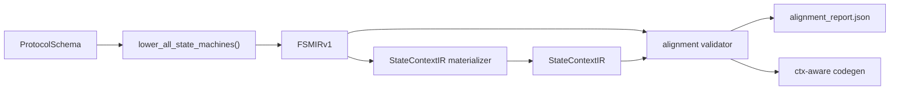

# Phase B: FSM-StateContextIR 对齐校验实施方案

## 1. 背景与定位

当前主链路已经具备：

- `FSMIRv1`：能够产出 typed guard / typed action
- `StateContextIR`：能够通过 materializer 自动物化
- pipeline：能够输出 `fsm_ir.json` 与 `state_context_ir.json`

但现在还缺一个关键环节：

> `FSMIRv1` 中实际读写的 `ctx.field` / `ctx.timer`，是否真的被 `StateContextIR` 声明了？

如果没有这层对齐校验，后续即使进入 `ctx-aware codegen`，也仍然存在两个风险：

- 行为层引用了不存在的上下文字段，代码生成时只能降级或静默漂移
- `StateContextIR` 虽然被物化出来，但和真正的 consumer 之间缺少强约束

因此，下一步最合适的工作不是继续扩更多 IR，而是补上：

> **FSM ↔ StateContextIR alignment validator**

它的作用是把当前系统从“能抽状态上下文”推进到“能验证行为层与状态层的一致性”。

---

## 2. 本阶段目标

本阶段目标：

- 实现 `FSMIRv1` 与 `StateContextIR` 的静态对齐校验
- 对 `ctx.field` / `ctx.timer` 的引用做可审计检查
- 输出独立的 `alignment_report.json`
- 将关键 diagnostics 回写到 `fsm_irs` / `state_contexts`
- 为下一阶段 `ctx-aware codegen` 提供稳定输入

本阶段不做：

- 不做 runtime trace verify
- 不做真正的 timer runtime
- 不做 message-payload 级 guard 求值
- 不做多 context / 多 scope 路由
- 不引入新的复杂 IR 层

---

## 3. 与主链路的关系



这一步的角色不是替代 materializer，而是站在 materializer 之后，验证：

- materializer 产出的 context 是否覆盖了 FSM consumer 的真实需要
- 当前 typed guard/action 的引用是否已经足够支撑下一阶段 codegen

---

## 4. 前置收口

在正式进入 Phase B 之前，建议先把 Phase A 剩余的三个收口点补齐：

### 4.1 merge priority 修正

文件：

- `src/extract/state_context_materializer.py`

问题：

- `_merge_field()` 当前先更新 `existing.provenance`，再计算 `current_priority`
- 这样会削弱 `manual_patch > document_clue > fsm_ref` 的严格优先级语义

处理建议：

- 先基于“旧 provenance”计算 existing priority
- 再决定是否覆盖字段属性
- 最后再 union provenance

### 4.2 state_field 校验修正

文件：

- `src/extract/state_context.py`

问题：

- `state_field_role_mismatch` 当前混用了 `field_by_name` 和 `field_by_role`
- 其中 `field_by_role` 的 key 是 semantic role，不是 canonical field name

处理建议：

- 先用 `state_field` 在 `field_by_name` 中查到具体字段
- 再检查该字段的 `semantic_role == "state"`

### 4.3 测试补齐

至少补下面三类显式测试：

- 缺失 `required_refs` 时 readiness 为 `DEGRADED_READY`
- 缺失 `state_field` 时 readiness 为 `BLOCKED`
- field 级 provenance union / patch priority

说明：

- 这三项不属于 Phase B 主体，但它们是 validator 进入主线前的稳定性前提

---

## 5. 实现范围

本阶段固定采用：

- **每个协议 1 个主 context**
- validator 直接消费 `schema.fsm_irs` 和 `schema.state_contexts[0]`

不在本阶段解决：

- 1 个协议下多个 context 的路由选择
- FSM 到 context 的复杂映射关系
- 按 state machine 分 context 的拆分问题

这意味着 Phase B 的默认假设是：

> `schema.fsm_irs[*]` 全部对齐到同一个主 `StateContextIR`

---

## 6. 模块设计

### 6.1 新增模块

建议新增：

- `src/extract/state_context_alignment.py`

### 6.2 核心接口

建议提供三层接口：

```python
def validate_fsm_context_alignment(
    fsm_ir: FSMIRv1,
    context: StateContextIR,
) -> list[IRDiagnostic]:
    """校验单个 FSMIR 与 StateContextIR 的对齐情况。"""


def validate_all_fsm_context_alignments(
    fsm_irs: list[FSMIRv1],
    context: StateContextIR,
) -> dict:
    """对协议下所有 FSMIR 进行汇总校验，返回可序列化 report。"""


def append_alignment_diagnostics(
    fsm_ir: FSMIRv1,
    context: StateContextIR,
    diagnostics: list[IRDiagnostic],
) -> tuple[FSMIRv1, StateContextIR]:
    """将对齐诊断回写到 IR 对象。"""
```

说明：

- 第一层负责单个 `FSMIRv1` 的规则判断
- 第二层负责协议级 report 汇总
- 第三层负责 diagnostics 回写，避免 pipeline 中出现过多细节逻辑

---

## 7. 校验规则

本阶段只校验当前 `FSMIRv1` 已经 typed 化的可消费引用。

### 7.1 guard -> ctx.field

触发条件：

- `branch.guard_typed.ref_source == "ctx"`
- 且 `branch.guard_typed.field_ref` 非空

校验逻辑：

- canonicalize 后必须能在 `context.fields[*].canonical_name` 中找到

诊断建议：

- `FSM_CTX_FIELD_MISSING`

级别：

- `error`

### 7.2 guard -> timer

触发条件：

- `branch.guard_typed.ref_source == "timer"`
- 且 `field_ref` 非空

校验逻辑：

- canonicalize 后必须能在 `context.timers[*].canonical_name` 中找到

诊断建议：

- `FSM_CTX_TIMER_MISSING`

级别：

- `error`

### 7.3 action update_field -> ctx.field

触发条件：

- `action.kind == "update_field"`
- `action.ref_source == "ctx"`
- `action.target` 非空

校验逻辑：

- canonicalize 后必须能在 `context.fields[*].canonical_name` 中找到

诊断建议：

- `FSM_CTX_UPDATE_MISSING`

级别：

- `error`

### 7.4 action start/cancel_timer -> ctx.timer

触发条件：

- `action.kind in {"start_timer", "cancel_timer"}`
- `action.target` 非空

校验逻辑：

- canonicalize 后必须能在 `context.timers[*].canonical_name` 中找到

诊断建议：

- `FSM_CTX_TIMER_ACTION_MISSING`

级别：

- `error`

### 7.5 action set_state -> state_field

触发条件：

- `action.kind == "set_state"`

校验逻辑：

- `context.state_field` 必须存在
- 且 `context.state_field` 必须指向 `semantic_role == "state"` 的字段

诊断建议：

- `CTX_STATE_FIELD_MISSING`

级别：

- `error`

### 7.6 ctx 中存在但未被 FSM 引用

触发条件：

- `context.fields[*]` / `context.timers[*]` 被声明，但未被任何 FSM typed refs 触达

校验逻辑：

- 只报 warning，不阻断

诊断建议：

- `CTX_FIELD_UNREFERENCED`
- `CTX_TIMER_UNREFERENCED`

级别：

- `warning`

说明：

- 这类未引用对象在 Phase A 是允许存在的，因为 document clue 或 manual patch 可能先补了 future-needed slot

---

## 8. 匹配与归一化策略

对齐校验必须复用与 materializer 一致的 canonicalization 规则，避免：

- materializer 认得
- validator 却误判缺失

建议：

- 直接复用 `canonicalize_context_name()`，不要在 validator 内再写一套新规则

对齐时只按 canonical name 比较，不按 display name 比较：

- `bfd.SessionState` -> `session_state`
- `SND.NXT` -> `send_next_seq`

这样可以保证：

- FSM 引用
- materializer 产物
- patch 增强

三者在同一个名字空间下比较。

---

## 9. report 设计

本阶段不建议立刻扩充新的复杂 Pydantic 模型，先用可序列化 `dict` 作为 artifact 即可。

建议结构：

```json
{
  "protocol_name": "rfc793-TCP",
  "context_id": "rfc793_tcp_context",
  "summary": {
    "fsm_count": 6,
    "error_count": 0,
    "warning_count": 4,
    "aligned_fsm_count": 6
  },
  "fsm_reports": [
    {
      "fsm_ir_id": "tcp_connection_state_machine",
      "fsm_name": "TCP Connection State Machine",
      "error_count": 0,
      "warning_count": 1,
      "diagnostics": [
        {
          "level": "warning",
          "code": "CTX_FIELD_UNREFERENCED",
          "message": "..."
        }
      ]
    }
  ]
}
```

报告的目标是：

- 方便 pipeline 落盘
- 方便后续实验统计
- 方便导师或论文中展示“对齐质量”

---

## 10. pipeline 接入方案

接入位置建议放在：

- `schema.state_contexts = materialize_all_state_contexts(...)`
- 之后
- `schema.model_dump_json(...)` 写出之前

建议流程：

```python
schema.fsm_irs = lower_all_state_machines(schema)
schema.state_contexts = materialize_all_state_contexts(schema, context_patches)

primary_context = schema.state_contexts[0]
alignment_report = validate_all_fsm_context_alignments(schema.fsm_irs, primary_context)

schema_path = ...
alignment_report_path = _artifact_path(doc_stem, "alignment_report")

schema_path.write_text(schema.model_dump_json(indent=2), encoding="utf-8")
_write_json(alignment_report_path, alignment_report)
```

`stage_data` 建议增加：

- `alignment_report_path`
- `alignment_error_count`
- `alignment_warning_count`
- `aligned_fsm_count`

### 运行策略

本阶段默认策略：

- 即使存在 alignment error，也**不阻断 merge stage**
- 但要在 artifact 中明确暴露错误数

原因：

- 当前系统还处在 IR 收敛期
- 过早把 alignment error 作为 hard fail，会影响数据积累和调试效率

后续等 Phase C 稳定后，再考虑把 alignment error 升级为 codegen gate。

---

## 11. diagnostics 回写策略

建议两边都回写，但职责分开：

### 回写到 `fsm_ir.diagnostics`

适合放：

- `FSM_CTX_FIELD_MISSING`
- `FSM_CTX_TIMER_MISSING`
- `FSM_CTX_UPDATE_MISSING`
- `FSM_CTX_TIMER_ACTION_MISSING`

原因：

- 这些错误本质上是“FSM 行为引用了不存在的 consumer slot”

### 回写到 `state_context.diagnostics`

适合放：

- `CTX_FIELD_UNREFERENCED`
- `CTX_TIMER_UNREFERENCED`
- `CTX_STATE_FIELD_MISSING`

原因：

- 这些问题更偏向 context 侧质量

说明：

- 同一条诊断不必强行双写，避免 artifact 噪声过大

---

## 12. 测试计划

建议新增：

- `tests/extract/test_state_context_alignment.py`

### 12.1 单元测试

必测场景：

- guard 引用存在的 `ctx.field` -> 不报错
- guard 引用缺失的 `ctx.field` -> `FSM_CTX_FIELD_MISSING`
- guard 引用缺失的 timer -> `FSM_CTX_TIMER_MISSING`
- `update_field` 目标不存在 -> `FSM_CTX_UPDATE_MISSING`
- `start_timer` / `cancel_timer` 目标不存在 -> `FSM_CTX_TIMER_ACTION_MISSING`
- `set_state` 但无 `state_field` -> `CTX_STATE_FIELD_MISSING`
- context 存在未引用 field -> `CTX_FIELD_UNREFERENCED`
- context 存在未引用 timer -> `CTX_TIMER_UNREFERENCED`
- `bfd.SessionState` / `SND.NXT` 能正确 canonicalize 后命中 context

### 12.2 集成测试

建议更新：

- `tests/extract/test_pipeline.py`

至少覆盖：

- pipeline 产出 `alignment_report.json`
- `stage_data` 含对齐统计字段
- `data/out/rfc5880-BFD/protocol_schema.json` 可完成 alignment
- `data/out/rfc793-TCP/protocol_schema.json` 可完成 alignment

### 12.3 回归测试

需要同时跑：

- `tests/extract/test_fsm_ir.py`
- `tests/extract/test_state_context_ir.py`
- `tests/extract/test_state_context_materializer.py`
- `tests/extract/test_pipeline.py`

---

## 13. 实施顺序

建议按三个小阶段推进。

### Step 1: 收口 Phase A

- 修 `_merge_field()` 优先级
- 修 `state_field` 校验
- 补齐 Phase A 剩余测试

目标：

- `StateContextIR` 输出和 readiness 语义先稳定

### Step 2: 实现 validator 核心

- 新增 `state_context_alignment.py`
- 实现单 FSM 校验
- 实现协议级 report 汇总
- 完成单元测试

目标：

- 本地可直接对 `schema.fsm_irs + schema.state_contexts[0]` 跑校验

### Step 3: 接入 pipeline artifact

- pipeline 中写出 `alignment_report.json`
- 回写 diagnostics
- 更新 `stage_data`
- 完成集成测试

目标：

- extraction pipeline 形成完整闭环：
  - `fsm_ir.json`
  - `state_context_ir.json`
  - `alignment_report.json`

---

## 14. 验收标准

完成 Phase B 后，至少满足：

- BFD 与 TCP 的真实 schema 能产出 `alignment_report.json`
- 对齐正确的 case 不报 error
- 人工构造缺失字段/定时器的 case 能稳定报错
- pipeline `stage_data` 能反映 alignment 统计
- 不引入现有 `fsm_ir` / `state_context` 测试回归

如果这些都满足，就可以认为系统进入下一状态：

> `StateContextIR` 已不再只是“物化出来的辅助 IR”，而是成为真正受 FSM consumer 约束的中间层。

---

## 15. Phase C 入口判断

满足下列条件后，再进入 `ctx-aware codegen`：

- Phase A 收口完成
- Phase B alignment validator 稳定
- BFD / TCP 至少两个协议的 alignment error 可控

此时再改 codegen，会比现在直接改更稳，因为：

- codegen 输入边界更清楚
- `ctx.field` / `ctx.timer` 都有静态存在性保证
- 生成结果更容易解释为“IR 驱动代码骨架”，而不是简单 prompt 填充

---

## 16. 一句话结论

你当前最值得推进的下一步，不是继续扩更多抽象，而是把：

> `FSMIRv1 -> StateContextIR -> Alignment Report`

这条链先闭合。

一旦这一步完成，后面的 `ctx-aware codegen`、实验评估、论文叙事都会明显更稳。
