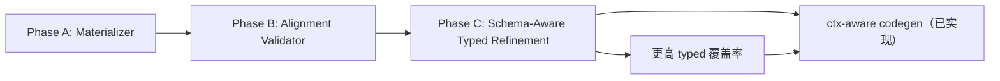

# Phase C: LLM-Assisted Typed Lowering 实施方案

## 0. 总纲

> [!abstract] 核心定位
> 系统不预置协议特定知识，但会在 pipeline 内部逐阶段积累协议上下文，并将其用于后续 typed refinement。我们称这一策略为**自举式协议知识积累（Bootstrapped Protocol Knowledge Accumulation）**。
>
> Phase C 是 **post-merge、pre-codegen 的 schema-aware typed refinement**，而非 re-extract。它不改变 extract 阶段的行为，不引入第二轮文档提取，而是在已有 `ProtocolSchema` 的基础上，对 regex 未能解析的 guard/action 进行 LLM 辅助的结构化分类。

与 APG 的本质区别：

| 维度 | APG | Kiro Phase C |
|------|-----|-------------|
| 协议知识来源 | 人工硬编码在 prompt 中 | pipeline 前置阶段自动从文档积累 |
| 换协议代价 | 改 prompt | 换 PDF，pipeline 代码不改 |
| 知识可审计性 | 低（散落在代码中的字符串） | 高（ProtocolHint 自动生成，可序列化可检查） |

---

## 1. 问题背景

### 1.1 当前链路的瓶颈

当前 `ProtocolStateMachine → FSMIRv1` 的 lowering 完全依赖 `fsm_ir.py` 中的正则启发式：

```text
LLM 提取 raw ProtocolTransition
    ↓
_try_parse_guard()    → regex 匹配 → TypedGuard | None
_try_parse_action()   → regex 匹配 → TypedAction | None
    ↓
匹配失败 → 留在 guard_raw / actions_raw → codegen 降级为注释
```

对 BFD 这类条件简短的协议，regex 够用。但对 TCP 这类自然语言密集的协议，regex 的覆盖率很低。

### 1.2 TCP 真实数据佐证（2026-04-04 实验）

| 指标 | 数值 | 说明 |
|------|------|------|
| FSM 数 | 19 | — |
| 总 blocks | 191 | — |
| typed_ref_count | 42 | alignment report 统计 |
| coverage_ratio | 1.0 | "抽出来的都对齐了" |
| 噪声字段 | `bit`, `the`, `control`, `ack`, `timeout` | regex 误抽自然语言片段 |
| 真正落地的 `ctx->` 代码 | ~20 行 | 主要是 `ctx->bit` guard 和 `ctx->the.active` timer |

> [!warning] coverage_ratio=1.0 的误导性
> 42 个 typed refs 全部对齐，但 191 个 blocks 中大量语义仍停留在 `actions_raw` / `guard_raw`。这个 1.0 表示"抽出来的都对齐了"，不表示"该抽的都抽出来了"。coverage_ratio 只能作为辅助指标，不能作为核心收益指标。

### 1.3 硬编码规则的问题

需要区分两类规则：

| 规则类别 | 示例 | 是否允许 |
|---------|------|---------|
| **通用 normalization** | snake_case 转换、前缀剥离、停用词过滤 | ✅ 允许——协议无关的格式清洗 |
| **协议特定知识** | `SND.NXT → send_next_seq`、`_TCP_NOISE_NAMES` | ⚠️ 应尽量进 LLM hint 或 patch lane |

如果持续向 `_CANONICAL_EXPANSIONS`、`_infer_field_role` 中添加协议特定映射，与 APG 在 prompt 中硬编码协议知识没有本质区别——只是位置不同。

> [!important] 核心设计目标
> 通用 normalization 保留在 pipeline 代码中。协议特定知识要么由 LLM 在自举上下文中自行理解，要么由人工通过 `context_patch.json` 显式注入。尽量不在代码中硬编码协议特定规则。

---

## 2. 方案概述

### 2.1 核心思路

在 `fsm_ir.py` 的 lowering 阶段引入 LLM fallback：regex 先行，失败时让 LLM 在已有协议上下文辅助下做结构化分类，LLM 结果经 acceptance gate 验证后方可采纳。

```text
ProtocolTransition
    ↓
_try_parse_guard/action()   ← regex（确定性，零成本）
    ↓ 触发条件满足
_llm_refine_transition()    ← LLM（语义理解，按需触发）
    ↓
acceptance gate             ← 验证 LLM 输出的合法性
    ↓ 通过
采纳为 typed               ← 替换对应 raw
    ↓ 未通过 / unresolved
保留 raw                    ← 退化为当前行为
```

### 2.2 设计原则

1. **确定性优先**：regex 能解决的不调 LLM
2. **按需触发**：只对满足触发条件的 FSM 触发 LLM refine
3. **Acceptance gate**：LLM 输出必须通过合法性校验才被采纳
4. **协议无关**：LLM 的上下文 hint 从已有 schema 自动构建，不含硬编码知识
5. **向后兼容**：`llm=None` 时行为与当前完全一致
6. **输出子集收紧**：只接收当前 codegen 能消费的 kind/operator 子集

---

## 3. 改动边界

> [!note] 定位
> Phase C 是 schema-aware typed refinement，不是第二轮 extract。不改 extract 阶段的 prompt，不改 ProtocolStateMachine 格式，不引入新的 IR 层。

| 模块 | 是否修改 | 原因 |
|------|---------|------|
| `extractors/state_machine.py` | ❌ | extract 阶段 prompt 和 schema 保持不变 |
| `ProtocolStateMachine` model | ❌ | 中间格式不动，merge 等消费方不受影响 |
| `ProtocolTransition` model | ❌ | raw 格式不动 |
| `TypedGuard` / `TypedAction` model | ❌ | 输出格式不动 |
| `state_context_materializer.py` | ❌ | 消费 FSMIRv1，上游改善后自动受益 |
| `state_context_alignment.py` | ❌ | 同上 |
| `codegen.py` | ⚠️ 可能小改 | `lower_all_state_machines` 变 async 后调用点需适配 |
| merge 阶段 | ❌ | 操作的是 ProtocolStateMachine |

**核心修改集中在**：

- `src/extract/fsm_ir.py` — 加 LLM fallback + acceptance gate
- `src/extract/pipeline.py` — 传 LLM 实例给 lowering

可能伴随少量调用点适配（`codegen.py` 中的 `_prepare_codegen_inputs`、相关测试文件等）。

---

## 4. ProtocolHint：自动构建的协议上下文

### 4.1 数据结构

```python
@dataclass
class ProtocolHint:
    known_states: list[str]               # FSM 状态名
    known_timers: list[str]               # 协议定时器名
    known_message_names: list[str]        # 消息类型名
    known_message_field_names: list[str]  # 消息结构体字段名（Header 字段等）
    observed_context_tokens: list[str]    # 从过程规则/转移条件中观察到的疑似上下文变量
```

### 4.2 构建来源

| hint 字段 | 来源 | 说明 |
|-----------|------|------|
| `known_states` | `schema.state_machines[*].states[*].name` | 所有 FSM 的状态名去重 |
| `known_timers` | `schema.timers[*].timer_name` | 文档中抽取到的定时器 |
| `known_message_names` | `schema.messages[*].name` | 文档中抽取到的消息类型 |
| `known_message_field_names` | `schema.messages[*].fields[*].name` | 消息结构体字段（如 TCP Header 的 SEQ、ACK） |
| `observed_context_tokens` | 从 `schema.procedures[*].steps[*]` 和 transition conditions 中提取的疑似变量名（含 `.` 的 token，如 `SND.NXT`） | 初步观察到的上下文变量候选 |

### 4.3 为什么拆分

将 `known_field_names` 拆成 `known_message_field_names` 和 `observed_context_tokens` 是因为：

- **消息字段**（如 TCP Header 的 `Source Port`）和**上下文变量**（如 `SND.NXT`）是不同类型的实体
- 在 prompt 中混在一起容易误导 LLM 把消息字段当成 ctx 变量
- 分开后 LLM 可以更准确地判断 `ref_source`：消息字段 → `"msg"`，上下文变量 → `"ctx"`

### 4.4 关键特性

- **自动构建**：从已有 `ProtocolSchema` 提取，无需人工输入
- **协议无关**：构建逻辑不含任何协议特定规则
- **轻量**：只传名字列表，不传完整定义，控制 prompt token 量
- **可序列化**：可以落盘为 JSON artifact，便于审计和调试

---

## 5. LLM Refine 接口设计

### 5.1 触发条件

采用双条件触发，避免小 FSM 被单一比例误触发：

```python
_REFINE_RAW_RATIO_THRESHOLD = 0.3
_REFINE_MIN_RAW_BRANCHES = 2

def _needs_refinement(ir: FSMIRv1) -> bool:
    """判断 FSM 是否需要 LLM 辅助结构化。"""
    total_branches = sum(len(b.branches) for b in ir.blocks)
    if total_branches == 0:
        return False
    raw_branches = sum(
        1 for b in ir.blocks for br in b.branches
        if br.actions_raw or (br.guard_raw and br.guard_typed is None)
    )
    raw_ratio = raw_branches / total_branches
    return (raw_ratio > _REFINE_RAW_RATIO_THRESHOLD
            and raw_branches >= _REFINE_MIN_RAW_BRANCHES)
```

> [!tip] 双条件的含义
> - **比例条件**（>30%）：避免大 FSM 因零星 raw branch 触发 refine
> - **最小计数条件**（≥2）：避免小 FSM 因 `1/3` 这类偶然比例误触发
> - 当小 FSM 中有多个 raw branch（如 3 个 branch 中 2 个或 3 个都未解析）时，仍可触发 refine

### 5.2 Prompt 设计

收紧 LLM 输出子集，只接收当前 codegen 能实际消费的 kind 和 operator：

```python
REFINE_SYSTEM_PROMPT = """You are a protocol specification analyst.
Given a protocol state machine transition and known protocol context,
classify the condition and actions into typed form.

Rules:
- Use "unresolved" if you cannot confidently classify
- field_ref should use the ORIGINAL variable name from the RFC
  (e.g. SND.NXT, not send_next_seq)
- Do NOT guess. If unsure, use "unresolved"
- ref_source: "ctx" for protocol state variables,
  "msg" for message/segment fields,
  "timer" for timers

Return JSON only:
{
  "guard": {
    "kind": "context_field_eq|context_field_ne|flag_check|timer_fired|always|unresolved",
    "ref_source": "ctx|msg|timer|unknown",
    "field_ref": "field name or null",
    "operator": "==|!=|null",
    "value": "value or null"
  },
  "actions": [
    {
      "kind": "set_state|start_timer|cancel_timer|update_field|unresolved",
      "ref_source": "ctx|msg|timer|unknown",
      "target": "name",
      "value": "literal value or null"
    }
  ]
}

Constraints on output:
- guard.operator: only == or != (other comparisons use "unresolved")
- update_field.value: only literal values (integers, booleans, enum names);
  complex expressions like "SEG.ACK + 1" should use "unresolved"
- set_state.target: must be one of the known states listed below
- start_timer/cancel_timer.target: must match a known timer
"""
```

> [!note] 为什么收紧 operator
> 当前 `TypedGuard` 模型支持 `>`, `<`, `>=`, `<=`，但 `codegen.py` 的 `_guard_to_c_expr()` 实际只处理 `==` 和 `!=`（见 line 742）。接收了更复杂的 operator 也会在 codegen 阶段降级为 `if (0)`。不如在源头就收紧，减少无效工作。

User prompt 包含：

1. ProtocolHint（known states / timers / messages / message fields / context tokens）
2. 单条 transition 的 `from_state`, `to_state`, `event`, `condition`, `actions`

### 5.3 Acceptance Gate

LLM 返回的 typed 结果必须通过以下校验才被采纳：

```python
def _accept_llm_guard(
    guard: dict,
    hint: ProtocolHint,
) -> bool:
    """校验 LLM 返回的 guard 是否可采纳。"""
    kind = guard.get("kind")
    if kind == "unresolved":
        return False
    if kind not in {"context_field_eq", "context_field_ne",
                    "flag_check", "timer_fired", "always"}:
        return False
    if kind == "timer_fired":
        return _matches_known_timer(guard.get("field_ref"), hint)
    if kind in {"context_field_eq", "context_field_ne"}:
        op = guard.get("operator")
        if op not in {"==", "!="}:
            return False
    return True


def _accept_llm_action(
    action: dict,
    hint: ProtocolHint,
) -> bool:
    """校验 LLM 返回的 action 是否可采纳。"""
    kind = action.get("kind")
    if kind == "unresolved":
        return False
    if kind not in {"set_state", "start_timer", "cancel_timer", "update_field"}:
        return False
    target = action.get("target", "")
    if kind == "set_state" and target:
        return _matches_known_state(target, hint)
    if kind in {"start_timer", "cancel_timer"} and target:
        return _matches_known_timer(target, hint)
    if kind == "update_field":
        if not _matches_known_context_or_message_slot(target, hint):
            return False
        value = action.get("value")
        if value and not _is_acceptable_literal(value):
            return False
    return True
```

> [!important] 安全保证
> 未通过 acceptance gate 的 LLM typed 结果一律丢弃，退化为 raw。因此在 gate 约束下，Phase C 最差情况等于当前行为（纯 regex），不会引入新的错误 typed 结果。

### 5.4 输出处理

```python
async def _llm_refine_transition(
    transition: ProtocolTransition,
    llm: LLMAdapter,
    hint: ProtocolHint | None,
) -> tuple[TypedGuard | None, list[TypedAction]]:
    """LLM 辅助结构化单条 transition，失败时返回 (None, [])。"""
```

- LLM 返回 `kind="unresolved"` → 视为未解析，不覆盖 regex 结果
- LLM 调用异常 → catch，返回空结果，fallback 到 regex
- LLM 返回的 `field_ref` 保留原始名（如 `SND.NXT`），后续 canonicalization 不变
- **所有结果必须通过 acceptance gate 才被采纳**

### 5.5 合并策略

```text
对每条 transition:
1. regex 先跑，得到 guard_typed_regex, actions_typed_regex, actions_raw
2. 如果 guard_typed_regex is None 且 condition 非空
   OR actions_raw 非空 → 调 LLM
3. LLM 返回 guard_typed_llm, actions_typed_llm
4. acceptance gate 过滤
5. 合并规则:
   - guard: 优先 regex（确定性），regex 为 None 时用 LLM（如果通过 gate）
   - actions: regex 已解析的保留，LLM 尝试解析 actions_raw 中的条目
   - 未通过 gate 或 "unresolved" 的留在 actions_raw
```

---

## 6. Pipeline 集成

### 6.1 lowering 签名变更

```python
# 当前
def lower_all_state_machines(schema: ProtocolSchema) -> list[FSMIRv1]

# 改为
async def lower_all_state_machines(
    schema: ProtocolSchema,
    llm: LLMAdapter | None = None,
) -> list[FSMIRv1]
```

`llm=None` 时完全等价于当前行为（纯 regex）。

### 6.2 pipeline 调用

```python
# pipeline.py merge 阶段
fsm_irs = await lower_all_state_machines(schema, llm=llm_adapter)
schema.fsm_irs = fsm_irs
# 后续 materializer / alignment / codegen 不变
```

### 6.3 stage_data 新增指标

| 指标 | 说明 |
|------|------|
| `llm_refine_triggered_count` | 触发 LLM refine 的 FSM 数 |
| `llm_refine_accepted_guard_count` | 通过 gate 被采纳的 LLM guard 数 |
| `llm_refine_accepted_action_count` | 通过 gate 被采纳的 LLM action 数 |
| `raw_branch_ratio_before` | refine 前的 raw branch 比例 |
| `raw_branch_ratio_after` | refine 后的 raw branch 比例 |
| `generated_action_count_before` | refine 前可被 codegen 真实落地的 action 数 |
| `generated_action_count_after` | refine 后可被 codegen 真实落地的 action 数 |
| `degraded_action_count_before` | refine 前降级为注释/placeholder 的 action 数 |
| `degraded_action_count_after` | refine 后降级为注释/placeholder 的 action 数 |

---

## 7. 回退与安全性

| 场景 | 行为 |
|------|------|
| `llm=None` | 纯 regex，等价当前 |
| LLM 调用超时 / 异常 | catch exception，保留 regex 结果 |
| LLM 返回非法 JSON | 忽略，保留 regex 结果 |
| LLM 返回 `kind="unresolved"` | 保留 raw |
| LLM 返回合法但未通过 acceptance gate | 丢弃，保留 raw |
| LLM 返回与 regex 冲突 | regex 优先（确定性 > 概率性） |
| FSM 未满足触发条件 | 不触发 LLM，零额外开销 |

> [!important] 安全保证
> 未通过 acceptance gate 的 LLM 结果一律丢弃。因此在 gate 约束下，Phase C 最差情况退化为当前行为（纯 regex）。

---

## 8. 泛化性分析

### 8.1 不同协议的预期效果

| 协议 | regex 覆盖率 | 是否触发 LLM | LLM 预期收益 |
|------|------------|-------------|-------------|
| BFD (RFC5880) | ~70%+ | 否（阈值内） | 不触发，无影响 |
| TCP (RFC793) | ~30% | 是 | 高——SND.NXT/SEG.ACK 等变量可正确分类 |
| FC-LS | 待验证 | 大概率是 | 高——FC 特有术语 LLM 难以用 regex 覆盖 |
| OSPF / BGP | 待验证 | 视复杂度 | 中——事件驱动型协议一般可受益 |
| ICMP / ARP | N/A | 否（几乎无 FSM） | 无影响 |

### 8.2 泛化的关键

1. **ProtocolHint 自动构建**：从 schema 已有数据提取，换协议不改代码
2. **LLM 分类任务通用**："这个 action 是 set_state、timer 操作，还是可接受的 literal update_field" 对多数事件驱动型协议都成立
3. **Acceptance gate 通用**：校验逻辑基于 hint 中的 known 集合，不含协议特定规则
4. **阈值自适应**：简单协议不触发，复杂协议才触发

### 8.3 泛化边界

- 对**事件驱动型协议**效果最好（BFD, TCP, OSPF, BGP, FC-LS）
- 对**纯结构协议**无影响（ICMP, ARP）——几乎没有 FSM
- 对**复杂过程式协议**（TLS handshake）可能有限——action 更像函数调用链

---

## 9. 论文叙事价值

### 9.1 对标 APG

```text
APG:  协议知识硬编码在 prompt 中 → 换协议改 prompt → 外部注入
Kiro: pipeline 前置阶段自动积累 → 换协议换 PDF → 内部自举
```

### 9.2 可写入论文的表述

> 系统采用自举式协议知识积累策略：前置阶段通过通用模式匹配和 LLM 通用理解能力从文档中提取初步结构（状态名、定时器名、消息类型名），后置阶段将这些结构作为上下文线索回传给 LLM，实现对复杂自然语言条件和动作的精确结构化分类。LLM 输出经 acceptance gate 校验后方可进入 typed IR，确保系统行为的确定性不因 LLM 引入而降低。整个过程中 pipeline 代码不包含协议特定逻辑。

### 9.3 实验数据点（核心 before/after 对比）

| 指标 | refine 前 | refine 后 | 说明 |
|------|----------|----------|------|
| `raw_branch_ratio` | ? | ? | **主指标**：未解析 branch 占比变化 |
| `accepted_llm_guard_count` | 0 | ? | LLM 新增的有效 guard 数 |
| `accepted_llm_action_count` | 0 | ? | LLM 新增的有效 action 数 |
| `generated_action_count` | ? | ? | codegen 真实生成代码的 action 数 |
| `degraded_action_count` | ? | ? | codegen 降级为注释的 action 数 |
| `noise_ref_count` | 5 | ? | 噪声字段数变化 |
| `coverage_ratio` | 1.0 | ? | 辅助指标，不作为核心收益衡量 |

---

## 10. 测试计划

### 10.1 单元测试

| 测试 | 说明 |
|------|------|
| `test_needs_refinement_below_threshold` | raw 率和计数都低于阈值不触发 |
| `test_needs_refinement_above_combined_threshold` | raw 比例和计数同时满足阈值时触发 |
| `test_needs_refinement_small_fsm_single_raw_branch_not_triggered` | 小 FSM 中 `1/3` raw 不应误触发 |
| `test_acceptance_gate_rejects_unknown_state` | set_state target 不在 known_states 中被拒 |
| `test_acceptance_gate_rejects_unknown_timer` | timer target 不在 known_timers 中被拒 |
| `test_acceptance_gate_rejects_complex_operator` | `>`, `<`, `>=`, `<=` 被拒 |
| `test_acceptance_gate_rejects_non_literal_value` | 复杂表达式的 update_field 被拒 |
| `test_acceptance_gate_accepts_valid_typed` | 合法的 typed 结果通过 |
| `test_llm_refine_returns_unresolved_keeps_raw` | LLM 返回 unresolved 保留 raw |
| `test_llm_refine_exception_fallback` | LLM 异常时 fallback 到 regex |
| `test_llm_refine_merges_with_regex` | LLM 结果与 regex 正确合并 |
| `test_protocol_hint_auto_build` | hint 从 schema 自动构建，字段分类正确 |
| `test_regex_priority_over_llm` | regex 已解析的不被 LLM 覆盖 |

### 10.2 集成测试

| 测试 | 说明 |
|------|------|
| `test_bfd_no_regression_without_llm` | BFD 无 LLM 时行为不变 |
| `test_bfd_no_regression_with_llm` | BFD 有 LLM 时也不退步（阈值内不触发） |
| `test_tcp_typed_count_improves_with_llm` | TCP 有 LLM 时 typed 化率提升 |
| `test_pipeline_stage_data_has_refine_metrics` | stage_data 包含 refine 指标 |

---

## 11. 实施步骤

```text
Step 1: ProtocolHint 数据结构 + _build_protocol_hint()
Step 2: _needs_refinement() 双条件触发判断
Step 3: acceptance gate 实现 + 单元测试
Step 4: _llm_refine_transition() 实现 + prompt
Step 5: _lower_transition() 加 LLM fallback 分支 + 合并策略
Step 6: lower_all_state_machines() 改为 async + 接收 llm 参数
Step 7: pipeline.py + codegen.py 调用点适配
Step 8: 单元测试 + BFD 回归验证
Step 9: TCP 真实数据验证 + before/after 指标对比
```

预估总工作量：**2-3 天**（含测试、回归、指标对比）。

---

## 12. 不做的事

- 不改 extract 阶段的 prompt 或 output schema
- 不改 `ProtocolStateMachine` / `ProtocolTransition` 数据模型
- 不建"全局协议语义网络"
- 不做跨节点关联或术语链接图
- 不做第二轮文档提取（Phase C 是 refinement，不是 re-extract）
- 不改 materializer / alignment 主逻辑
- 不改 codegen 主逻辑；若 lowering 接口改为 async，仅做调用点适配
- 不接收当前 codegen 无法消费的 operator（`>`, `<`, `>=`, `<=`）

---

## 13. 与 Phase A / B 的关系



Phase C 不是在 A/B 之上新建一层，而是**增强 A/B 的输入质量**：

- Phase A materializer 从 FSMIRv1 的 typed refs 中物化 context → typed refs 更多，context 更丰富
- Phase B alignment validator 检查 FSM 与 context 的对齐 → typed refs 更多，对齐更有意义
- codegen 消费对齐后的 typed actions → 真实生成代码更多，降级注释更少

> [!success] 一句话定位
> Phase C 解决的不是"怎么存 context"（Phase A）或"怎么验对齐"（Phase B），而是"怎么让更多协议语义进入 typed 系统"——通过自举式知识积累，而非硬编码规则。
