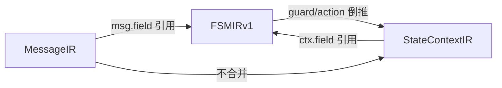

# StateContextIR 落地方案

## 1. 当前现状

### 已有资产

| 资产              | 状态         | 说明                                                                                         |
| --------------- | ---------- | ------------------------------------------------------------------------------------------ |
| 数据模型            | ✅ 完整       | `ContextFieldIR`, `ContextTimerIR`, `ContextResourceIR`, `ContextRuleIR`, `StateContextIR` |
| normalization   | ✅ 完整       | 三态 readiness + 9 种诊断码                                                                      |
| TCP builder     | ✅ READY    | `build_tcp_connection_state_context()` 5 字段 + 1 timer + 1 resource                         |
| generic builder | ✅ DEGRADED | `build_generic_session_state_context()` 5 字段, 无 timer/resource                             |
| 测试              | ✅ 通过       | `test_state_context_ir.py` + `test_state_context_examples.py`                              |
| FSMIRv1 引用能力    | ✅ 就绪       | `TypedGuard` 支持 `ctx.field` 引用, `TypedAction` 支持 timer/field 操作                            |

### 核心缺口

| 缺口 | 影响 |
|------|------|
| **无自动物化** | StateContextIR 只能手写 builder, 不能从文档/FSM 自动推导 |
| **无 codegen** | 无法生成 `ctx` struct / timer placeholder / action skeleton |
| **FSM↔ctx 未对齐** | FSMIRv1 的 `TypedGuard`/`TypedAction` 引用 field_ref, 但未校验 ref 是否存在于 StateContextIR |
| **无 trace verify** | 无法基于 StateEventBlock 跑最小行为 trace |
| **FC 无实例** | FC-LS 协议没有 StateContextIR 实例 |

## 2. 设计定位

> [!important] 核心原则
> StateContextIR 不应脱离行为层独立设计, 而应从 FSMIRv1 的 guard/action 引用中**倒推物化**。

```text
FSMIRv1 guard/action 引用 ctx.field / ctx.timer
         │
         ▼
  自动收集所有被引用的 slot
         │
         ▼
  合并文档 clues (timer configs, state fields)
         │
         ▼
  StateContextIR v1 (consumer-driven, 最小集)
```

### 与三层 IR 的关系



- **MessageIR**: 报文字节布局 (wire format)
- **StateContextIR**: 运行时持久状态 (runtime state)
- **FSMIRv1**: 何时读写什么 (behavior)

## 3. 落地方案：三步走

### Phase A: 自动物化 — 从 FSMIRv1 倒推 StateContextIR

> [!abstract] 目标
> 不再手写 builder, 从 FSMIRv1 的 typed guard/action 自动收集 context slot。

#### 新增模块: `src/extract/state_context_materializer.py`

**核心函数:**

```python
def materialize_state_context_from_fsm(
    fsm_ir: FSMIRv1,
    schema: ProtocolSchema,   # 已有 timers, state_machines
    protocol_name: str,
) -> StateContextIR:
```

**物化逻辑:**

1. **扫描所有 TypedGuard**, 收集被引用的 `field_ref`:
   - `context_field_eq` / `context_field_ne` → `ContextFieldIR` (type_kind 从 operator/value 推断)
   - `timer_fired` → `ContextTimerIR`
   - `flag_check` → `ContextFieldIR(type_kind="bool")`

2. **扫描所有 TypedAction**, 收集被引用的 target:
   - `set_state` → 标记 `state_field`
   - `update_field` → `ContextFieldIR`
   - `start_timer` / `cancel_timer` → `ContextTimerIR`
   - `emit_message` → 不产生 ctx slot, 但记录为 notes

3. **合并文档线索**:
   - `schema.timers` (TimerConfig) → 补充 `duration_expr`, `semantic_role`
   - FSMIRv1 states → 推断 state field 的 enum domain

4. **推断 semantic_role** (启发式):
   - field 名含 "state" → `semantic_role="state"`
   - field 名含 "seq" + "send"/"snd" → `semantic_role="send_next_seq"`
   - field 名含 "window"/"win" → `semantic_role="send_window"` / `recv_window"`
   - timer 名含 "retransmit" → `semantic_role="retransmission"`

5. **计算 readiness**:
   - 有 state_field + 至少 1 个 typed field → `DEGRADED_READY`
   - 有 state_field + 5 个核心 role 全覆盖 → `READY`
   - 无 state_field → `BLOCKED`

6. **生成 diagnostics**:
   - `CTX_FIELD_FROM_GUARD` — 从 guard 倒推出的 field
   - `CTX_FIELD_FROM_ACTION` — 从 action 倒推出的 field
   - `CTX_TIMER_FROM_FSM` — 从 timer action 倒推出的 timer
   - `CTX_ROLE_INFERRED` — 自动推断的 semantic_role
   - `CTX_ROLE_UNKNOWN` — 无法推断 role

#### 集成点

```python
# pipeline.py, 在 fsm_ir lowering 之后
from src.extract.state_context_materializer import materialize_all_state_contexts

schema.state_contexts = materialize_all_state_contexts(schema)
```

#### 验收标准

- [ ] BFD FSMIRv1 → 自动产出 StateContextIR, 含 state field
- [ ] TCP FSMIRv1 → 自动产出 StateContextIR, 含 state + seq fields
- [ ] FC FSMIRv1 → 自动产出 StateContextIR (一旦 FC pipeline 跑通)
- [ ] 手写 builder 的结果与自动物化结果结构兼容

### Phase B: 交叉校验 — FSM↔StateContextIR 对齐

> [!abstract] 目标
> 验证 FSMIRv1 引用的 `ctx.field` / `ctx.timer` 在 StateContextIR 中确实存在。

#### 新增函数: `validate_fsm_context_alignment()`

```python
def validate_fsm_context_alignment(
    fsm_ir: FSMIRv1,
    ctx: StateContextIR,
) -> list[IRDiagnostic]:
```

**校验规则:**

| 规则 | 级别 | 说明 |
|------|------|------|
| guard 引用 field 不存在于 ctx | ERROR | `FSM_CTX_FIELD_MISSING` |
| action 引用 timer 不存在于 ctx | ERROR | `FSM_CTX_TIMER_MISSING` |
| ctx field 从未被任何 guard/action 引用 | WARNING | `CTX_FIELD_UNREFERENCED` |
| action `set_state` 但 ctx 无 state_field | ERROR | `CTX_STATE_FIELD_MISSING` |
| action `update_field` target 不在 ctx | ERROR | `FSM_CTX_UPDATE_MISSING` |

#### 产物

- `alignment_report.json`: 每个 FSM↔ctx pair 的对齐结果
- diagnostics 追加到 FSMIRv1 和 StateContextIR

#### 验收标准

- [ ] BFD alignment 无 ERROR
- [ ] TCP alignment 无 ERROR
- [ ] 故意构造 misaligned case → 正确报 ERROR

### Phase C: Codegen + Trace Verify

> [!abstract] 目标
> 生成 ctx struct skeleton, 并支持最小 trace verify。

#### C.1 Context Codegen

**新增模板:** `state_context.h.j2`

```c
typedef enum {{ ctx_state_enum }} {

    {{ state_enum_entry }},

} {{ ctx_state_enum }};

typedef struct {{ ctx_struct_name }} {
    {{ ctx_state_enum }} {{ state_field_name }};

    {{ field.c_type }} {{ field.c_name }};  /* {{ field.semantic_role }} */


    bool {{ timer.c_name }}_active;  /* {{ timer.semantic_role }} */

} {{ ctx_struct_name }};
```

**新增模板:** `state_context.c.j2`

```c
void {{ ctx_init_fn }}({{ ctx_struct_name }}* ctx) {
    memset(ctx, 0, sizeof(*ctx));
    ctx->{{ state_field_name }} = {{ initial_state }};


    ctx->{{ field.c_name }} = {{ field.initial_value_expr }};


}
```

#### C.2 FSM Skeleton 升级

当前 FSM skeleton 签名:

```c
state_enum transition(state_enum current_state, event_enum event);
```

升级为 (ctx-aware):

```c
state_enum transition(ctx_struct* ctx, event_enum event);
```

action 从注释升级为 ctx 操作:

```c
// 之前: /* action: set state to ESTABLISHED */
// 之后: ctx->connection_state = STATE_ESTABLISHED;

// 之前: /* typed: start_timer(retransmit) */
// 之后: ctx->retransmit_active = true; /* start_timer(retransmit) */
```

#### C.3 最小 Trace Verify

**trace 格式:**

```json
{
  "steps": [
    {
      "input_event": "RECV_SYN",
      "input_msg": { "syn_flag": 1, "seq": 100 },
      "expect_state_after": "SYN_RECEIVED",
      "expect_ctx_delta": { "recv_next_seq": 101 },
      "expect_emit": "SYN_ACK"
    }
  ]
}
```

**trace harness:**

```python
def run_trace(fsm_ir, ctx, trace_steps) -> TraceResult:
    for step in trace_steps:
        event = derive_event(step.input_msg)
        block = find_block(fsm_ir, ctx.state, event)
        branch = evaluate_guards(block, ctx, step.input_msg)
        execute_actions(branch, ctx)
        assert ctx.state == step.expect_state_after
        assert ctx_delta_matches(ctx, step.expect_ctx_delta)
```

#### 验收标准

- [ ] BFD ctx struct 编译通过
- [ ] FC ctx struct 编译通过
- [ ] 至少 1 条 FC trace 跑通
- [ ] 至少 1 条 BFD trace 跑通 (推荐)

## 4. 协议实例映射

### BFD (rfc5880)

```text
StateContextIR(
  scope = "session",
  state_field = "session_state",
  fields = [
    session_state       (role=state, type=enum),
    local_discr         (role=opaque, type=u32),
    remote_discr        (role=opaque, type=u32),
    desired_min_tx      (role=opaque, type=u32),
    required_min_rx     (role=opaque, type=u32),
    detect_mult         (role=opaque, type=u8),
    local_diag          (role=opaque, type=enum),
  ],
  timers = [
    tx_timer            (role=keepalive),
    detect_timer        (role=hold_timer),
  ],
  resources = []
)
```

### TCP (rfc9293)

```text
StateContextIR(
  scope = "connection",
  state_field = "connection_state",
  fields = [
    connection_state    (role=state, type=enum),
    send_next_seq       (role=send_next_seq, type=u32),
    send_unacked        (role=opaque, type=u32),
    recv_next_seq       (role=recv_next_seq, type=u32),
    send_window         (role=send_window, type=u32),
    recv_window         (role=recv_window, type=u32),
  ],
  timers = [
    retransmission      (role=retransmission),
    user_timeout        (role=user_timeout),
  ],
  resources = [
    send_queue          (role=send_queue, kind=queue),
    retransmit_queue    (role=retransmission_queue, kind=queue),
  ]
)
```

### FC-LS (Login FSM)

```text
StateContextIR(
  scope = "association",
  state_field = "login_state",
  fields = [
    login_state         (role=state, type=enum),
    local_port_name     (role=opaque, type=bytes),
    remote_port_name    (role=opaque, type=bytes),
    service_params      (role=opaque, type=opaque),
  ],
  timers = [
    e_d_tov             (role=hold_timer),
    r_a_tov             (role=retransmission),
  ],
  resources = []
)
```

## 5. 实施优先级

```text
Phase A (物化)     ████████████  3-4 天
  │
  ├─ 实现 materializer
  ├─ 接入 pipeline
  └─ BFD + TCP 验证
  
Phase B (对齐)     ████████      2 天
  │
  ├─ alignment validator
  └─ diagnostics 集成

Phase C (codegen)  ████████████  3-4 天
  │
  ├─ ctx struct 模板
  ├─ FSM skeleton 升级
  └─ 最小 trace verify
```

> [!tip] 关键路径
> Phase A 是前置依赖。Phase B 和 Phase C 的 codegen 部分可并行。Trace verify 依赖 Phase C codegen。

## 6. 与 V5 Phase 的映射

| 本方案 | V5 Phase | 论文章节 |
|--------|---------|---------|
| Phase A: 自动物化 | Phase 5 前半 | 第五章 IR 设计 |
| Phase B: 交叉校验 | Phase 5 中间 | 第五章 + 第七章实验四 |
| Phase C: codegen | Phase 5 后半 | 第五章 codegen + 第六章验证 |
| Phase C: trace | Phase 5 尾部 | 第七章实验二 |

## 7. 风险与缓解

| 风险 | 缓解 |
|------|------|
| FSMIRv1 typed 化比例低, 物化出的 ctx 太空 | 允许 DEGRADED_READY, 手工 patch 补充 |
| FC PDF 提取质量差, guard/action 几乎全是 raw | 先在 BFD/TCP 验证, FC 用手工 builder 兜底 |
| trace verify 需要人工标注 trace fixture | 先做 1-2 条, 不追求覆盖率 |
| ctx-aware FSM skeleton 改动大 | 保留旧模板作 fallback, 渐进切换 |
